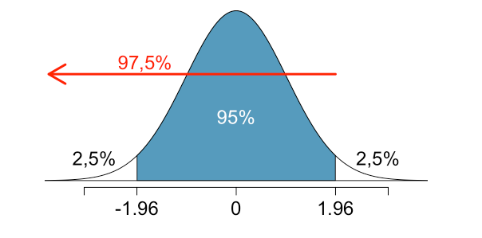

```{r setup, include=FALSE}
knitr::opts_chunk$set(echo = TRUE, warning = F, message = F)
```


# Sobre o projeto 


Este curso é uma adaptação dos laboratórios de estatística disponíveis no livro **OpenIntro Statistics: Labs for R** [@openintro]. Aqui, usamos as principais biliotecas do R para desenvolver aquilo que é proposto nos capítulos (laboratórios) do livro. Em cada caso, usamos também gráficos e tabelas para auxiliar no aprendizado dos conceitos estatísticos  envolvidos.

Todas as análises realizadas neste livro são subsidiadas por bases de dados reais, públicas, disponibilizadas pelos autores do livro [@datasets]. Além disso, como bibliografia complementar, utilizamos o livro-texto de Estatística Básica dos autores Bussab & Morettin [@bussab_morettin].

Por fim, ressaltamos que o livro está em contínuo desenvolvimento e, dessa forma, melhorias podem ser implementadas a qualquer momento. No mesmo aspecto, sugestões são sempre bem vindas.


# Lab01: Introdução ao R e ao Rstudio


O R é um poderoso software estatístico. Com ele, é possível fazer desde cálculos simples envolvendo distribuições de probabilidades e estatística descritiva até o desenvolvimento de modelos de machine learning. 

A linguagem R foi desenvolvida na década de 90 por dois estatísticos Neozelandêses, Ross Ihaka e Robert Gentleman (daí o nome R). O R é um software livre e de código aberto. Atualmente possui uma vasta biblioteca de funções para cálculos estatísticos e possui uma grande comunidade que contribui com o projeto [@rproject].

As distribuições linux geralmente já contêm o R. Para as demais, o software pode ser baixado através da página do projeto: <https://cran.r-project.org/>.

O Rstudio, por sua vez, é uma IDE (Integrated Development Enviroment) ou Ambiente de Desenvolvimento Integrado. Genericamente falando, uma IDE é um programa que, com sua interface gráfica amigável (mais parecida com os programas voltados ao usuário comum), traz uma série de ferramentas que facilitam o desenvolvimento de aplicações. Algumas dessas ferramentas são compilador e um editor de código-fonte capaz de apontar erros e sugerir a sintáxe correta das funções [@wikipediaIDE]. 

O Rstudio, a exemplo do R, também é um software gratuito e de código aberto. Porém, diferentemente do R, esta IDE possui também uma versão paga. Para baixar a ferramenta, basta acessar a página oficial: <https://posit.co/download/rstudio-desktop/>.


## Conteúdos abordados neste laboratório

* Primeiros passos no R e no Rstudio
* Explorando uma base de dados carregada da nuvem
* fazendo filtros e gráficos com o R


## Carregamento de pacotes

O R é uma linguagem de programação de código aberto, o que significa que os usuários podem contribuir com pacotes que facilitam nossas vidas. Ainda melhor, podemos usá-las gratuitamente. Para este laboratório, e muitos outros futuros, usaremos principalmente os seguintes pacotes do R:

* `dplyr`: para descrição de dados
* `ggplot2`: para visualização de dados
* `kableExtra`: Para deixar as saídas de dados em formato de tabela
* `rmarkdown`: para fazer relatórios como este, usando markdown

Para carregá-los no nosso ambiente de trabalho, digitamos no console:

```{r}
library(ggplot2)
library(plyr)
library(tidyr)
library(dplyr)
library(DescTools)
library(htmltools)
library(knitr)
library(rmarkdown)
library(combinat)
library(kableExtra) #Para gerar tabelas com um layout agradável
```

## Os dados: Registros de batismos do Dr. Arbuthnot

Aqui, vamos carregar os dados diretamente da itnernet, na página do *OpenIntro Statistics*:

```{r}
source("http://www.openintro.org/stat/data/arbuthnot.R")
```

O conjunto de dados Arbuthnot se refere ao Dr. John Arbuthnot, um médico, escritor e matemático do século 18. Ele se interessou pela razão ente o número de meninos e meninas recém-nascidos, e para isso ele coletou os registros de batismo de crianças nascidas em Londres no período compreendido entre 1629 e 1710. Vamos começar dando uma olhada nos dados, com o auxílio da função `head()`:

```{r}
arbuthnot %>%
  head(10) %>%
  kable() %>%
  kable_styling(
    full_width = F, 
    bootstrap_options = c("striped", "hover", "condensed",
                          "responsive")
    )
```

Podemos ver as dimensões desse banco de dados

```{r}
dim(arbuthnot)
```

Para ver os nomes das variáveis observadas (colunas), fazemos:

```{r}
names(arbuthnot)
```

## Explorando os dados

Nós podemos acessar separadamente os dados de uma única coluna da base de dados da seguinte forma:

```{r}
arbuthnot$boys
```

```{r}
arbuthnot$girls
```

Nesse caso, os dados são impressos em tela como vetores, e não como um banco de dados estruturado.

O R tem algumas funções poderosas para criar gráficos. Podemos criar um gráfico simples do número de meninas batizadas por ano com o comando


```{r}
arbuthnot %>%
  ggplot(aes(x = year, y = girls)) + 
  geom_point(size = 2, col = "red") +
  labs(
    title = "Registros de nascimento do dr. Arbuthnot"
  ) +
  theme(text = element_text(size = 16))
```


Podemos também fazer um gráfico de linhas, ao invés de plotar os pontos dispersos:


```{r}
arbuthnot %>%
  ggplot(aes(x = year, y = girls)) + 
  geom_line(linewidth = 1, col = "red") +
  labs(
    title = "Registros de nascimento do dr. Arbuthnot"
  ) +
  theme(text = element_text(size = 16))
```

## Há alguma tendência aparente no número de meninas batizadas ao longo dos anos? Como você a descreveria? 

Para saber o número total de crianças batizadas em cada ano, fazemos:

```{r}
arbuthnot$boys + arbuthnot$girls
```

Nesse caso, visualizamos um vetor com 82 entradas, cada uma contendo a soma do número de meninos e de meninas batizados no respectivo ano. Nós podemos ainda utilizar este vetor para gerar alguns gráficos, então iremos salvá-lo como uma coluna permanente do nosso banco de dados:

```{r}
arbuthnot = mutate(arbuthnot, total = boys + girls)

arbuthnot %>%
  head(10) %>%
  kable() %>%
  kable_styling(
    full_width = F, 
    bootstrap_options = c("striped", "hover", "condensed",
                          "responsive")
    )
```

Assim, uma nova coluna chamada "total" foi incluída no banco de dados. Podemos criar um gráfico do número total de batismos por ano com o comando:


```{r}
arbuthnot %>%
  ggplot(aes(x = year, y = total)) + 
  geom_line(linewidth = 1, col = "orange") +
  labs(
    title = "Registros de nascimento do dr. Arbuthnot"
  ) +
  theme(text = element_text(size = 16))
```

Podemos também calcular a proporção do número de meninos batizados em relação ao número de meninas batizadas em cada ano:

```{r}
arbuthnot$boys / arbuthnot$girls
```

Podemos também calcular a proporção de meninos batizados ano a ano em relação ao total de crianças batizadas no respectivo ano:

```{r}
arbuthnot$boys / (arbuthnot$boys + arbuthnot$girls)
```

Vamos usar novamente a função `mutate`para incluir uma nova coluna em nosso conjunto de dados para a proporção do número de meninos em relação ao total de recém-nascidos em cada ano:

```{r}
arbuthnot = mutate(arbuthnot, ratio_boys = arbuthnot$boys / arbuthnot$total)

arbuthnot %>%
  head(10) %>%
  kable() %>%
  kable_styling(
    full_width = F, 
    bootstrap_options = c("striped", "hover", "condensed",
                          "responsive")
    )
```

Podemos também fazer um gráfico da proporção de meninos batizados relativo ao total ano a ano:


```{r}
arbuthnot %>%
  ggplot(aes(x = year, y = ratio_boys)) + 
  geom_line(linewidth = 1, col = "skyblue") +
  labs(
    title = "Porporção de meninos batizados"
  ) +
  theme(text = element_text(size = 16))
```

Nesse caso, percebe-se que a proporção de meninos oscila em torno de 50%.

Podemos ainda criar uma variável lógica que indica se o número de meninos nascidos é maior que o número de meninas:

```{r}
arbuthnot = mutate(arbuthnot, more_boys = boys > girls)

arbuthnot %>%
  head(10) %>%
  kable() %>%
  kable_styling(
    full_width = F, 
    bootstrap_options = c("striped", "hover", "condensed",
                          "responsive")
    )
```

## Um novo conjunto de dados: registros atuais de nascimento nos Estados Unidos

Vamos agora trabalhar com um conjunto de dados obtido mais recentemente. Primeiro, carregamos o dataframe:

```{r}
source("http://www.openintro.org/stat/data/present.R")
```

1. Quais anos estão incluídos nesse conjuntos de dados? 

```{r}
names(present)
```

```{r}
present$year
```

Vemos então que os anos incluídos vão de 1940 a 2002.

2. Quais as dimensões da base de dados? 

```{r}
dim(present)
```

3. Quais sãos os nomes das colunas ou variáveis?

```{r}
names(present)
```

4. Como esses dados se comparam aos de Arbuthnot? Eles estão em uma escala similar?


```{r}
present %>%
  ggplot(aes(x = year, y = girls)) + 
  geom_point(size = 2, col = "red") +
  labs(
    title = "Registros de nascimento atuais"
  ) +
  theme(text = element_text(size = 16))
```


```{r}
cat("Intervalo de anos para os dados do dr. Arbuthnot:", 
    c(min(arbuthnot$year), max(arbuthnot$year)),
    "\nIntervalo de anos para os dados atuais:",
    c(min(present$year), max(present$year))
    )
```
Como podemos ver a partir do resultado do gráfico acima, bem como com a saída da função `cat()`, os dados dos conjuntos `arbuthnot` e `present` estão em escalas diferentes. No caso dos dados do dr. Arbuthnot, o número de batismos de menina, por exemplo, está na escala de alguns milhares, ao passo que no conjunto de dados atual, esse número está na escala de milhão. Além disso, o intervalo temporal de coleta dos dois conjuntos de dados são também diferentes.

5. Crie um gráfico que mostre a proporção de meninos em relação às meninas para cada ano do conjunto de dados. O que você vê? A observação de Arbuthnot de que os meninos nascem numa proporção maior do que as meninas se mantém nos EUA?


```{r}
present = mutate(present, ratio_boys_girls = present$boys/present$girls)
```

```{r}
present %>%
  ggplot(aes(x = year, y = ratio_boys_girls)) + 
  geom_line(linewidth = 1, col = "orange") +
  labs(
    title = "Razão entre o número de meninos e de meninas",
    subtitle = "Conjunto de dados atual."
  ) +
  theme(text = element_text(size = 16))
```

Conforme podemos ver na saída do comando abaixo, a observação de Arbuthnot se mantêm nos EUA, embora o gráfico acima nos mostre que a razão entre o número de meninos e de meninas nascidos vem caindo ao longo das décadas, se aproximando de 1.

```{r}
present$meninos > present$meninas
```

Outra maneira de ver se existe algum ano no qual o número de meninos nascidos é menor do que o número de meninas é fazendo um filtro no dataframe:

```{r}
present[present$boys < present$girls, ]
```

Como vemos, a saída é vazia, tendo apenas os nomes das variáveis, sem qualquer observação nas linhas.

6. Em qual ano se verifica o maior número de nascimentos nos EUA? **Dica**: primeiramente calcule o total e salve em uma nova variável. Então, ordene seu banco de dados em ordem decrescente na colula total. Você pode fazer isso interativamente no seu *Data Viewer*, clicando nas flechas próximas aos nomes das variáveis.

Primeiro, vamos acrescentar a coluna "Total" ao nosso dataframe. 

```{r}
present = mutate(present, Total = present$boys + present$girls)
```

Em seguida, vamos aplicar um filtro ao dataframe, assim como fizemos acima, e mostrar todas as colunas do dataframe, porém apenas a linha correspondente ao valor máximo da coluna **Total**:

```{r}
present[present$Total == max(present$Total), ] 
```

Uma maneira mais elegante de fazer esse filtro é por meio da função `subset()`:


```{r}
present%>%
  subset(Total == max(Total))
```

Por outro lado, para responder à mesma pergunta e mostrar apenas as colunas **ano** e **Total**, na linha correspondente ao total máximo, fazemos:


```{r}
present[present$Total == max(present$Total), c('year', 'Total')]
```

Ou, por meio da função `select()`:

```{r}
present%>%
  subset(Total == max(Total), select = c("year", "Total"))
```

Esses dados são provenientes de uma pesquisa realizada pelo Centro de Controle de Doenças (Center For Disease Control) [Link do Artigo](http://www.cdc.gov/nchs/data/nvsr/nvsr53/nvsr53_20.pdf).


# Lab02: Introdução à Análise de Dados


Algumas pessoas definem a Estatística como a ciência que tem por objetivo transformar informação em conhecimento. O primeiro passo no processo é sumarizar e descrever a informação bruta - os dados. Neste laboratório, você obterá novos conhecimentos sobre saúde pública gerando sumários gráficos e numéricos de um conjunto de dados coletados pelo Centro para o Controle e Prevenção de Doenças (Centers for Disease Control and Prevention, CDC). Como esse conjunto de dados é extenso, ao longo do caminho você também aprenderá as habilidades indispensáveis de processamento de dados e organização de subconjuntos.


## Conteúdos abordados neste laboratório

* Histogramas
* Estatísticas descritivas
* Tabelas de contingência
* Aprofundando a biblioteca `dplyr`
* Observando relações entre duas variáveis quantitativas
* Observando relações entre duas variáveis qualitativas
* Observando relações entre uma variável qualitativa e uma quantitativa
* Box plots
* Distribuição normal


## Carregamento e detalhamento dos dados

O Sistema de Monitoramento de Fatores de Risco Comportamental (Behavioral Risk Factor Surveillance System, BRFSS) é uma pesquisa anual realizada por telefone com 350.000 pessoas nos Estados Unidos. Como seu nome implica, o BRFSS foi desenvolvido para identificar fatores de risco na população adulta e relatar tendências emergentes na saúde. Por exemplo, os respondentes são indagados sobre sua dieta e atividades físicas semanais, seu diagnóstico de HIV/AIDS, uso provável de tabaco, e mesmo seu nível de cobertura por planos de saúde. O website do BRFSS <http://www.cdc.gov/brfss> contém uma descrição completa desta pesquisa, incluindo as questões que motivaram o estudo e muitos resultados interessantes derivados dos dados.

Nós focaremos em uma amostra aleatória de 20.000 pessoas do BRFSS conduzida em 2000. Ainda que existam mais de 200 variáveis neste conjunto de dados, nós trabalharemos com um subconjunto menor.

Começamos importando os dados das 20.000 observações para dentro do espaço de trabalho do R. Depois de inicializar o RStudio, entre com o seguinte comando:

```{r}
source("http://www.openintro.org/stat/data/cdc.R")
```

O conjunto de dados `cdc` que aparece em seu espaço de trabalho é uma matriz de dados, onde cada linha representa um caso e cada coluna representa uma `variável`. Lembre-se que o R denomina este formato de dados como banco de dados (data frame), que será um termo utilizado ao longo dos laboratórios.

Para visualizar o nome das variáveis, digite o comando:

```{r}
names(cdc)
```

Ainda, nosso banco de dados tem `r nrow(cdc)` indivíduos entrevistados, sendo `r nrow(cdc[cdc$gender == "f", ])` do gênero feminino.

Cada uma dessas variáveis corresponde a uma questão que foi feita na pesquisa. Por exemplo, para `genhlth`, os respondentes foram indagados sobre sua saúde geral, respondendo good, very good, excellent e fair. A variável `exerany` indica se o respondente se exercitou no último mês (1) ou não (0). Da mesma forma, `hlthplan` indica se o respondente tem alguma forma de cobertura por plano de saúde (1) ou não (0). A variável `smoke100` indica se o respondente fumou pelo menos 100 cigarros ao longo da vida. As variáveis `height`, `weight`, `wtdesire`, `age` e `gender` registram a altura (em polegadas), o peso (em libras), o peso desejado (em libras), a idade (em anos) e o gênero, respectivamente.

Em tese, você poderia verificar toda a base de dados de só uma vez digitando seu nome no console, mas isso pode não ser muito sábio neste caso. Sabemos que `cdc` tem 20.000 linhas, portanto verificar o conjunto de dados inteiro significa inundar sua tela. Uma função bastante útil para dar uma rápida olhada no seu conjunto de dados, ver suas dimensões e os tipos de dados é a função `str`:

```{r}
str(cdc)
```

Note que o R chama as as variáveis categóricas de `factor` e a quantidade de categorias de `levels`. Você também poderá dar pequenas espiadas nos dados utilizando os comandos `head` (que mostra as primeiras linhas de dados). Vamos utilizar também a função `kable()`, do pacote `kableExtra`, a fim de deixar a tabela com um layout agradável:

```{r}
head(cdc) %>%
  kable() %>%
  kable_styling(
    full_width = F, 
    bootstrap_options = c("striped", "hover", "condensed",
                          "responsive")
    )
```

`tail()` (que mostra as últimas linhas de dados):

```{r}
tail(cdc) %>%
  kable() %>%
  kable_styling(
    full_width = F, 
    bootstrap_options = c("striped", "hover", "condensed",
                          "responsive")
    )
```

ou as técnicas de construção de subconjuntos que você aprenderá no decorrer do laboratório.

Por outro lado, se quisermos mostrar o banco de dados na saída do arquivo html como uma tabela estruturada, podemos usar a biblioteca `rmarkdown`:

```{r}
paged_table(cdc)
```

<br>

Podemos também estruturar a tabela de saída por meio da biblioteca `kableExtra`, mudando o nome das colunas da maneira que achar conveniente:

```{r}
kable(head(cdc, 10), col.names = c("Saúde", "Atividade Física", "Plano de Saúde", "Fumou nos últimos 100 dias?", "Altura", "Peso", "Peso desejado", "Idade", "Gênero")) %>% 
  kable_styling(full_width = F, bootstrap_options = c("striped", "hover", "condensed", "responsive"))
```

<br>

## Descrevendo Distribuições

### Histogramas

O questionário do BRFSS é um tesouro enorme de informações. Um primeiro passo útil em qualquer análise é destilar toda essa informação em algumas estatísticas sumárias e gráficos.

Vamos começar olhando alguns histogramas. Nós podemos criar um histograma da idade dos respondentes com o seguinte comando:

```{r}
cdc %>%
  ggplot(aes(x = age)) + 
  geom_histogram(col = "black", fill = "orange") + 
  labs(
    x = "idade",
    y = "contagem",
    title = "Histograma da idade"
  ) +
  theme(text = element_text(size = 18))
```

Esta função diz ao R para plotar a `age` no eixo-x. Além disso, a entrada `geom_histogram` (abreviação para geometric object) diz ao R o tipo de gráfico a ser plotado.

Outro comentário interessante se deve ao fato do R reportar suas análises no idioma inglês. Como você pode notar, no caso do histograma, o eixo-x é descrito de acordo com o nome originário do conjunto de dados, enquanto o eixo-y recebe a descrição *count* (número de observações para o intervalo correspondente). Caso você queira mudar os nomes apresentados nos eixos do gráfico plotado, basta indicar ao R o nome desejado.


Histogramas costumam ser uma boa maneira de enxergar a forma da distribuição de uma variável, mas esta forma pode variar dependendo do número de intervalos escolhido (ou a amplitude de cada intervalo) para representar cada barra do histograma. Você pode definir facilmente a amplitude de cada intervalo ao indicá-lo ao R por meio do argumento `binwidth`:

```{r}
cdc %>%
  ggplot(aes(x = age)) + 
  geom_histogram(col = "black", fill = "orange", binwidth = 1) + 
  labs(
    x = "idade",
    y = "contagem",
    title = "Histograma da idade"
  ) +
  theme(text = element_text(size = 18))

cdc %>%
  ggplot(aes(x = age)) + 
  geom_histogram(col = "black", fill = "orange", binwidth = 20) + 
  labs(
    x = "idade",
    y = "contagem",
    title = "Histograma da idade"
  ) +
  theme(text = element_text(size = 18))
```

É uma boa ideia explicitar em seu código todas as opções ao invés de aceitar as entradas padrões do R. Isso lhe permitirá a construção de gráficos mais informacionais e esteticamente mais agradáveis.

Além disso, podemos adicionar transparência ao gráfico por meio do argumento `alpha`, assim como também podemos escolher o número de classes através do argumento `bins` abaixo:

```{r}
cdc %>%
  ggplot(aes(x = age)) + 
  geom_histogram(col = "black", fill = "orange", alpha = .4, bins = 30) + 
  labs(
    x = "idade",
    y = "contagem",
    title = "Histograma da idade"
  ) +
  theme(text = element_text(size = 18))
```

Existem diversas possibilidades para alterar a estética dos seus gráficos e, para tal, nós o incentivamos a procurar informações à respeito dos comandos do R, assim como do pacote ggplot2. Por fim, é bastante comum que queiramos construir um histograma onde o eixo-y contenha uma medida de altura adequada, de tal modo que a área de cada bloco seja correspondente à frequência relativa do intervalo que representa a base do bloco, ao invés do número de observações. Neste caso, não podemos nos basear no formato do comando qplot, mas o pacote ggplot2 nos oferece alternativas interessantes e podemos obter esse gráfico com o comando abaixo:

```{r}
cdc %>%
  ggplot(aes(x = age)) + 
  geom_histogram(
    aes(y = after_stat(density)), 
    col = "black", 
    fill = "orange", 
    alpha = .4, 
    bins = 30
    ) + 
  labs(
    x = "idade",
    y = "contagem",
    title = "Histograma da idade"
  ) +
  theme(text = element_text(size = 18))
```

Em todos os casos acima, `aes` indica ao R quais as variáveis correspondentes a cada eixo, `geom_histogram` indica ao R a geometria do histograma (no caso, escolhemos a densidade para o eixo-y) e as demais entradas são bastante similares às que comentamos nos gráficos anteriores. O comando + indica ao R que ao gráfico serão adicionadas novas informações adiante. Poderíamos, inclusive, adicionar uma linha com a densidade estimada ao último gráfico com o comando abaixo:

```{r}
cdc %>%
  ggplot(aes(x = age)) + 
  geom_histogram(
    aes(y = after_stat(density)), 
    col = "black", 
    fill = "orange", 
    alpha = .4, 
    bins = 30
    ) + 
  geom_density(
    col = "red", 
    linewidth = 1
    ) +
  labs(
    x = "idade",
    y = "contagem",
    title = "Histograma da idade"
  ) +
  theme(text = element_text(size = 18))
```

### Estatísticas Descritivas

Como um exemplo simples, a função `summary` retorna um sumário numérico: mínimo, primeiro quartil, mediana, média, terceiro quartil e máximo. Para a variável `peso`do nosso conjunto de dados `cdc`, este sumário é dado por:

```{r}
cdc %>%
  select(weight) %>%
  summary()
```

Alternativamente, poderíamos ter a mesma saída acima com o seguinte comando:

```{r}
summary(cdc$weight)
```

> O operador %>% é chamado de operedor de direcionamento. Basicamente, ele pega a saída da linha corrente e a direciona à linha de código seguinte.

Você também pode criar a sua própria lista de estatísticas descritivas escolhendo aquelas que te interessam, assim como as variáveis que deseja visualizar usando a função `summarise`:

```{r}
summarise(
  cdc, 
  media_pe = mean(weight), 
  dp_pe = sd(weight), 
  media_alt = mean(height), 
  dp_alt = sd(height)
  ) %>%
  kable() %>%
  kable_styling(
    full_width = F, 
    bootstrap_options = c("striped", "hover", "condensed",
                          "responsive")
    )
```

ou calcular uma estatística descritiva individualmente com o comando

```{r}
mean(cdc$weight)
median(cdc$height)
```

Note que na função `summarise` nós criamos uma lista de quatro elementos. Os nomes desses elementos são definidos pelo usuário, por exemplo `mean_pe`, `dp_pe`, etc. e você pode alterá-los como quiser (apenas não utilize espaço entre seus nomes). Ao calcular estas estatísticas, o R também exige que você conheça as chamadas das funções. Algumas chamadas úteis para estatísticas descritivas numéricas únicas seguem abaixo com seu significado:

-   `mean` - calcula a média
-   `median` - calcula a mediana
-   `sd` - calcula o desvio padrão amostral
-   `var` - calcula a variância amostral
-   `IQR` - calcula a distância interquantil
-   `range` - calcula o mínimo e o máximo
-   `min` - calcula o mínimo
-   `max` - calcula o máximo

Uma outra funcionalidade bastante útil é você ser capaz de calcular estatísticas descritivas para várias categorias no seu banco de dados. Por exemplo, nós podemos calcular as estatísticas desejadas separadamente para os grupos masculino e feminino usando a função `group_by`:

```{r}
cdc %>%
  group_by(gender) %>%
  summarise(
    media_pe = mean(weight), 
    dp_pe = sd(weight), 
    media_al = mean(height), 
    dp_al = sd(height)
    ) %>%
  kable() %>%
  kable_styling(
    full_width = F, 
    bootstrap_options = c("striped", "hover", "condensed",
                          "responsive")
    )
```

Aqui, primeiramente agrupamos os dados por gênero, e depois calculamos as estatísticas descritivas.

-   Exercício 2: Calcule a mediana e a distância interquantil da variável `peso`, separadamente, para pessoas que se exercitaram ou não no último mês.

```{r}
cdc %>%
  group_by(exerany) %>%
  summarise(
    median_pe = median(weight), 
    dq_peso = IQR(weight)
    ) %>%
  kable() %>%
     kable_styling(
    full_width = F, 
    bootstrap_options = c("striped", "hover", "condensed",
                          "responsive")
    )
```

### Tabelas

Ainda que faça sentido descrever uma variável quantitativa como `peso` em termos destas estatísticas, o que fazer com variáveis qualitativas? Nós podemos considerar a frequência da amostra ou a distribuição relativa de frequência. A função `table` faz isso por você contando o número de vezes que cada tipo de resposta é dada. Por exemplo, para ver o número de pessoas que fumaram 100 cigarros ao longo de sua vida, digite

```{r}
cdc %>%
  select(smoke100) %>%
  table()
```

ou então, verifique a distribuição da frequência relativa digitando

```{r}
cdc %>%
  select(smoke100) %>%
  table()/20000
```

Perceba como o R automaticamente divide todas as entradas na tabela por 20.000 no comando acima. Isso é similar a algo que observamos no último laboratório; quando multiplicamos ou dividimos um vetor por um número, o R aplica essa ação a todas as entradas dos vetores. Como vimos acima, isso também funciona para tabelas. 

A seguir, criamos um gráfico de barras para as entradas na tabela:


```{r}
cdc %>%
  select(smoke100, gender) %>%
  mutate(smoke100 = ifelse(smoke100 == 1, "Sim", "Não")) %>%
  ggplot(aes(x = smoke100, fill = gender)) + 
  geom_bar(position = "dodge", width = 0.5) + 
  labs(
    x = "Fumou pelo menos 100 cigarros?",
    y = "Número de indivíduos",
    title = "Distribuição dos Fumantes por Gênero"
  ) + 
  theme(text = element_text(size = 18))
```


-   Calcule a distribuição da frequência relativa para as variáveis `gender` e `genhlth`. Quantos homens compõem a amostra? Qual proporção da amostra diz estar com saúde excelente?

Para a variável `gender` temos, em relação ao total:

```{r}
cdc %>%
  select(gender) %>%
  table() %>%
  prop.table()
```

Já para a variável `genhlth`, temos:

```{r}
cdc %>%
  select(genhlth) %>%
  table() %>%
  prop.table()
```

O comando `table` pode também ser utilizado para criar tabelas de contingência. Por exemplo, para examinar quais participantes fumaram separadamente por gênero, podemos usar os comandos abaixo.

```{r}
cdc %>%
  select(gender, smoke100) %>%
  table()
```

<br>

a.  Qual percentual de fumantes são homens? Qual percentual de fumantes são mulheres?

Para responder essa pergunta, da forma como dispusemos os dados, precisamos determinar o percentual em relação ao total da coluna:

```{r}
cdc %>%
  select(gender, smoke100) %>%
  table() %>%
  prop.table(margin = 2)
```

Nesse caso, vemos que aproximadamente 53% dos fumantes são homens e aproximadamente 47% são mulheres. Poderíamos também estar interessados em determinar os percentuais em relação ao total geral de indivíduos na amostra:

```{r}
cdc %>%
  select(gender, smoke100) %>%
  table() %>%
  prop.table()
```

Poderíamos fazer o mesmo procedimento apenas com filtros no dataframe, sem usar a função ```table()```. Por exemplo, para determinar o percentual de fumantes que são mulheres, fazemos:

```{r}
nrow( cdc[cdc$smoke100 == 1 & cdc$gender == 'f', ] ) / nrow( cdc[cdc$smoke100 == 1, ] )
```

b.  Dentre os homens, qual o percentual dos que são fumantes? Dentre as mulheres, qual o percentual das que são fumantes?

Para responder a essa pergunta, da forma como dispusemos os dados, precisamos determinar o percentual em relação ao total da linha:

```{r}
cdc %>%
  select(gender, smoke100) %>%
  table() %>%
  prop.table(margin = 1)
```

Nesse caso, vemos que o percentual de homens que são fumantes é aproximandamente 52%, enquanto nas mulheres esse percentual é de aproximadamente 42%.

c.  Qual par de estatísticas é mais útil para determinar se é mais provável um homem ou uma mulher ser fumante? Justifique sua resposta.

Penso que, nesse caso, o melhor par de estatísticas para estimar se é mais provável um homem ou uma mulher ser fumante é aquele calculado no item 1, ou seja, dentre os fumantes, qual o percentual de homens e de mulheres.

-   **Indo um pouco além:** uma outra maneira de olhar para essas tabelas de contingência é olhar para os totais (e não percentuais) em cada linha ou coluna. Isso pode ser feito com o uso da função `margin.table()`, da seguinte forma:

1.  Somando sobre a linha:

```{r}
cdc %>%
  select(gender, smoke100) %>%
  table() %>%
  margin.table(margin = 1)
```

Nesse caso, a saída está nos retornando o número total de mulheres e de homens no conjunto de dados.

2.  Somando sobre a coluna:

```{r}
cdc %>%
  select(gender, smoke100) %>%
  table() %>%
  margin.table(margin = 2)
```


Já aqui, como a soma está sendo feita ao longo da coluna, a saída está nos fornecendo o total de fumantes e de não fumantes.

## Visualizando Relações 

### Entre duas variáveis quantitativas

No último laboratório nós visualizamos a relação entre duas variáveis numéricas usando gráficos de dispersão. Como um rápido lembrete, vamos criar mais um desses gráficos:

```{r}
cdc %>%
  ggplot(aes(x = height, y = weight)) + 
  geom_point(size = 1.5, color = "red") + 
  labs(
    title = "Peso versus altura"
  ) + 
  theme(text = element_text(size = 18))
```

Uma medida importante que nos dá informação de como duas variáveis numéricas estão relacionadas é a correlação. Podemos calcular a correlação entre duas variáveis numéricas por meio do comando `cor`. Abaixo calculamos a correlação entre as variáveis peso e altura:

```{r}
cor(cdc$weight, cdc$height)
```

- Com base no gráfico de dispersão e na medida de correlação, como você explica a relação entre essas variáveis?

Com base no baixo valor da correlação linear entre as duas variáveis ($\rho \approx 0,56$), concluímos que há uma correlação linear fraca entre elas.

### Entre duas variáveis qualitativas

Para criar um gráfico de barras segmentado nós podemos utilizar a seguinte opção.


```{r}
cdc %>%
  select(smoke100, gender) %>%
  mutate(smoke100 = ifelse(smoke100 == 1, "Sim", "Não")) %>%
  ggplot(aes(x = smoke100, fill = gender)) + 
  geom_bar(position = "dodge", width = 0.5) + 
  coord_flip() + 
  labs(
    x = "Fumou pelo menos 100 cigarros?",
    y = "Número de indivíduos",
    title = "Distribuição dos Fumantes por Gênero"
  ) + 
  theme(text = element_text(size = 18))
```


### Entre uma variável quantitativa e uma qualitativa

A finalidade de um boxplot é proporcionar um esboço de uma variável com o propósito de comparar as categorias existentes. Portanto, podemos, por exemplo, comparar as alturas de homens e mulheres com


```{r}
cdc %>%
  ggplot(aes(x = gender, y = height, fill = gender)) + 
  geom_boxplot(width = 0.4) + 
  labs(
    x = "",
    title = "Altura em função do gênero"
  ) +
  theme_void() + 
  theme(text = element_text(size = 20))
```

Há uma nova notação para a geometria aqui. Nós pedimos ao R para plotar os boxplots da altura em relação aos gêneros masculino e feminino que estão descritos no banco de dados.

Vamos considerar uma nova variável que não aparece diretamente neste conjunto de dados: o Índice de Massa Corporal (IMC) (<https://pt.wikipedia.org/wiki/%C3%8Dndice_de_massa_corporal>).

O IMC é uma razão entre peso e altura calculado segundo a fórmula:

$$ IMC = \dfrac{peso}{altura^2} $$ 

Como nossos dados não estão nas unidades métricas (quilogramas e metros) e sim nas unidades imperiais (libras e polegadas) multiplicamos a primeira fórmula por 703 (que é o valor aproximado de conversão das unidades métricas para imperiais), obtendo a fórmula

$$ IMC = \dfrac{peso}{altura^2}*703 $$

Agora, podemos usar a função `mutate` para adicionar uma nova variável, relativa ao IMC, ao conjunto de dados `cdc`:

```{r}
cdc = mutate(cdc, imc = (weight/height^2)*703)
```

Perceba que a primeira linha acima representa uma simples aritmética, mas é aplicada para todos os 20.000 elementos do conjunto de dados `cdc`. Ou seja, para cada um dos 20.000 participantes, pegamos seu peso, dividimos pelo quadrado de sua altura e multiplicamos por 703. O resultado são 20.000 valores de IMC, um para cada respondente. Essa é uma das razões pela qual gostamos do R: ele nos permite realizar cálculos como esse utilizando expressões bem simples.

Agora nós podemos utilizar esta nova variável em nossa análise. Por exemplo, vamos criar uma sequência de boxplots da variável `imc` à partir das categorias da variável `saude`.


```{r}
cdc %>%
  ggplot(aes(x = genhlth, y = imc, fill = genhlth)) + 
  geom_boxplot(size = 0.6) + 
  theme_void() + 
  scale_fill_manual(values = c("green", "skyblue", "orange", "yellow", "red")) + 
  theme(text = element_text(size = 20))
```

-   Essa figura nos mostra que, quanto pior o estado de saúde relatado da pessoa, maior é o seu IMC mediano.

-   Escolha outra variável qualitativa do banco de dados e verifique como ela se relaciona ao IMC. Liste a variável que você escolheu, explique por que você pensou que ela poderia ter alguma relação com o IMC, construa uma sequência de boxplots à partir das categorias da variável e indique o que o gráfico parece sugerir.

```{r}
cdc %>%
  ggplot(aes(x = gender, y = imc, fill = gender)) + 
  geom_boxplot(size = 0.6, width = 0.4) + 
  theme_void() + 
  theme(text = element_text(size = 20))
```


Esperamos que o IMC médio (ou mediano) varie entre os gêneros, por isso escolhemos essa variável para analisar o comportamento dessa medida nos dois grupos disponíveis. Conforme vemos no boxplot acima, os homens possuem um IMC maior. Contudo, as mulheres possuem outliers mais acentuados.

## Subconjuntos

É bastante comum agruparmos em subconjuntos elementos individuais do banco de dados que possuam características específicas. Nós podemos fazer isso facilmente por meio da função `filter` e uma série de operadores lógicos. Os operadores lógicos mais comuns na análise de dados são

-   `==` - significa "igual a"
-   `!=` - significa "diferente de"
-   `>` or `<` - significa "maior que" ou "menor que"
-   `>=` or `<=` - siginifica "maior ou igual que" ou "menor ou igual que"

Usando esses operadores, nós podemos criar um subconjunto do banco de dados `cdc` relativo apenas aos homens e, então, salvar esta filtragem em um novo conjunto de dados chamado `homens`:

```{r}
men = filter(cdc, gender == "m")
```

Aqui nós criamos um novo objeto, chamado `men`. Nós podemos dar uma olhada neste objeto clicando sobre o banco de dados `homens` que aparece em seu ambiente de traballho (Environment), ou podemos usar o comando `head` para dar uma espiada nas suas primeiras linhas:

```{r}
head(men) %>%
  kable() %>%
  kable_styling(
    full_width = F, 
    bootstrap_options = c("striped", "hover", "condensed",
                          "responsive")
    )
```

Este novo conjunto de dados contém as mesmas variáveis de antes, apenas com um número menor de linhas. Nós também poderíamos dizer ao R para manter algumas variáveis específicas usando a função `select` que foi introduzida anteriormente, mas isto não é relevante no momento, uma vez que iremos focar na criação de subconjuntos do banco de dados.


```{r}
men2 = cdc %>%
  subset(gender == "m", select = c(gender, genhlth, age))
```

Você poderá utilizar diversas dessas condições conjuntamente aos condicionadores `&` and `|`. O condicionador `&` corresponde à intersecção. A grosso modo, podemos dizer que `&` é equivalente a `e`. Nos comandos abaixo, agrupamos em um banco de dados os indivíduos que são homens e possuem mais de trinta anos:

```{r}
homens_e_30mais = filter(cdc, gender == "m" & age > 30)
```

Já o condicionador `|` corresponde à união e, podemos dizer, que é equivalente a `ou`. O comando abaixo agrupa os indivíduos do conjunto de dados que são homens ou possuam mais de 30 anos:

```{r}
homens_ou_30mais = filter(cdc, gender == "m" | age > 30)
```

À princípio, você pode usar esses condicionadores na quantidade e da maneira que decidir para formar subconjuntos. Se estes agrupamentos tem interpretações práticas é uma outra questão

-   Crie um novo objeto `menos23_fumante` relativo àqueles que possuem menos de 23 anos e já fumaram 100 cigarros em seu tempo de vida. Escreva o comando que você utilizou para criar este novo objeto e apresente o número de casos que atendem a esse critério.

```{r}
menos23_fumante = filter(cdc, age < 23 & smoke100 == 1)
```

Vemos então que `r nrow(menos23_fumante)` indivíduos do nosso banco de dados atendem à condição de ter menos que 23 anos e já ter fumado pelos menos 100 cigarros ao longo da vida.

## Recapitulando

A esta altura, fizemos uma boa primeira exposição sobre a análise das informações contidas no questionário BRFSS. Nós descobrimos uma associação interessante entre fumo e gênero, e nós podemos comentar algo a respeito da relação entre a avaliação de saúde em geral dada pelas pessoas e seu próprio IMC. Nós também nos apropriamos de ferramentas computacionais essenciais -- estatísticas descritivas, subconjuntos e gráficos -- que nos servirão bem ao longo deste curso.

## Por sua conta

1.  Crie um gráfico de dispersão da variável peso em relação ao peso desejado. Descreva a relação entre essas duas variáveis.


```{r}
cdc %>%
  ggplot(aes(x = wtdesire, y = weight)) + 
  geom_point(size = 1.8, color = "orange") +
  labs(
    title = "Peso desejado versus peso real",
    x = "peso real",
    y = "peso desejado"
  ) +
  theme(text = element_text(size = 18))

cor(cdc$wtdesire, cdc$weight)
```

O gráfico de dispersão mostrado acima mostra uma relação praticamente linear entre as variáveis `weight` e `wtdesire`. Este fato é corroborado pelo coeficiente de correlação linear entre as variáveis, que foi de aproximadamente 0.8.

2.  Vamos considerar uma nova variável: a diferença entre o peso desejado (`wtdesire`) e o peso atual (`weight`). Crie esta nova variável subtraindo as duas colunas na base de dados e atribuindo-as a um novo objeto chamado `pdif`.

```{r}
pdif = cdc$wtdesire - cdc$weight
```

3.  Que tipo de dados estão contidos na variável `pdif`? Se uma observação de pdif é 0, o que isso implica em relação ao peso atual e desejado de uma pessoa? E se o valor de pdif for positivo ou negativo?

```{r}
typeof(pdif)

typeof(cdc$weight)

typeof(cdc$wtdesire)
```

Como podemos ver na saída dos comandos acima, as variáveis `weight` e `wtdesire` são ambas do tipo `integer`, de modo que `pdif`, que é a diferença entre aquelas duas, é também do tipo inteiro. Vemos então que tanto o peso como o peso desejado foram registrados em quilos no nosso banco de dados, sem a parte fracionária.


Vemos ainda que, se `pdif` é zero, a pessoa já acredita que está em seu peso ideal, desejado. Se essa quantidade é positiva, ela acredita que seu peso precisa aumentar e, se é negativa, ela acredita que precisa perder peso.

4.  Descreva a distribuição de `pdif` em termos de sua posição central, forma e variação, incluindo qualquer gráfico que você usar. O que isso nos diz sobre como as pessoas se sentem a respeito do seu peso atual?


```{r}
cdc = mutate(cdc, pdif = wtdesire - weight)
```

```{r}
cdc %>%
  select(pdif) %>%
  summary()
```


```{r}
cdc %>%
  ggplot(aes(x = pdif)) +
  geom_histogram(aes(y = after_stat(density)), 
                 fill = "orange", bins = 50, alpha = 0.8, color = "black") +
  labs(
    x = "P_dif", 
    y = "Densidade", 
    title = "Histograma da diferença entre o peso desejado e o atual"
  ) + 
  theme(text = element_text(size = 18))
```

Com este resumo dos dados da variável `pdif` que fizemos logo acima, percebemos que, em média, os participantes acreditam que estão próximos de seu peso ideal, com cerca de 6 quilos acima. Além disso, a partir do histograma e do boxplot gerados, podemos notar também que a distribuição das diferenças entre os pesos ideal e real dos participantes do estudo é praticamente simétrica. Contudo, podemos notar também que existem mais pessoas acreditando que estão acima do peso ideal do que abaixo dele.


5.  Utilizando estatísticas numéricas e uma sequência de boxplots, determine se homens tendem a ver seu peso diferentemente das mulheres.

```{r}
cdc %>%
  group_by(gender) %>%
  summarize(
    media_pdif = mean(pdif), 
    sd_pdif = sd(pdif), 
    mediana_pdif = median(pdif), 
    dq_pdif = IQR(pdif)
    ) %>%
    kable() %>%
  kable_styling(
    full_width = F, 
    bootstrap_options = c("striped", "hover", "condensed",
                          "responsive")
    )

cdc %>%
  ggplot(aes(x = gender, y = pdif, fill = gender)) +
  geom_boxplot(width = 0.4) + 
  theme_void() + 
  theme(text = element_text(size = 20))
```

Conforme vemos nas estatísticas calculadas acima, bem como nos boxplots, dentre os participantes do estudo, as mulheres tendem a achar que estão mais acima do peso do que os homens pensam sobre eles mesmos.

6.  Agora chegou a hora de usar a criatividade. Encontre a média e o desvio padrão de peso e determine qual a proporção de pesos que estão a um desvio padrão da média. E a dois desvios padrões da média?

Para responder a essas perguntas, basta calcularmos, dentro do nosso dataframe, a proporção de elementos que satisfazem as seguintes condições

$$ |P-\bar{P}| < sd(P)  $$

$$ |P-\bar{P}| < 2*sd(P)  $$

```{r}
nrow(filter(cdc, abs(weight - mean(weight)) < sd(weight)))/nrow(cdc)

nrow(filter(cdc, abs(weight - mean(weight)) < 2*sd(weight)))/nrow(cdc)
```

Como podemos ver, aproximadamente 70% dos valores dos pesos dos entrevistados estão dentro de 1 desvio padrão da média, ao passo que aproxidamente 95% dos valores estão dentro de dois desvios padrões de distância da média. Vemos, portanto, que o peso dos indivíduos entrevistados seguem uma distribuição aproximadamente normal. Isto pode ser corroborado com um histograma para essa variável:


```{r}
cdc %>%
  ggplot(aes(x = weight)) +
  geom_histogram(
    aes(y = after_stat(density)), 
    fill = "blue",
    alpha = 0.5,
    col = "black"
    ) + 
  labs(
    x = "Peso", 
    y = "Densidade",
    title = "Histograma para os pesos dos participantes do estudo"
    ) + 
  theme(text = element_text(size = 18))
```


# Lab03: Probabilidade: Mãos Quentes (Hot Hands)


## Conteúdos abordados neste laboratório

* Probabilidade
* Eventos independentes
* Simulações de eventos independentes no R

## Mãos Quentes (Hot Hands)

Jogadores de basquete que pontuam várias vezes seguidas costumam ser descritos como tendo as *mãos quentes*. Fãs e jogadores acreditam há muito tempo no fenômeno das mãos quentes, que refuta o pressuposto de que cada lance é independente do próximo. Contudo, um artigo de 1985 escrito por Gilovich, Vallone e Tversky coletou evidências que contradizem essa crença e mostrou que lances sucessivos são eventos independentes. Este artigo iniciou uma grande controvérsia que continua até hoje, como você pode verificar se procurar por *hot hand basketball* no Google.

Não temos a expectativa de resolver esta controvérsia hoje. Entretanto, neste laboratório nós aplicaremos um procedimento para responder a questões como essa. Os objetivos deste laboratório são (1) **refletir sobre o efeito de eventos dependentes e independentes**, (2) **aprender como simular sequências de lances no R**, e (3) **comparar a simulação com os dados efetivos para determinar se o fenômeno das mãos quentes parece ser real**.


## Começando

Nossa investigação terá como foco a performance de um jogador: Kobe Bryant do Los Angeles Lakers. Sua performance contra o Orlando Magic nas finais de 2009 da NBA lhe deram o título de Jogador Mais Valioso (ou, em inglês, *Most Valuable Player*) e vários espectadores comentaram como ele parecia demonstrar a característica de mãos quentes. Vamos carregar alguns dados desses jogos que iremos utilizar durante este laboratório.


```{r}
load(file = "hot_hand.Rdata")
```


Você deve ver dois objetos na aba Environment: ```kobe_basket``` e ```calc_streak```:

* ```kobe_basket```: um conjunto de dados de 133 observações e 6 variávies, onde cada linha registra um arremesso feito por Kobe Bryant. A variável `basket` indica se o arremesso foi um acerto (H) ou um erro (M).

* ```calc_streak```: uma função customizada que irá nos ajudar a calcular comprimentos de sequências de acertos (mais sobre isso à frente).


```{r}
names(kobe_basket)
head(kobe_basket) %>%
  kable() %>%
  kable_styling(
    full_width = F, 
    bootstrap_options = c("striped", "hover", "condensed",
                          "responsive")
  )
```


Apenas olhando para a sequência de acertos e erros pode ser difícil de auferir se é provável que Kobe estava arremessando com as mãos quentes. Uma possível maneira de abordarmos este problema é supormos que arremessadores com as mãos quentes tendem a conseguir uma longa sequência de acertos. Para este laboratório, definiremos o comprimento de uma sequência de acertos como o *número de cestas consecutivas até acontecer um erro*.

Por exemplo, no Jogo 1, Kobe teve a seguinte sequência de acertos e erros de suas nove tentativas de arremessos no primeiro quarto:

<center>
**H M** | **M** | **H H M** | **M** | **M** | **M**
</center>

Para verificar esta informação, use o seguinte comando:

```{r}
kobe_basket%>%
  filter(game == 1, quarter == 1) %>%
  select(shot)
```

Dentre as nove tentativas de arremesso existem seis sequências, que são separadas por um “|” acima. Seus comprimentos são um, zero, dois, zero, zero, zero (em ordem de ocorrência). Vemos então que em uma sequência de comprimento 1 existe 1 acerto e 1 erro, ao passo que na sequência de comprimento 0 existe 0 acerto e 1 erro. Uma sequência de comprimento 2, por sua vez, contêm 2 acertos e 1 erro. Portanto, uma sequência de comprimento L contêm L acertos e 1 erro.

Contar os comprimentos de todos os 133 arremessos manualmente seria extremamente tedioso, então iremos utilizar a função ```calc_streak``` para realizar este trabalho para nós. Os resultados serão armazenados em um conjunto de dados chamado ```kobe_streak``` como a variável ```length``` (comprimento em inglês).


```{r}
kobe_streak = kobe_basket %>%
  select(shot) %>%
  calc_streak()
```


Nós podemos dar uma olhada na distribuição desses comprimentos com o comando abaixo.


```{r}
kobe_streak %>%
  ggplot(aes(x = length)) +
  geom_histogram(binwidth = 1, col = "black", fill = "orange") + 
  labs(
    title = "Tamanho das sequências de arremesso de Kobe",
    y = "N"
    ) +
  theme(text = element_text(size=18))
```


```{r}
summary(kobe_streak)

table(kobe_streak)
```

Conforme podemos ver na saída de código acima, o comprimento típico das sequências de Kobe foi zero. Além disso, podemos ver também que a mediana dos comprimentos das sequências é também zero, enquanto a média é um número menor que 1.


## Ao que comparar

Nós mostramos que Kobe teve algumas sequências longas de arremesso, mas elas são longas o suficiente para apoiar a crença de que ele tinha mãos quentes? Com o que podemos compará-las?

Para responder a essa pergunta, vamos retornar ao conceito de *independência*. Dois eventos são independentes se o resultado de um evento não afeta o resultado do outro. Se cada arremesso do jogador for um evento independente, acertar ou errar o primeiro arremesso não afetará a probabilidade de ele converter ou errar o segundo arremesso.

Um arremessador com as mãos quentes terá arremessos que *não* são independentes um do outro. Mais especificamente, se o arremessador converte seu primeiro arremesso, o modelo acerca das mãos quentes afirma que ele terá uma probabilidade *maior* de converter seu segundo arremesso.

Vamos supor por um momento que o modelo das mãos quentes é válido para Kobe. Durante sua carreira, o percentual de vezes que Kobe acertou uma cesta (ou seja, seu percentual de arremessos convertidos) é de cerca de 45%, ou, em notação de probabilidade,

<center>
**P(arremesso 1 = H) = 0.45**
</center>

Se ele converte o primeiro arremesso e tem as mãos quentes (arremessos não independentes), então a probabilidade de ele converter seu segundo arremesso deveria aumentar para, digamos, 60%,

<center>
**P(arremesso 2 = H | arremesso 1 = H) = 0.60**
</center>

Como um resultado do aumento da probabilidade, seria esperado que Kobe obtivesse sequências mais longas. Compare com a perspectiva cética de que Kobe *não* tenha as mãos quentes, ou seja, que cada arremesso é independente do anterior. Se ele acerta seu primeiro arremesso, a probabilidade de ele acertar o segundo continua sendo 0.45.

<center>
**P(arremesso 2 = H | arremesso 1 = H) = 0.45**
</center>

Em outras palavras, converter o primeiro arremesso não afeta de maneira alguma a probabilidade de ele converter o segundo arremesso. Se os arremessos de Kobe forem independentes, então ele teria a mesma probabilidade de acertar cada arremesso independentemente de seus arremessos anteriores: 45%.

Agora que reformulamos a situação em termos de arremessos independentes, vamos retornar à questão: como podemos saber se as sequências de arremessos de Kobe são longas o suficiente para indicar que ele tem mãos quentes? Podemos comparar o tamanho de suas sequências a alguém que não tem as mãos quentes: um arremessador independente.


## Simulações no R

Embora não tenhamos dados de um “arremessador independente”, esse tipo de dado é muito fácil de ser simulado no R. Numa simulação, você define as regras básicas de um processo aleatório e então o computador utiliza números aleatórios para gerar um resultado fiel a essas regras. Como um exemplo simples, vamos simular o lançamento de uma moeda honesta onde ```K``` simboliza cara e ```C``` simboliza coroa:

```{r}
face_moeda = c("K", "C")
sample(face_moeda, size = 1, replace = T)
```

Primeiramente registramos os possíveis resultados no vetor ```face_moeda```. O comando ```sample``` realiza uma amostra do experimento ao selecionar aleatoriamente um dos valores ```K``` ou ```C```. O vetor ```face_moeda``` pode ser entendido como um chapéu com duas tiras de papel dentro dele: numa tira está escrito ```K``` e na outra ```C```. A função ```sample``` sorteia uma tira de dentro do chapéu e revela se ela é cara ou coroa.

Execute o segundo comando listado acima várias vezes. Da mesma maneira que quando jogamos uma moeda, algumas vezes você obterá cara, algumas vezes você obterá coroa, mas a longo prazo você esperaria obter um número mais ou menos igual de cada possível resultado.

Se você quisesse simular o lançamento de uma moeda honesta 100 vezes, você poderia rodar a função 100 vezes ou, de forma mais simples, ajustar o argumento ```size``` (tamanho), que regula quantas amostras retirar. O argumento ```replace``` indica se há (TRUE) ou não (FALSE) reposição dos possíveis valores. Voltando à analogia do chapéu, TRUE indica que nós recolocamos a tira de papel de volta no chapéu antes de retirar as amostras seguintes. Salve o vetor resultante de caras e coroas num novo objeto denominado sim_moeda_honesta.


```{r}
sim_moeda_honesta = sample(face_moeda, 100, replace = T)

sim_moeda_honesta
```

Para visualizar os resultados desta simulação, digite o nome do objeto e então use o comando table pra contar o número de caras e coroas.

```{r}
table(sim_moeda_honesta)
```

Uma vez que há apenas dois elementos no vetor ```face_moeda```, a probabilidade de que um lançamento dê o resultado cara é 0,5. Digamos que estamos tentando simular uma moeda viciada, onde a probabilidade de sair cara é 20%. Podemos ajustar a amostra adicionando um argumento denominado ```prob```, que fornece um vetor com as respectivas probabilidades.


```{r}
sim_moeda_viciada = sample(face_moeda, size = 100, replace = T, prob = c(0.2, 0.8))
```

```prob = c(0.2, 0.8)``` indica que, para os dois elementos no vetor ```face_moeda```, nós queremos selecionar o primeiro (cara) com probabilidade 0,2, e o segundo (coroa), com probabilidade 0,8. Outra maneira de pensar sobre esse cenário é imaginar o espaço amostral como um saco contendo 10 fichas, sendo 2 marcadas como “cara” e 8 como “coroa”. Portanto, a cada seleção, a probabilidade de retirar uma ficha escrito “cara” é 20%, e “coroa” é 80%.

> **Uma nota sobre sementes:** Especificar uma semente irá fazer com que o R obtenha a mesma amostra cada vez que você aperta o botão *Knit*. Isso garante a reprodutibilidade do seu trabalho, uma vez que os seus resultados serão os mesmos cada vez que você compilar os seus comandos. Você pode especificar uma semente com o comando abaixo:

```{r}
set.seed(123) #Podemos usar qualquer valor como semente, desde que 
#utilizemos sempre o mesmo ao longo das nossas simulações.
```


```{r}
set.seed(123)

sim_moeda_viciada_reprod = sample(face_moeda, 100, replace = T, prob = c(0.2,0.8))

sim_moeda_viciada_reprod

table(sim_moeda_viciada_reprod)
```

Num certo sentido, nós reduzimos o tamanho da tira de papel que diz “cara”, tornando-o menos provável de ser escolhido, e nós aumentamos o tamanho da tira de papel que diz “coroa”, tornando-o mais provável de ser retirado. Quando simulamos a moeda honesta, ambas as tiras de papel tinham o mesmo tamanho. Isso acontece de maneira padrão se você não fornecer o argumento ```prob```; todos os elementos no vetor ```face_moeda``` terão igual probabilidade de serem escolhidos.


## Simulando o arremessador independente

Para simular um jogador de basquete que arremessa de forma independente, utilizamos o mesmo mecanismo que empregamos para simular o lançamento de uma moeda. Para simular um único arremesso de um arremessador independente, com um percentual de acerto de 50%, digitamos


```{r}
arremesso = c("H", "M")
sim_cesta = sample(arremesso, 1, replace = T)
```

Para fazermos uma comparação válida entre Kobe e nosso arremessador independente simulado, precisamos alinhar tanto seus percentuais de arremesso quanto seus números de arremessos tentados.

Considerando os 133 arremessos de Kobe nas finais de 2009 da NBA, bem como seu percentual histório de acertos, que era de 45%, podemos simular como seria sua versão independente da seguinte forma:


```{r}
set.seed(123)
sim_cesta = sample(arremesso, size = 133, replace = T, prob = c(0.45, 0.55))
```

Observe que nomeamos o novo vetor como ```sim_cesta```, com o mesmo nome que demos ao vetor anterior correspondente a um percentual de arremesso de 50%. Nessa situação, o R sobrescreve o objeto antigo com o novo, portanto sempre se certifique que você não precisa da informação no vetor antigo antes de atribuir um novo objeto ao seu nome.

Com os resultados da simulação salvos como `sim_cesta`, temos os dados necessários para comparar Kobe ao nosso arremessador independente. Podemos visualizar os dados de Kobe em conjunto com os nossos dados simulados.

Ambos os conjuntos de dados representam o resultado de 133 tentativas de arremessos, cada uma com o mesmo percentual de acerto de 45%. Sabemos que nossos dados simulados são de um arremessador que arremessa de forma independente. Quer dizer, sabemos que o arremessador simulado não tem as mãos quentes.


## Por sua conta

1. Utilizando a função ```calc_streak```, calcule os comprimentos  das sequências de arremessos convertidos de ```sim_cesta``` e salve os resultados em um conjunto de dados chamado ```sim_streak```. Note que ```sim_streak``` é apenas um vetor e não uma variável de um conjunto de dados como o que utilizamos para calcular as sequências de Kobe. Desse modo, não é preciso selecionar a variável dentro de um conjunto de dados, bastando apenas aplicar a função ao vetor.


```{r}
sim_streak = calc_streak(sim_cesta)
```

2. Descreva a distribuição das sequências de arremessos. Qual é o comprimento de sequência típico para o arremessador independente simulado com um percentual de arremesso de 45%? Qual o comprimento da sequência mais longa de cestas em 133 arremessos? Não esqueça de incluir um gráfico à sua resposta.

Para começar, vamos ver um resumo estatístico das sequências de Kobe e do arremessador independente:


```{r}
summary(kobe_streak)

summary(sim_streak)
```

Vemos então que o tamanho máximo de uma sequência de Kobe foi igual a 4, ao passo que o arremessador independente alcançou um máximo de 7. As medianas são iguais e as médias muito parecidas.

Podemos ainda executar o comando ```table```, combinado com o comando ```prop.table()```, a fim de verificar, em cada conjunto de dados, o tamanho de sequência que mais ocorre:

```{r}
prop.table(table(kobe_streak))

prop.table(table(sim_streak))
```
Vemos, portanto, que as sequências ocorrem com frequências muito parecidas nos dois conjuntos de dados. Por exemplo, aproximadamente 51% das sequências de Kobe naquela final de temporada teve comprimento zero. No caso do simulador independente, esse percentual foi perto de 54%. Já as sequências de tamanho 2 ocorreram com frequência de aproximadamente 8% em ambos os casos. Por meio dessa análise, podemos concluir que os dois arremessadores são compatíveis.


Por fim, vamos comparar os histogramas para os comprimentos dos arremessos de Kobe e do arremessador independente:


```{r}
hist_kobe = ggplot(kobe_streak, aes(x = length)) +
  geom_histogram(col = "black", fill = "green", binwidth = 1) +
  labs(
    x = "Comprimento",
    y = "N",
    title = "Sequências de Kobe"
  ) +
  theme(text = element_text(size=18))

hist_sim = ggplot(sim_streak, aes(x = length)) +
  geom_histogram(col = "black", fill = "orange", binwidth = 1) +
  labs(
    x = "Comprimento",
    y = "",
    title = "Sequências simuladas"
  ) +
  theme(text = element_text(size=18))

cowplot::plot_grid(hist_kobe, hist_sim, labels = "AUTO")
```


# Lab04: A Distribuição Normal


# Lab05: Distribuições Amostrais


Neste laboratório, investigaremos os meios pelos quais as estatísticas de uma amostra aleatória de dados podem servir como estimativas pontuais de parâmetros populacionais. Estamos interessados em formular uma distribuição amostral de nossa estimativa para aprender sobre as propriedades da estimativa, como sua distribuição.


## Conteúdos abordados neste laboratório

* Amostragem no R
* Distribuição amostral da média
* Distribuição normal
* Teorema do Limite Central
* Histogramas
* Box plots

> **Especificando uma semente:** Nós iremos tomar amostras aleatórias e gerar algumas distribuições amostrais neste laboratório. Desse modo, você deverá especificar uma semente logo no início de seu relatório. Caso tenha dúvidas sobre como definir esta semente, retorne ao laboratório anterior onde explicamos este conceito.


```{r}
set.seed(123)
```


## Os dados


Vamos analisar dados do setor imobiliário da cidade de Ames, no estado de Iowa, Estados Unidos. Os detalhes de cada transação imobiliária na cidade de Ames são registrados pelo escritório da Secretaria Municipal da Receita da cidade. Nosso foco particular para este laboratório será todas as vendas de casa em Ames entre 2006 e 2010. Essa coleção representa nossa população de interesse. Neste laboratório queremos aprender sobre essas vendas de casas retirando pequenas amostras da população completa. Vamos importar os dados.


```{r}
load("ames.rda")
names(ames)
```


Como você pode observar, o banco de dados está em sua língua originária, inglês, e existe uma quantidade consideravelmente grande de variáveis. Para este laboratório, restringiremos nossa atenção para somente duas variáveis: a área habitável da casa acima do nível do solo em pés quadrados (```area```) e o preço da venda (```price```) em dólares.

Nós podemos explorar a distribuição da área das casas em nossa população de vendas de casas calculando algumas estatísticas sumárias e criando um histograma. Vamos iniciar criando uma visualização por meio do histograma:


```{r}
ames %>%
  ggplot(aes(x = area)) + 
  geom_histogram(fill = "orange", col = "black", binwidth = 250) + 
  labs(
    x = "Area",
    y = "N",
    title = "Histograma para as áreas das casas em Ames, Iowa"
  ) + 
  theme(text = element_text(size = 18))
```


Vamos obter, também, algumas medidas descritivas. Observe que podemos fazer isso por meio da função `summarise`. O número de estatísticas a serem calculadas fica a nosso critério. Algumas das funções abaixo já foram discutidas no primeiro laboratório (como `mean`, `median`, `sd`, `IQR`, `min`, e `max`). A função `quantile` aparece pela primeira vez em nossos laboratórios, correspondendo ao quantil especificado da distribuição de interesse. Por exemplo, a expressão `quantile(x, 0.25)` irá nos revelar o valor que acumula 25% (Q1) da distribuição da variável `X`. Conforme pode ser acompanhado em qualquer livro-texto de estatística básica, esses valores são úteis na descrição da distribuição dos dados: como exemplo, poderíamos estar interessados na “região central que acumula 50% das casas com área dada em pés quadrados”. Na saída abaixo, usamos também a função `kable`, do pacote `kableExtra`, para apresentar a saída da função `summarise` na forma de uma tabela:


```{r}
n = nrow(ames)
ames %>%
  summarise(
    mu = mean(area), 
    pop_med = median(area),
    sigma = ((n-1)/n)*sd(area), 
    pop_iqr = IQR(area),
    pop_min = min(area), pop_max = max(area),
    pop_q1 = quantile(area, 0.25),# primeiro quartil, 25º percentil
    pop_q3 = quantile(area, 0.75) # terceiro quartil, 75º percentil
    ) %>%
  kable() %>%
  kable_styling(
    full_width = F, 
    bootstrap_options = c("striped", "hover", "condensed",
                          "responsive")
  )
```


* **Exercício 1**: Descreva a distribuição desta população usando visualizações e estatísticas descritivas. Você não precisa usar todas as estatísticas descritivas existentes, mas deve decidir quais delas são relevantes baseando-se na forma da distribuição. Não esqueça de incluir os gráficos e saídas das estatísticas calculadas no seu relatório juntamente com a sua narrativa.


```{r}
ames %>%
  select(area) %>%
  filter(abs(area - mean(area)) < ((n-1)/n)*sd(area)) %>%
  nrow()/nrow(ames)
```

Como podemos notar a partir do histograma plotado e da saída do código logo acima, assim como através das estatísticas descritivas selecionadas na função `summarise`, a distribuição das áreas das habitações do nosso conjunto de dados é aproximadamente normal, porém, com uma leve assimetria à direita, devido aos poucos imóveis que possuem área muito maior que os demais (*outliers*). Isso pode ser reforçado pela visualização de um boxplot:

```{r}
ames %>%
  ggplot(aes(x = "", y = area)) + 
  geom_boxplot(width = 0.2, fill = "orange", outlier.color = "red") + 
  labs(
    title = "Boxplot para as áreas das casas em Ames, Iowa",
    x = "Area"
  ) + 
  theme_void() +
  theme(text = element_text(size = 18))
```


## A distribuição Amostral Desconhecida

Neste laboratório nós temos acesso à população inteira, mas isso raramente acontece na vida real. Reunir informação sobre uma população inteira costuma ser muito custoso ou impossível. Por essa razão, frequentemente retiramos uma amostra da população e a utilizamos para compreender propriedades da população.

Se estivermos interessados em estimar a área habitável média na cidade de Ames com base numa amostra, podemos utilizar o seguinte comando para sondar a população.

```{r}
set.seed(123)
amostra1 = slice_sample(ames, n = 50, replace = T)
```


Esse comando retira uma amostra aleatória simples de tamanho 50 do dataframe `ames`, que é atribuída à variável `amostra1`. É como se fossemos ao banco de dados da Secretaria Municipal da Fazenda e retirássemos os arquivos de 50 vendas de casas aleatoriamente. Trabalhar com esses 50 arquivos seria consideravelmente mais simples do que lidar com todas as 2930 vendas de casas.

* **Exercício 2**: Descreva a distribuição desta amostra. Como ela se compara à distribuição da população? Dica A função `slice_sample` retira uma amostra das observações (i.e. linhas) no banco de dados. Você pode utilizar os mesmos nomes para as variáveis do banco de dados. Os códigos utilizados no exercício anterior podem ser muito úteis para visualizar e descrever a distribuição, mas tenha cuidado ao nomear as estatísticas uma vez que `mu` e `sigma` são parâmetros populacionais já definidos e o que você tem é uma amostra e, consequentemente, estatísticas amostrais. Você pode nomear à sua escolha as estatísticas calculadas, sendo muito útil indicar no nome atribuído que seus valores são oriundos de uma amostra.

Se estamos interessados em estimar a área habitável média nas casas da cidade de Ames utilizando esta amostra, nosso melhor palpite é a média da amostra.

```{r}
summarise(amostra1, x_bar = mean(area))
```

Dependendo de quais foram as 50 casas que foram sorteadas, sua estimativa pode estar um pouco acima ou abaixo da média populacional verdadeira de 1499,69 pés quadrados. De maneira geral, mesmo assim, a média da amostra costuma ser uma estimativa muito boa da média da área habitável, e nós a obtemos por meio de uma amostra de menos de 3% da população.


Não é surpreendente que, a cada vez que retiramos uma nova amostra aleatória, obtemos uma média amostral diferente. É útil ter uma ideia de quanta variabilidade podemos esperar quando estimamos a média populacional desta maneira. A distribuição das médias amostrais, denominada de *distribuição amostral*, pode nos ajudar a compreeder essa variabilidade. Neste laboratório, uma vez que temos acesso à população, podemos elaborar a distribuição amostral para a média amostral repetindo os passos acima várias vezes. Agora iremos gerar 2000 amostras e calcularemos a média amostral de cada uma delas. Note que utilizamos o argumento `replace = TRUE` pelo simples fato de que amostras aleatórias simples são obtidas da distribuição original para cada réplica.


```{r}
set.seed(123)
amostra50 = rdply(2000, slice_sample(ames, n = 50, replace = T), .id = "id_sample")
```

para determinar as médias de cada uma das 2000 amostras de 50 elementos, utilizamos as funções da biblioteca `dplyr`, além do operador `%>%`:

```{r}
medias_amostra50 = amostra50 %>%
  group_by(id_sample) %>%
  summarise(x_bar = mean(area))
```


## Interlúdio: A função `rdply`

Na seção anterior, utilizamos a função `rdply`, do pacote `plyr`, para gerar `L = 2000` amostras de tamanho `n = 50` do nosso conjunto de dados `ames`. Para tanto, continuamos a utilizar a função `slice_sample`, da biblioteca `dplyr`. Contudo, como nesse caso não precisávemos apenas de uma amostra, mas de 2000, selecionadas aleatoriamente do nosso dataframe, foi necessário a utilização da função `rdply`.

A função `rdply`permite replicar o cálculo de uma expressão sem a necessidade de utilizar uma estrutura de repetição (ou *loop*), de modo a tornar a programação mais limpa e rápida. Além disso, os resultados dos cálculos efetuados são alocados em um novo dataframe, associados a um identificador (argumento `.id`, inserido na função `rdply`). 

Para separar o dataframe criado em 2000 amostras isoladas, podemos usar a função `split`, da biblioteca `plyr`. Poderíamos fazer, por exemplo, `amostra50 = split(amostra50, rep(1:2000, each = nrow(amostra50)/2000))`. Neste caso, seria criada uma lista com os 2000 dataframes. Essa talvez não seja a opção mais interessante, uma vez que irá ocupar muito espaço de memória. Uma alternativa, por exemplo, é fazer o *slice* do dataframe que é retornado da função `rdply`, por meio da coluna `.id`.


## Tamanho da Amostra e a Distribuição Amostral

Deixando de lado os aspectos técnicos de programação, vamos retomar a razão pela qual utilizamos a função `rdply`: calcular uma distribuição amostral, especificamente, esta aqui.


```{r}
medias_amostra50 %>%
  ggplot(aes(x = x_bar)) + 
  geom_histogram(
    aes(y = after_stat(density)), 
    binwidth = 10, 
    fill = "green", 
    col = "black") + 
  stat_function(
    fun = dnorm,
    args = 
      list(mean = mean(medias_amostra50$x_bar), sd = sd(medias_amostra50$x_bar)), 
    linewidth = 1, 
    color = "red"
    ) + 
  theme(text = element_text(size = 18)) + 
  labs(
    title = "Distribuição das médias amostrais",
    subtitle = "2000 amostras com n = 50 cada"
  )
```


A distribuição amostral que calculamos nos informa bastante sobre as estimativas da área habitável das casas na cidade de Ames. Uma vez que a média amostral é um estimador não viesado, a distribuição amostral estará centrada na verdadeira média da área habitável da população, e a dispersão da distribuição indica quanta variabilidade é possível ao se amostrar somente 50 vendas de casas.

Para ter uma ideia melhor do efeito do tamanho da amostra na distribuição amostral, vamos construir distribuições a partir de amostras de diferentes tamanhos:

**Passo 1**: Crie três distribuições amostrais, cada uma contendo 2000 médias amostrais, oriundas de amostras de tamanho $n=10$, $n=50$ e $n=100$.

```{r}
set.seed(123)
medias_amostra10 = rdply(2000, slice_sample(ames, n = 10, replace = T), .id = "id_sample") %>%
  group_by(id_sample) %>%
  summarise(x_bar = mean(area))
```

```{r}
set.seed(123)
medias_amostra100 = rdply(2000, slice_sample(ames, n = 100, replace = T), .id = "id_sample") %>%
  group_by(id_sample) %>%
  summarise(x_bar = mean(area))
```


**Passo 2**: Construa o gráfico dessas três distribuições amostrais, uma seguida da outra e, na mesma escala, de modo que possamos comparar as formas, centros e dispersões de cada uma.

* **Passo 2a**: Combine essas três distribuições amostrais (cada uma com 2000 valores) em um novo conjunto de dados contendo 6000 valores. Para combinar bancos de dados, linha por linha, nós usamos a função `rbind`.

* **Passo 2b**: Adicione uma nova coluna chamada `tamanho_amostra` aos dados que você acabou de criar, indicando o tamanho da amostra utilizado ao obter cada entrada. Lembre-se que os primeiros 2000 valores foram obtidos de amostras de tamanho 10, os 2000 seguintes de amostras de tamanho 50 e, finalmente, os 2000 últimos valores foram obtidos de amostras de tamanho 100. Portanto, essa nova variável é simplesmente a repetição do valor 10 por 2000 vezes, seguida de 50 por 2000 vezes e, novamente, 100 por 2000 vezes. O uso da função `factor` indica ao R que a variável é qualitativa, e não numérica. Lembre-se também de usar a função `mutate` para adicionar a nova variável ao banco de dados. O argumento `rep(c(10,50,100), each=2000)` diz ao R que os valores 10, 50 e 100 serão repetidos cada um 2000 vezes.


```{r}
medias_amostra = rbind(medias_amostra10, medias_amostra50, medias_amostra100) %>%
  select(-id_sample) %>%
  mutate(tamanho_amostra = factor(rep(c(10,50,100), each = 2000)))
```

* **Passo 2c**: Finalmente, construa os três gráficos representando estas três distribuições amostrais. Podemos fazer isso via *faceting*, i.e. criar faces separadas no gráfico para cada uma das distribuições. Lembre-se que nós identificamos cada distribuição a partir da variável `tamanho_amostra`, que acabamos de criar. A expressão `~tamanho_amostra` é nova: ela separa o eixo-y do nosso gráfico em três faces segundo o `tamanho_amostra` e não separa o eixo-x, o que significa que os gráficos serão dispostos um acima do outro ao invés de um ao lado do outro. Decidimos por esta abordagem para facilitar a comparação entre a posição e a dispersão das distribuições.


```{r}
medias_amostra %>%
  ggplot(aes(x = x_bar)) + 
  geom_histogram(binwidth = 20, fill = "orange", col = "black") + 
  facet_wrap(~tamanho_amostra, ncol = 1, strip.position =  "right") +
  theme(text = element_text(size = 18))
```


Vemos, portanto, que o aumento do tamanho da amostra tem pouca influência sobre o centro da distribuição (a média amostral, que é uma estimativa da média populacional). A dispersão, porém, diminui bastante com o aumento do tamanho da amostra.

Isso mostra, na prática, o que diz o teorema do limite central: a distribuição amostral da média é normal com média igual à média populacional e variância igual a $\sigma/\sqrt{n}$, em que $n$ é o tamanho da amostra e $\sigma$ é o desvio padrão populacional[@bussab_morettin]. Em outras palavras, podemos dizer que, se sorteamos aleatoriamente um número grande de amostras suficientemente grande, a distribuição da média amostral será normal, centrada na média da população e com variância inversamente proporcional ao tamanho das amostras.


## Por Sua Conta

Até agora, nós nos ocupamos em estimar a média da área habitável nas casas do município de Ames. Agora você tentará estimar a média dos preços das casas.


1. Retire uma amostra aleatória de tamanho 15 da variável `price` e calcule a média. Com essa amostra, qual é sua melhor estimativa pontual para a média populacional?


Como sabemos, um bom estimador para a média populacional é a média amostral $\bar{X}$, que é um estimador não viesado. Para esse caso, a média amostral seria:


```{r}
set.seed(123)
ames %>%
  select(price) %>%
  slice_sample(n = 15, replace = T) %>%
  summarise(x_bar = mean(price))
```


2. Já que você tem acesso à população, simule a distribuição amostral de $\bar{X}_{price}$, retirando 2000 amostras de tamanho 15 da população e calculando 2000 médias amostrais. Armazene essas médias em um vetor com o nome `medias_amostra15`. Crie um gráfico com os resultados, e então descreva a forma dessa distribuição amostral. Baseado nessa distribuição amostral, qual seria seu palpite para a média dos preços das casas na população? Por fim, calcule e informe a média populacional.


```{r}
set.seed(123)
medias_amostra15 = rdply(2000, slice_sample(ames, n = 15, replace = T), .id = "id_sample") %>%
  group_by(id_sample) %>%
  summarise(x_bar = mean(price))

medias_amostra15 %>%
  ggplot(aes(x = x_bar)) +
  geom_histogram(
    aes(y = after_stat(density)), 
    binwidth = 2000, 
    fill = "orange", 
    col = "black"
    ) + 
  labs(
    title = "Distribuição das médias amostrais dos preços",
    subtitle = "2000 amostras com n = 15 cada"
  ) + 
  theme(text = element_text(size = 18)) + 
  stat_function(
    fun = dnorm, 
    args = list(mean = mean(medias_amostra15$x_bar), sd = sd(medias_amostra15$x_bar)),
    linewidth = 1, 
    color = "red"
    )
```

Conforme podemos ver no histograma plotado logo acima, a forma da distribuição da média para essas 2000 amostras de tamanho 15 é de uma normal, como seria de esperar pelo teorema do limite central. Segundo esse histograma, a melhor estimativa para a média populacional seria em torno de $ 180.000,00.

Além disso, a média populacional dos preços dos imóveis do nosso conjunto de dados é igual a `r format(colMeans(select(ames, price)), scientific = F, decimal.mark = ",", big.mark = ".", nsmall = 2)` dólares.

3. Mude o tamanho da sua amostra de 15 para 150, e então calcule a distribuição amostral utilizando o mesmo método descrito acima, e guarde as médias em um novo vetor com o nome `medias_amostra150`. Descreva a forma dessa distribuição amostral e compare-a com a distribuição amostral para a amostra de 15 elementos. Com base nessa distribuição amostral, qual seria seu palpite sobre a média dos preços de vendas de casas no município de Ames?


```{r}
set.seed(123)
medias_amostra150 = rdply(2000, slice_sample(ames, n = 150, replace = T), .id = "id_sample") %>%
  group_by(id_sample) %>%
  summarise(x_bar = mean(price))

medias_amostra150 %>%
  ggplot(aes(x = x_bar)) +
  geom_histogram(
    aes(y = after_stat(density)), 
    binwidth = 2000, 
    fill = "orange", 
    col = "black"
    ) + 
  labs(
    title = "Distribuição das médias amostrais dos preços",
    subtitle = "2000 amostras com n = 150 cada"
  ) + 
  theme(text = element_text(size = 18)) + 
  stat_function(
    fun = dnorm, 
    args = list(mean = mean(medias_amostra150$x_bar), sd = sd(medias_amostra150$x_bar)),
    linewidth = 1, 
    color = "red"
    )
```

Como podemos ver no histograma acima, a forma da distribuição das médias para amostras de tamanho $n=150$ é também normal, como esperado. Além disso, vemos também que nossa melhor estimativa para a média populacional continua sendo em torno de 180.000 dólares. 

Comparando este caso com o da distribuição das médias dos preços para amostras de tamanho $n = 15$, vemos que a maior diferença está na dispersão em torno da média populacional, que no presente caso é menor.


4. Das distribuições amostrais calculadas nos exercícios 2 e 3, qual tem menor dispersão? Se estamos interessados em estimativas que estão mais próximas do valor verdadeiro, preferiríamos uma distribuição com uma dispersão pequena ou grande?


Conforme já discutido no item acima, a distribuição amostral com menor dispersão é aquela com maior $n$, que nesse caso é aquela com $n = 150$. Se estamos interessados em fazer um inferência a respeito do valor da média populacional, por exemplo, deveríamos preferir amostras com maior $n$, a fim de ter maior precisão.


```{r}
medias_amostra_price = rbind(medias_amostra15, medias_amostra150) %>%
  select(-id_sample) %>%
  mutate(tamanho_amostra = factor(rep(c(15, 150), each = 2000)))

medias_amostra_price %>%
  ggplot(aes(x = x_bar)) + 
  geom_histogram(
    aes(y = after_stat(density)), 
    fill = "green", 
    col = "black", 
    binwidth = 2000
    ) +
  facet_wrap(~tamanho_amostra, ncol = 1, strip.position = "right") +
  theme(text= element_text(size = 18))
```


# Lab06: Introdução à Regressão Linear


O filme [Moneyball](https://en.wikipedia.org/wiki/Moneyball_(film)) aborda a “busca pelo segredo do sucesso no beisebol”. O filme conta a história de um time de baixo orçamento, o Oakland Athletics, que acreditava que estatísticas pouco utilizadas, tal como a habilidade de um jogador chegar a uma base, prediziam melhor a habilidade de marcar pontos do que estatísticas mais comuns, como **home** **runs**, **RBIs** (runs batted in, pontos feitos quando um jogador estava rebatendo), e média de rebatidas. Contratar jogadores que se destacavam nessas estatísticas pouco utilizadas se mostrou muito mais econômico para o time.

Neste laboratório iremos explorar os dados de todos os 30 times da Liga Principal de Beisebol dos Estados Unidos e examinaremos a relação linear entre pontos marcados numa temporada e várias outras estatísticas dos jogadores. Nosso objetivo será resumir essas relações de maneira visual e numérica para identificar qual variável, se houver alguma, melhor nos ajuda a predizer os pontos marcados por um time numa temporada.


## Conteúdos abordados neste laboratório


* Gráfico de pontos
* Correlação Linear
* Método de Mínimos Quadrados Ordinários
* Modelo de Regressão Linear Simples


## Os dados

Vamos carregar os dados da temporada de 2011:


```{r}
download.file("http://www.openintro.org/stat/data/mlb11.RData", destfile = "mlb11.RData")
load("mlb11.RData")
```

Além dos pontos marcados (`runs`), este conjunto de dados contém sete variáveis tradicionalmente utilizadas: vez ao taco (`at_bats`), rebatidas (`hits`), rebatidas para fora do campo (`homeruns`), média de rebatidas (`bat_avg`), eliminações (`strikeouts`), bases roubadas (`stolen_bases`), e vitórias (`wins`). Também foram incluídas três novas variáveis: percentual de alcance de base (`new_onbase`), percentual de potência (`new_slug`), e alcance de base mais potência (`new_obs`). Para a primeira parte da análise consideraremos as sete variáveis tradicionais. Ao final do laboratório, você trabalhará com as novas variáveis por conta própria.


> Que tipo de gráfico você utilizaria para mostrar a relação entre `runs` e alguma outra variável numérica? Crie um gráfico dessa relação utilizando a variável `at_bats` como preditora. A relação parece ser linear? Se você soubesse o valor de `at_bats` de um time, você se sentiria confiante para utilizar um modelo linear para predizer o número de runs?

Para ter uma ideia da relação entre as duas variáveis, podemos usar um gráfico de pontos ou dispersão:


```{r}
  ggplot(data = mlb11, aes(x = at_bats, y = runs)) + 
  geom_point(size = 2, color = "red") + 
  labs(
    title = "gráfico de dispersão",
    subtitle = "Pontos marcados como função de vezes ao taco"
  ) + 
  theme(text = element_text(size = 18))
```


Apesar da expressiva dispersão dos dados, é possível perceber, a partir do gráfico de pontos mostrado, que existe uma tendência de crescimento linear direto do número de pontos marcados (`runs`) com o número de vezes ao taco (`at_bats`). Portanto, dado um modelo linear devidamente ajustado aos dados por meio de algum algoritmo adequado de otimização (como mínimos quadrados ordinários, por exemplo), poderíamos sim utilizar esse modelo linear para predizer o número de pontos marcados por um time na temporada, usando a variável `at_bats` como preditora.


Se a relação parece ser linear, podemos quantificar a força da relação utilizando o coeficiente de correlação.


```{r}
mlb11 %>%
  summarise(cor(runs, at_bats))
```


## Soma dos quadrados dos resíduos

> Nesta seção você irá utilizar uma função interativa, `plot_ss`, para investigar o que queremos dizer com “soma dos quadrados dos resíduos”. Você deverá rodar esta função em seu console, não no documento markdown. Para rodar esta função é necessário que o conjunto de dados `mlb11` esteja carregado em seu ambiente de trabalho.


Assim como utilizamos a média e o desvio padrão para resumir características importantes de uma única variável, podemos resumir a relação entre essas duas variáveis por meio de uma reta que melhor descreve sua associação. Utilize a seguinte função interativa para selecionar a linha que você acha que cruza a nuvem de pontos da melhor maneira.


```{r eval=FALSE}
plot_ss(x = mlb11$at_bats, y = mlb11$runs, showSquares = T)
```


Depois de executar esse comando, você será solicitado a clicar em dois pontos situados no gráfico para definir uma reta. Depois que você fizer isso, a reta que você especificou será mostrada na cor preta e os resíduos na cor azul. Perceba que há 30 resíduos, um para cada uma das 30 observações. Lembre-se que os resíduos são a diferença entre os valores observados e os valores preditos pela linha:

$$ e_i = y_i - \hat{y_i} $$
A maneira mais comum de se fazer uma regressão linear é selecionar a linha que minimiza a soma dos quadrados dos resíduos. Para visualizar o quadrado dos resíduos, você pode rodar novamente o comando de geração do gráfico e adicionar o argumento showSquares = `TRUE`.


```{r eval=FALSE}
plot_ss(x = mlb11$at_bats, y = mlb11$runs, showSquares = T)
```

Note que o resultado da função `plot_ss` fornece a inclinação (coeficiente angular) e o intercepto da sua reta, bem como a soma dos quadrados.


## O modelo linear

É bastante cansativo tentar obter a linha dos mínimos quadrados, ou seja, a reta que minimiza a soma dos quadrados dos resíduos, por meio de tentativa e erro. Ao invés disso, podemos utilizar a função `lm` no R para ajustar o modelo linear (também conhecido como linha de regressão).


```{r}
m1 = lm(formula = runs ~ at_bats, data = mlb11)
```

O primeiro argumento da função lm é a fórmula, descrita como `y ~ x`. O que a função faz é obter o modelo linear de `runs` (pontos marcados) em função de `at_bats` (vezes ao taco). Aqui, cabe um destaque para o operador `~` (tilde), que é usado para separar as variáveis dependentes e independentes em um modelo. Neste caso, a fórmula diz: *`runs` depende de `at_bats`*. O segundo argumento especifica que o R deve buscar no banco de dados `mlb11` as variáveis `runs` e `at_bats`.

A saída da função `lm` é um objeto que contém todas as informações que precisamos sobre o modelo linear que acabamos de ajustar. Podemos acessar essa informação utilizando a função `summary`.


```{r}
summary(m1)
```
Vamos analisar o resultado passo a passo. Primeiramente, a fórmula utilizada para descrever o modelo é apresentada no começo. Depois da fórmula você verá o resumo de cinco números dos resíduos. A tabela “Coefficients” (coeficientes) apresentada em seguida é fundamental; sua primeira coluna apresenta o intercepto-y do modelo linear e o coeficiente da variável `at_bats`. Com essa tabela, podemos descrever a reta de regressão de mínimos quadrados para o modelo linear:


$$ \hat{y_i} = -2789.2429 + 0.6305 \times at\_bats $$
Uma última informação que abordaremos sobre a saída da função `summary` é o “Multiple R-Squared” (R-quadrado Múltiplo), ou de maneira abreviada, $R^2$. O valor do $R^2$ representa a proporção de variabilidade na variável resposta que é explicada pela variável explicativa. Neste modelo, 37,3% da variabilidade dos pontos `runs` é explicada pelas vezes ao taco `at_bats`.

> Ajuste um novo modelo que utilize a variável `homeruns` para predizer `runs`. Utilizando as estimativas dos resultados do R, escreva a equação da reta de regressão. O que a inclinação (coeficiente angular) nos diz sobre a relação entre o sucesso de um time e seus home runs?


```{r}
m2 = lm(formula = runs ~ homeruns, data = mlb11)
summary(m2)
```

Nesse caso, ajustando um modelo linear que utiliza a variável `homeruns` para predizer a variável `runs`, obtemos a seguinte equação para a reta de regressão:


$$ \hat{y_i} = 415.2389 + 1.8345 \times homeruns $$
Ainda, o coeficiente angular nos diz que o número de pontos marcados (`runs`) cresce com o número de rebatidas fora do campo (`homeruns`) a uma taxa de 1,8345 vezes.

Para visualizarmos melhor a relação entre as duas variáveis, podemos plotar um gráfico de pontos:


```{r}
ggplot(data = mlb11, aes(x = homeruns, y = runs)) +
  geom_point(size = 2, col = "red") + 
  labs(
    title = "Gráfico de dispersão",
    subtitle = "pontos marcados como função das rebatidas fora do campo"
  ) + 
  theme(text = element_text(size = 18))
```


Além disso, podemos ver também o coeficiente de correlação entre as variáveis `runs` e `homeruns`:


```{r}
mlb11 %>%
  summarise(coef_cor = cor(runs, homeruns))
```


## Predição e erro de predição

Vamos criar um gráfico de dispersão com a reta de mínimos quadrados para `m1` disposta junto aos pontos.

```{r}
ggplot(data = mlb11, aes(x = at_bats, y = runs)) +
  geom_point(size = 2, col = "red") +
  stat_smooth(method = "lm", formula = y ~ x, se = F) + 
  labs(
    title = "Modelo linear ajustado",
    subtitle = "vezes ao taco como preditora dos pontos"
  ) + 
  theme(text = element_text(size = 18))
```

Aqui nós estamos literalmente adicionando uma camada ao topo de nosso gráfico. A função `stat_smooth` cria uma reta ao ajustar um modelo linear. Ela também pode nos mostrar o erro padrão `se` associado à nossa reta, mas iremos omitir essa saída por enquanto.

Esta linha pode ser utilizada para predizer $y$ em função do valor $x$. Quando as previsões associadas aos valores de $x$ são feitas além dos valores observados, nos referimos a elas como extrapolações e não é bem recomendado. Portanto, previsões realizadas à partir dos dados observados são mais confiáveis. Ela também é utilizada para computar os resíduos.


> Se o gerente de um time visse a reta de regressão de mínimos quadrados e não os dados reais, quantos pontos (`runs`) ele prediria para um time com 5.579 vezes ao taco (`at_bats`)? Esse valor superestima ou subestima o valor real, e por quanto? Em outras palavras, qual é o resíduo para esta predição?

Utilizando os valores dos parâmetros ajustados de acordo com a amostra, $\beta_0 = −2789.2429$ e $\beta_1 = 0.6305$, além da equação do nosso modelo de regressão ajustado, podemos escrever:

```{r}
p_marcados = as.double(subset(mlb11, at_bats == 5579, select = "runs"))

p_previstos = -2789.2429 + 0.6305*5579

cat(
  "Pontos previstos: ",
  p_previstos,
  "\nPontos marcados: ",
  p_marcados,
  "\nResíduo: ", 
  p_marcados - p_previstos, 
  "\nErro relativo absoluto: ", 
  abs((p_marcados - p_previstos)/p_marcados),
  "\n"
  )
```


Escrita alternativa para o trecho acima:


```{r eval=FALSE}
p_marcados = mlb11 %>%
  filter(at_bats == 5579) %>%
  select(runs) %>%
  as.double()

p_previstos = -2789.2429 + 0.6305*5579

cat(
  "Pontos previstos: ",
  p_previstos,
  "\nPontos marcados: ",
  p_marcados,
  "\nResíduo: ", 
  p_marcados - p_previstos, 
  "\nErro relativo absoluto: ", 
  abs((p_marcados - p_previstos)/p_marcados),
  "\n"
  )
```

Conforme podemos ver na saída da linha de código acima, o número de pontos previsto pelo modelo em função do número de vezes ao taco, para o caso em que `at_bats = 5579`, é igual a `r as.integer(p_previstos)`, ao passo que o número de pontos observados para esse número de vezes ao taco é `r as.integer(p_marcados)`. Vemos, portanto, que o modelo superestima um pouco o valor realmente observado. Vemos também que a diferença relativa entre os dois valores é de cerca de 2%.


## Diagnóstico do Modelo

Para avaliar se um modelo linear é confiável, precisamos verificar (1) a linearidade, (2) resíduos normalmente distribuídos, e (3) variância constante.

**Linearidade**: Você já verificou se a relação entre pontos (`runs`) e vezes ao taco (`at_bats`) é linear utilizando o gráfico de dispersão. Deveríamos também verificar essa condição utilizando um gráfico dos resíduos em função dos valores ajustados.


```{r}
ggplot(data = m1, aes(x = .fitted, y = .resid)) +
  geom_point(col = "red", size = 2) +
  geom_hline(yintercept = 0, linetype = "dashed", linewidth = 1, col = "blue") + 
  labs(
    x = "valores ajustados",
    y = "Resíduos",
    title = "Modelo linear para runs x at_bats",
    subtitle = "Avaliação de viés nos resíduos"
  ) + 
  theme(text = element_text(size = 18))
```


Neste último gráfico, esperamos uma nuvem de pontos uniformemente distribuídos em torno da reta $x = 0$, o que indicaria resíduos com média aproximadamente igual a zero e ausência de vieses.

Note que o nosso objeto `m1` também funciona como um conjunto de dados, pois nele estão armazenados os valores ajustados ($\hat{y}$) e os resíduos. Observe tembém que nós utilizamos um código bem elegante aqui: depois de criar o gráfico de dispersão na primeira camada (primeira linha de código), nós adicionamos uma linha tracejada em $y=0$ (para nos ajudar a checar se os resíduos estão distribuiídos em torno de 0), e também nomeamos os eixos de modo a tornar o gráfico mais informativo.


> Há algum padrão aparente no gráfico de resíduos? O que isso indica sobre a linearidade da relação entre pontos (`runs`) e vezes ao taco (`at_bats`)?

Conforme podemos ver no gráfico de resíduos plotado, não há um padrão aparente (viés) na dispersão dos dados. Aparentemente, os resíduos estão dispostos aleatoriamente em torno de zero, o que é uma suposição incial em modelos de regressão. Contudo, a baixa quantidade de pontos dificulta um pouco a análise, já que alguns dos pontos estão muito afastados da reta tracejada.


**Resíduos aproximadamente normais**: Para verificar essa condição, podemos conferir o histograma dos resíduos:

```{r}
ggplot(data = m1, aes(x = .resid)) +
  geom_histogram(
    aes(y = after_stat(density)), 
    binwidth = 20, 
    col = "black", 
    fill = "orange"
    ) + 
  stat_function(
    fun = dnorm, 
    args = 
      list(mean = mean(m1$residuals), sd = sd(m1$residuals)),
    col = "red", 
    linewidth = 1
  ) + 
  labs(
    x = "Residuals",
    title = "Distribuição dos resíduos"
  ) + 
  theme(text = element_text(size = 20))
```

ou um QxQ-plot (quantis dos resíduos vs quantis teóricos da normal padrão). Nesse caso, esperamos que se os quantis seguirem a mesma distribuição (normal) eles devem estar posicionados sobre uma reta com orientação positiva.

```{r}
ggplot(data = m1, aes(sample = .resid)) + 
  geom_qq(col = "red", size = 2) + 
  geom_qq_line(linetype = "dashed", color = "blue", linewidth = 1) +
  labs(
    x = "Quantis teóricos",
    y = "Quantis amostrais",
    title = "Estudo da normalidade dos resíduos",
    subtitle = "q-q plot para os resíduos"
  ) + 
  theme(text = element_text(size = 20))
```

Note que a sintaxe para a construção deste gráfico é um pouco diferente do que você está aconstumado: nós indicamos `sample` para os resíduos aos invés de `x` (pois os dados provém de uma amostra, ou sample em inglês), e indicamos também o método estatístico `geom_qq()`, que significa “quantil-quantil” (QxQ), outro nome bem comum para este tipo de gráfico.

Conforme podemos obsersar no qXq plot e no histograma esboçado, os resíduos estão razoavlemente afastados da normalidade.

**Variância constante**: Essa condição pode ser verificada através da curva dos resíduos padronizados em função dos valores ajustados. Aqui, é importante ressaltar que essa condição também é conhecida como *homocedasticidade*.

Para verificar se um modelo de regressão linear ajustado atende aos pressupostos, podemos aplicar a função `plot()` à saída de `lm()`. Para entendermos qual será o resultado, podemos rodar o comando `?plot.lm`.


- A função `par()` é usada para definir parâmetros de gráficos

- O argumento `mfrow` divide o gráfico conforme uma matriz $n_r \times c_c$, plotando primeiro os quadros horizontais.

- A função `plot()`, quando aplicada a um objeto do tipo `lm()`, dispõe de 6 saídas:


1 - gráfico de dispersão para resíduos contra valores ajustados

2 - gráfico de localização da escala da raíz dos resíduos versus valores ajustados

3 - q-q plot para a distribuição normal

4 - gráfico de distâncias de Cook versus rótulos de linha

5 - resíduos versus alavancagem

6 - distâncias de Cook versus alavancagem


Por padrão, a saída apresenta as 3 primeiras e a quinta opções. Porém, outras podem ser selecionadas com o argumento `which`.


```{r}
par(mfrow = c(2, 2))
plot(m1, which = c(1:4), pch = 16)
```


Olhando para o terceiro quadro acima, vemos que a hipótese de homocedasticidade aproximada dos resíduos está verificada.


## Por sua conta

1. Escolha outra variável tradicional contida no banco de dados `mlb11`, diferente da variável `at_bats`, que você acha que poderia ser um bom preditor da variável `runs`. Crie um gráfico de dispersão das duas variáveis e ajuste um modelo linear. Visualmente, parece haver uma relação linear?


Vamos escolher a variável `hits` (rebatidas) como preditora. Deste modo, temos:


```{r}
ggplot(data = mlb11, aes(x = hits, y = runs)) + 
  geom_point(col = "red", size = 2) + 
  stat_smooth(method = "lm", formula = y ~ x, se = T) + 
  labs(
    title = "Ajuste para pontos em função da média de rebatidas",
    subtitle = "modelo de regressão linear, ajuste linear"
  ) + 
  theme(text = element_text(size = 18))

mlb11 %>%
  summarise(cor(hits, runs))
```


Como podemos ver no resultado acima, existe uma aparente relação linear entre as variáveis `runs` e `hits`, que é corroborada pelo valor de $\rho = 0.8012$.


2. Como essa relação se compara àquela existente entre `runs` e `at_bats`? Utilize os valores $R^2$ do sumário dos dois modelos para compará-los. A variável que você escolheu parece predizer `runs` melhor do que `at_bats`? Como você justificaria sua resposta?


Para responder a essas perguntas, primeiro vamos obter os parâmetros da regressão:


```{r}
m3 = lm(data = mlb11, formula = runs ~ hits)
summary(m3)
```

Conforme podemos concluir a partir dos valores do coeficiente de correlação entre as variáveis `hits`e `runs`, assim como a partir do valor do $R^2$ múltiplo, a relação linear entre as duas variáveis se mostra mais forte do que aquela existente entre `at_bats` e `runs`. De fato, no atual caso em análise, o valor do $R^2$ múltiplo é de aproximadamente 0.64, ao passo que no caso em que usamos a variável `at_bats` como preditora para `runs`, esse valor é de apenas 0.37. Portanto, concluímos que a variável `hits` (número de rebatidas) parece predizer melhor o número de pontos marcados pelo time na temporada do que o número de vezes ao taco (`at_bats`).

3. Agora que você pode resumir a relação linear entre duas variáveis, investigue a relação entre `runs` e cada uma das outras cinco variáveis tradicionalmente utilizadas no beisebol. Qual variável prediz melhor o valor de `runs`? Justifique sua conclusão utilizando métodos gráficos e numéricos já discutidos (para ser conciso, inclua apenas os resultados da melhor variável, não de todas as cinco).


Como já testamos 3 variáveis preditoras até agora (`at_bats`, `home_runs` e `hits`), vamos analisar as outras três e inserir cada resultado numa tabela:


```{r}
m4 = lm(data = mlb11, formula = runs ~ bat_avg)
m5 = lm(data = mlb11, formula = runs ~ strikeouts)
m6 = lm(data = mlb11, formula = runs ~ stolen_bases)
m7 = lm(data = mlb11, formula = runs ~ wins)
m8 = lm(data = mlb11, formula = runs ~ new_onbase)
m9 = lm(data = mlb11, formula = runs ~ new_slug)
m10 = lm(data = mlb11, formula = runs ~ new_obs)
```


```{r}
resultado1 = data.frame(
  var_predit = c("at_bats", "hits", "home_runs", "bat_avg", "strikeouts", "stolen_bases", "wins"), 
  r_square_mult = c(summary(m1)$r.squared, summary(m2)$r.squared, summary(m3)$r.squared, summary(m4)$r.squared, summary(m5)$r.squared, summary(m6)$r.squared, summary(m7)$r.squared), 
  cor_coef = c(cor(mlb11$runs, mlb11$at_bats), cor(mlb11$runs, mlb11$hits), cor(mlb11$runs, mlb11$homeruns), cor(mlb11$runs, mlb11$bat_avg), cor(mlb11$runs, mlb11$strikeouts), cor(mlb11$runs, mlb11$stolen_bases), cor(mlb11$runs, mlb11$wins))
  )

  kable(
    resultado1, 
    col.names = c("Variável Preditora", "R^2-múltiplo", "Coef. de Correlação")
    ) %>% 
    kable_styling(
      full_width = F, 
      bootstrap_options = c("striped", "hover", "condensed", "responsive")
      )
```

<br>


De acordo com a tabela apresentada acima, a melhor variável preditora para a variável `runs`, dentre as 7 listadas na tabela, é a variável `bat_avg` (média de rebatidas). Podemos ainda ver como fica a linha de regressão para esse caso:


```{r}
ggplot(data = mlb11, aes(x = bat_avg, y = runs)) +
  geom_point(col = "red", size = 2) + 
  stat_smooth(method = "lm", formula = y ~ x, se = T) + 
  labs(
    title = "Ajuste para runs como função de bat_avg",
    subtitle = "modelo de regressão linear, ajuste linear"
  ) + 
  theme(text = element_text(size = 18))
```


4. Agora examine as três variáveis mais recentes. Essas são as estatísticas utilizadas pelo autor do filme Moneyball para predizer o sucesso de um time. De modo geral, elas são mais ou menos eficazes para predizer os pontos (`runs`) se comparadas às variáveis mais tradicionais? Explique utilizando evidências gráficas e numéricas apropriadas. De todas as dez variáveis que nós analisamos, qual parece ser a melhor preditora da variável runs? Utilizando as informações limitadas (ou não tão limitadas) que você conhece sobre estas estatísticas do beisebol, seu resultado faz sentido?


```{r}
resultado2 = data.frame(
  var_predit = c("new_onbase", "new_slug", "new_obs"), 
  r_square_mult = c(summary(m8)$r.squared, summary(m9)$r.squared, summary(m10)$r.squared), 
  cor_coef = c(cor(mlb11$runs, mlb11$new_onbase), cor(mlb11$runs, mlb11$new_slug), cor(mlb11$runs, mlb11$new_obs)))

  kable(
    resultado2, 
    col.names = c("Variável Preditora", "R^2-múltiplo", "Coef. de Correlação")
    ) %>% 
    kable_styling(
      full_width = F, 
      bootstrap_options = c("striped", "hover", "condensed", "responsive")
      )
```


Conforme podemos ver na tabela acima, as estatísticas usadas no Filme [Moneyball](https://en.wikipedia.org/wiki/Moneyball_(film)) são melhores que todas as outras 7 tradicionalmente utilizadas para prever o número de pontos marcados por um time naquela temporada analisada. Dentre as novas estatísticas introduzidas, a variável `new_obs`é a que tem maior sucesso em predizer o número de pontos marcados por um time, considerando o $R^2$ múltiplo e o coeficiente de correlação entre a variável `runs` e a respectiva variável preditora.

De fato, podemos ver como fica a linha de regressão para esse caso:


```{r}
ggplot(data = mlb11, aes(x = new_obs, y = runs)) + 
  geom_point(col = "red", size = 2) +
  stat_smooth(method = "lm", formula = y ~ x, se = T) +
  labs(
    title = "Ajuste para runs como função de new_obs",
    subtitle = "modelo de regressão linear, ajuste linear"
  ) + 
  theme(text = element_text(size = 18))
```


5. Faça uma análise de diagnóstico do modelo de regressão a partir da variável que você escolheu como melhor preditora dos pontos (variável `runs`).


Para subsidiar a nossa análise, vamos aplicar a função `plot()` ao nosso modelo ajustado, `m10`, a fim de obter a avaliação dos resíduos do modelo.

```{r}
par(mfrow = c(2, 2))
plot(m10, which = c(1:4), pch = 16)
```

**Linearidade**


Como podemos ver no gráfico acima, os resíduos não apresentam um viés claro aparente. Porém, a hipótese de que a média dos resíduos é zero parece estar violada.


**Resíduos aproximadamente normais**


Conforme podemos ver no qq-plot mostrado acima, os resíduos amostrais se ajustam razoavelmente bem a uma distribuição normal.


**Variância constante**

Com base no resultado do terceiro quadro mostrado acima, vemos que a hipótese de homocedasticidade é aproximadamente válida, sendo que a variância parece diminuir levemente com o aumento dos valores ajustados.


Finalmente, dados o gráfico do modelo ajustado e a análise de resíduos feita acima, podemos concluir que o modelo linear adotado (percentual de alcance de base como preditora para os pontos marcados) parece razoavelmente adequado. Contudo, devemos ter um pouco de cautela, já que duas das hipóteses utilizadas para a construção do modelo parecem ser ligeiramente violadas. Tal fato pode decorrer do reduzido número de pontos para análise (30). 


# Lab07: Intervalos de confiança


Se você tem acesso aos dados de um população inteira, por exemplo o tamanho de cada casa na cidade de Ames, Iowa, Estado Unidos, é fácil e direto responder a questões como “Qual é o tamanho de uma casa típica na cidade de Ames?” e “Quanta variação existe no tamanho das casas?”. Se você tem acesso somente a uma amostra da população, como costuma ser o caso, responder a essas perguntas fica um pouco mais complicado. Qual é a sua melhor estimativa para o tamanho típico de uma casa se você só sabe o tamanho de algumas dezenas de casas? Esse tipo de situação requer que você use sua amostra para fazer inferências à respeito da população em geral.


## Conteúdos abordados neste laboratório


* Teorema do Limite Central
* Distribuição Normal
* Distribuição normal padrão
* Intervalo de confiança


> **Especificando um semente**: Nós iremos tomar algumas amostras aleatórias e calcular intervalos de confiança com base nessas amostras para este laboratório. Por esta razão, você deve especificar uma semente no topo do seu relatório. Caso tenha dúvidas sobre este tópico, retorne aos laboratórios anteriores.


```{r}
set.seed(123)
```

## Os dados

No quarto laboratório, “Distribuições Amostrais”, nós exploramos os dados populacionais das casas da cidade de Ames, Iowa. Vamos começar carregando este conjunto de dados.

```{r}
load("ames.rda")
```

Neste laboratório, começaremos com uma amostra aleatória simples de 60 elementos da população. Perceba que o conjunto de dados contém informações sobre várias variáveis relativas às casas, mas para a primeira parte do laboratório focaremos no tamanho da casa, representada pela variável `area`.


```{r}
n = 60
set.seed(123)
amostra = slice_sample(ames, n = 60, replace = T) 

cat(
  "Média Populacional:",
  mean(ames$area),
  "\nMédia Amostral:",
  mean(amostra$area)
)
```

```{r}
amostra %>%
  ggplot(aes(x = area)) + 
  geom_histogram(binwidth = 200, col = "black", fill = "orange") + 
  labs(
    y = "N",
    title = "Histograma para as áreas das casas em Ames",
    subtitle = "Amostra aleatória simples com 60 elementos"
  ) + 
  theme(text = element_text(size = 18))
```


Conforme podemos ver na saída dos comandos acima, a média populacional das áreas dos imóveis na cidade de Ames e a média da amostra aleatória simples de 60 casas que retiramos do conjunto original são muito parecidas. De fato, elas diferem por apenas `r format(round( 100*abs( as.double(colMeans(select(ames, area))) - as.double(colMeans(select(amostra, area)))) / as.double(colMeans(select(ames, area))), digits = 2 ), decimal.mark = ",")`%. 

Esse é um resultado importante da estatística, que é uma consequência do teorema do limite central (**TLC**), o qual diz que as médias de amostras aleatórias simples de tamanho $n$ terão distribuição aproximadamente normal quando $n \rightarrow \infty$, e a média dessa distribição será igual à média da população subjacente. Por esse motivo, espera-se que outras pessoas que façam o mesmo procedimento amostral acima obtenham uma média amostral semelhante à média da população. Contudo, não é esperado que o valor que outra pessoa obtenha seja igual ao meu (se ela usar uma semente diferente durante o procedimento amostral), já que a média amostral é uma variável aleatória, que deve variar de uma amostra para outra.


## Intervalos de Confiança


Retornemos, por um momento, à pergunta que motivou este laboratório: baseado nesta amostra, o que podemos inferir sobre a população? Baseado apenas nesta única amostra, a melhor estimativa da área habitacional das casas vendidas em Ames seria a média amostral, geralmente representada como $\bar{x}$ (aqui denominaremos x_bar). A média amostral serve como uma boa **estimativa pontual**, mas seria interessante também comunicar quanta incerteza temos à respeito desta estimativa. Isso pode ser feito pelo uso de um **intervalo de confiança**.

Conforme pode ser acompanhado em qualquer livro-texto de estatística básica [@bussab_morettin], um intervalo de confiança para a média de uma população com variância conhecida tem a seguinte forma

$$ \left( \bar{x} - z_{1-\alpha/2} \dfrac{\sigma}{\sqrt{n}}, \bar{x} + z_{1-\alpha/2} \dfrac{\sigma}{\sqrt{n}} \right). $$

Por questões didáticas, queremos trabalhar primeiramente com a distribuição normal. Contudo, é preciso deixar claro que a ideia de intervalo de confiança vale para qualquer distribuição de probabilidades. Por exemplo, se $T$ for um estimador do parâmetro $\theta$, e, se conhecemos a distribuição de $T$, sempre será possível achar dois valores $t_1$ e $t_2$ que satisfaçam a relação [@bussab_morettin]


$$ P(t_1 < \theta < t_2) = \gamma $$,


sendo $\gamma$ uma probabilidade, ou seja, $0 < \gamma < 1$. No caso específico das distribuições normais e da t-Student, os dois quantis são simétricos, já que a prória distribuição é simétrica, em ambos os casos.

Uma vez que queremos usar as medidas amostrais e não calculamos a verdadeira variância da população, em nosso exemplo iremos supor normalidade dos dados e considerar que o tamanho da amostra é suficientemente grande para utilizarmos o desvio padrão amostral $s$ no lugar de $\sigma$. Assim não teremos que, obrigatoriamente, utilizar a distribuição t-Student. Nosso intervalo de confiança terá, então, a forma

$$ \left( \bar{x} - z_{1-\alpha/2} \dfrac{s}{\sqrt{n}}, \bar{x} + z_{1-\alpha/2} \dfrac{s}{\sqrt{n}} \right). $$

> Aqui, é preciso fazer um parêntesis: Teoricamente, ao usar o desvio padrão amostral $S$ em vez do desvio padrão populacional $\sigma$, que é o que fazemos na prática, pois não conhecemos os parâmetros populacionais quando estamos fazendo inferência, a distribuição da estatística do teste muda para uma distribuição t de Student. Porém, também sabemos que, quanto maior o número de graus de liberdade da t de Student (que está relacionado ao tamanho da amostra), mais essa distribuição se aproxima de uma normal padrão. Por isso, esta aproximação está sendo usada aqui, já que o autor não queria introduzir a distribuição t de Student neste momento do estudo.


Neste ponto do curso você já deve se sentir confortável para calcular a média e o desvio padrão amostrais no R, e sabemos que o tamanho da amostra é 60. Desse modo, o único ponto que nos falta é determinar o valor crítico (quantil) associado a um nível de confiança dado. Lembre-se que níveis de confiança e quantis não são equivalentes. Por exemplo, um nível de confiança de 95% se refere a 95% da região central da distribuição, e o valor crítico associado a essa área na distribuição normal é o quantil de 97,5% da distribuição. Como a distribuição é simétrica, o outro quantil é o negativo deste.


<center>



</center>

Nós podemos encontrar o valor crítico para um intervalo com confiança de 95% usando

```{r}
z_gamma = qnorm(0.975)
```
que é o valor 1,96 com o qual você já está bastante familiarizado.

Vamos finalmente calcular o intervalo de confiança:

```{r}
amostra %>%
  summarise(inf = mean(area) - z_gamma*sd(area)/sqrt(n), sup = mean(area) + z_gamma*sd(area)/sqrt(n))
```

Ou, como é mostrado nos livros-textos:

```{r}
cat("IC(mu, 95%) = ",
    "[",
    mean(amostra$area) - z_gamma*sd(amostra$area)/sqrt(n),
    ",",
    mean(amostra$area) + z_gamma*sd(amostra$area)/sqrt(n),
    "]"
    )
```


Recapitulando: mesmo que não saibamos como a população inteira se distribui, temos 95% de confiança de que a verdadeira média do tamanho das casas em Ames se encontre entre os valores *inf* (limite inferior do intervalo de confiança) e *sup* (limite superior do intervalo de confiança). Contudo, existem algumas condições que precisam ser atendidas para esse intervalo ser válido.


> Para que esse resultado seja válido, a população (que nesse caso é composta pelas áreas das casas na cidade de Ames) precisa ter distribuição normal, já que, para determinar um intervalo de confiança para a média com variância desconhecida, precisamos considerar a variável aleatória $\frac{\sqrt{n}(\bar{X}-\mu)}{S}$, a qual terá distribuição t de Student se a população já tiver distribuição normal. Além disso, estamos considerando o fato de que, quando $n \rightarrow \infty$, a distribuição t de Student com $n$ graus de liberdade tende para uma normal padrão. Nesse caso, com $n = 60$, a aproximação é razoável, dando uma diferença de cerca de 2% no quantil relativamente ao resultado exato.


## Níveis de Confiança


> O que significa 95% de confiança? Em poucas palavras, significa que, se repetirmos esse procedimento e determinarmos a média amostral um número grande de vezes, cerca de 95% deles conterá o valor da média da população.

Em nosso caso, temos o luxo de sabermos a verdadeira média populacional, uma vez que temos os dados da população inteira. Vamos calcular este valor para determinar se nosso intervalo de confiança realmente captura a média. Vamos armazenar este valor com o nome `param` (abreviação para parâmetro populacional), e nomeá-lo `mu`.

```{r}
param = ames %>%
  summarise(mu = mean(area))
param
```
Assim, vemos que o nosso intervalo de confiança de 95% nesse caso contêm a média $\mu$ da população. Além disso, se muitas pessoas fizessem esse mesmo procedimento amostral feito aqui, espera-se que cerca de 95% dos intervalos de confiança gerados contenham o valor real de $\mu$.


Utilizando o R, vamos criar várias amostras para aprender um pouco mais a respeito de como as médias amostrais e os intervalos de confiança variam de uma amostra para outra.

Eis o esboço do processo:

a. Obter uma amostra aleatória.

b. Calcular a média e o desvio padrão da amostra.

c. Utilizar estas estatísticas para calcular um intervalo de confiança.

d. Repetir estas etapas 50 vezes.


Nós podemos alcançar este objetivo por meio da função `rdply` do pacote `plyr`. As seguintes linhas de comando tomam 50 amostras aleatórias simples de tamanho n da população (lembre-se que definimos n=60 mais cedo), e calcula os intervalos de confiança para cada uma das amostras.

```{r}
set.seed(123)
ic = rdply(50, slice_sample(ames, n = n, replace = T), .id = "Amostra") %>%
  group_by(Amostra) %>%
  summarise(inf = mean(area) - z_gamma*sd(area)/sqrt(n), sup = mean(area) + z_gamma*sd(area)/sqrt(n))
```

Vamos dar uma olhada nos cinco primeiros intervalos:

```{r}
ic %>%
  slice(1:5) %>%
  kable() %>%
  kable_styling(
    full_width = F, 
    bootstrap_options = c("striped", "hover", "condensed",
                          "responsive")
    )
```

Em seguida iremos criar um gráfico bastante ilustrativo: representaremos cada intervalo de confiança que captura a média pela cor azul e cada intervalo que não captura a média pela cor vermelha. Note que capturar a média significa que o limite inferior (inf) está abaixo do valor da média e o limite superior (sup) está acima do valor da média. O primeiro passo na construção deste gráfico é atualizar a variável `ic`, adicionando a seguinte informação: ele captura ou não a média? Faremos isso por meio da função `mutate`.


```{r}
ic = ic %>%
  mutate(captura_mu = ifelse(inf < param$mu & sup > param$mu, "sim", "não"))
```

A função `ifelse` é nova. Ela carrega três argumentos: primeiro uma declaração lógica, em segundo lugar vem o valor que desejamos apresentar se a resposta à declaração lógica for verdadeira, e em terceiro lugar vem o valor que desejamos apresentar se a resposta à declaração por falsa.

Agora possuímos toda a informação necessária para a criação do gráfico, mas necessitamos reorganizar nossos dados um pouquinho para facilitar o “desenho” do gráfico. Especificamente, nós queremos organizar os dados em um novo banco de dados onde cada linha represente um limite relacionado a um intervalo, ou seja, uma variável chamada `ic_id` irá identificar a qual intervalo nos referimos (isso tanto para o inf como para o sup), a variável `ic_limites` irá guardar os limites inferior e superior de cada intervaldo indexado pela `ic_id` e a variável `captura_mu` irá nos dizer se aquela linha corresponde a um limite que captura ou não a verdadeira média populacional. Podemos alcançar esse objetivo por meio do código abaixo:


```{r}
ic_dados = data.frame(
  ic_id = c(1:50, 1:50), 
  ic_limites = c(ic$inf, ic$sup), 
  captura_mu = c(ic$captura_mu, ic$captura_mu)
  )
```


E, finalmente, podemos criar o gráfico usando o seguinte:


```{r}
ic_dados %>%
  ggplot(aes(x = ic_limites, y = ic_id, group = ic_id, color = captura_mu)) + 
  geom_point(size = 3) +
  geom_line() +
  geom_vline(xintercept = param$mu, color = "darkgray") +
  labs(
    x = "IC(95%)",
    y = "Amostra",
    title = "Intervalos de confiança para a média",
    subtitle = "amostras de tamanho n = 60"
  ) + 
  theme(text = element_text(size = 18))
```


> Qual a proporção de intervalos de confiança que capturam a verdadeira média da população? Essa proporção é exatamente igual ao nível de confiança? Se não, explique o motivo. Não se esqueça de incluir seu gráfico à sua resposta.


Conforme podemos ver no gráfico acima, apenas 1/50, ou seja, 2% dos intervalos de confiança gerados, não contêm o verdadeiro valor da média. Teoricamente, esse valor deveria ser igual a 5%, já que estamos usando um intervalo de confiança de 95%. Contudo, o processo de amostragem possui natureza aleatória e, portanto, a depender do número de amostras que estivermos considerando, o número de intervalos que não conterão a verdadeira média naturalmente irá oscilar, mas certamente sua fração correspondente não se distanciará muito de $1 - \gamma$, que nesse caso é igual a 5%.


## Por sua conta


1. Escolha um nível de confiança de sua preferência, desde que não seja 95%. Qual é o valor crítico apropriado?


Vamos escolher, por exemplo, dois níveis de confiança tipicamente presente nos livros-textos ou nos trabalhos científicos, que são os de 90% e 99%:

```{r}
qnorm(c(0.95, 0.995))
```

Nesse caso, geramos os valores críticos (quantis), já bastante conhecidos na literatura, que são $z_1 \approx 1.64$ e $z_2 \approx 2.57$.


2. Calcule 50 intervalos de confiança utilizando o nível de confiança que você escolheu na questão anterior, e construa um gráfico similar ao que acabamos de criar, e calcule a proporção de intervalos que incluem a verdadeira média da população. Como se compara essa proporção com o nível de confiança que você escolheu para os intervalos? Não se esqueça de incluir seu gráfico à sua resposta.


```{r}
set.seed(123)
z_gamma2 = qnorm(0.95) # Quantil de referência para o intervalo de 90%
ic2 = rdply(50, slice_sample(ames, n = n, replace = T), .id = "Amostra") %>%
  group_by(Amostra) %>%
  summarise(
    inf = mean(area) - z_gamma2*sd(area)/sqrt(n), 
    sup = mean(area) + z_gamma2*sd(area)/sqrt(n)) %>% 
  mutate(captura_mu = ifelse(inf < param$mu & sup > param$mu, "sim", "não"))

ic_dados2 = data.frame(
  ic_id = c(1:50, 1:50), 
  ic_limites = c(ic2$inf, ic2$sup), 
  captura_mu = c(ic2$captura_mu, ic2$captura_mu)
  )

ic_dados2 %>%
  ggplot(aes(x = ic_limites, y = ic_id, group = ic_id, color = captura_mu)) +
  geom_point(size = 3) +
  geom_line() +
  geom_vline(xintercept = param$mu, color = "darkgray") +
  labs(
    x = "IC(90%)",
    y = "Amostra",
    title = "Intervalos de confiança para a média",
    subtitle = "amostras de tamanho n = 60"
  ) + 
  theme(text = element_text(size = 18))
```

Conforme podemos ver no gráfico gerado, apenas três intervalos em cinquenta, ou seja, 6% dos intervalos de confiança gerados não incluem a média da população. Novamente, se repetirmos esse experimento com um grande número de amostras, esperamos que aproximadamente 10% dos intervalos de confiança gerados não incluam a verdadeira média da população, já que o nível de confiança foi fixado em 90%. Portanto, o nível de significância, $1-\gamma = 10\%$, representa o percentual de amostras que não incluirão a média da população.


# Lab08: Inferência para dados numéricos


Neste laboratório, realizaremos testes de hipóteses e construíremos intervalos de confiança (IC's) para médias e diferenças de médias. Vamos fazer esses cálculos "manualmente" e através do uso de uma função nativa do R chamada `t.test()`, que é uma função extremamente útil e flexível quando a amostra bruta é dada. Às vezes, porém, só temos acesso a estatísticas da amostra (por exemplo, $\bar{x}, s_x, n$), o que exige que realizemos cálculos "manualmente" - ou seja, a função `t.test()` requer os dados brutos.


## Conteúdos abordados neste laboratório


* Intervalo de confiança
* Teste t para a média de uma população supostamente normal
* Teste t pareado e não pareado para a diferença entre duas médias


## Nascimentos na Carolina do Norte

Em 2004, o estado da Carolina do Norte, Estados Unidos, disponibilizou um grande conjunto de dados contendo informações sobre os nascimentos registrados no estado. Esse conjunto de dados é útil para pesquisadores que estudam a relação entre hábitos e práticas de gestantes e o nascimento de seus filhos. Nós trabalharemos com uma amostra aleatória das observações deste conjunto de dados.


## Análise Exploratória

Carregue o conjunto de dados `nc` em seu espaço de trabalho [@datasets].

```{r}
download.file("http://www.openintro.org/stat/data/nc.RData", destfile = "nc.RData")
load("nc.RData")
```

Temos dados de 13 variáveis diferentes, algumas qualitativas e outras quantitativas. O significado de cada variável é o seguinte:


<center>

<table style="border-collapse:collapse;border-color:#aaa;border-spacing:0" class="tg"><thead><tr><th style="background-color:#f38630;border-color:#aaa;border-style:solid;border-width:1px;color:#fff;font-family:Arial, sans-serif;font-size:14px;font-weight:bold;overflow:hidden;padding:10px 5px;text-align:center;vertical-align:middle;word-break:normal"><span style="font-weight:700">variable</span></th><th style="background-color:#f38630;border-color:#aaa;border-style:solid;border-width:1px;color:#fff;font-family:Arial, sans-serif;font-size:14px;font-weight:bold;overflow:hidden;padding:10px 5px;text-align:center;vertical-align:middle;word-break:normal"><span style="font-weight:700">description</span></th></tr></thead><tbody><tr><td style="background-color:#FCFBE3;border-color:#aaa;border-style:solid;border-width:1px;color:#333;font-family:Arial, sans-serif;font-size:14px;overflow:hidden;padding:10px 5px;text-align:left;vertical-align:top;word-break:normal"><span style="color:inherit">`fage`</span></td><td style="background-color:#FCFBE3;border-color:#aaa;border-style:solid;border-width:1px;color:#333;font-family:Arial, sans-serif;font-size:14px;overflow:hidden;padding:10px 5px;text-align:left;vertical-align:middle;word-break:normal">father’s age in years.</td></tr><tr><td style="background-color:#fff;border-color:#aaa;border-style:solid;border-width:1px;color:#333;font-family:Arial, sans-serif;font-size:14px;overflow:hidden;padding:10px 5px;text-align:left;vertical-align:top;word-break:normal"><span style="color:inherit">`mage`</span></td><td style="background-color:#fff;border-color:#aaa;border-style:solid;border-width:1px;color:#333;font-family:Arial, sans-serif;font-size:14px;overflow:hidden;padding:10px 5px;text-align:left;vertical-align:middle;word-break:normal">mother’s age in years.</td></tr><tr><td style="background-color:#FCFBE3;border-color:#aaa;border-style:solid;border-width:1px;color:#333;font-family:Arial, sans-serif;font-size:14px;overflow:hidden;padding:10px 5px;text-align:left;vertical-align:top;word-break:normal"><span style="color:inherit">`mature`</span></td><td style="background-color:#FCFBE3;border-color:#aaa;border-style:solid;border-width:1px;color:#333;font-family:Arial, sans-serif;font-size:14px;overflow:hidden;padding:10px 5px;text-align:left;vertical-align:middle;word-break:normal">maturity status of mother.</td></tr><tr><td style="background-color:#fff;border-color:#aaa;border-style:solid;border-width:1px;color:#333;font-family:Arial, sans-serif;font-size:14px;overflow:hidden;padding:10px 5px;text-align:left;vertical-align:top;word-break:normal"><span style="color:inherit">`weeks`</span></td><td style="background-color:#fff;border-color:#aaa;border-style:solid;border-width:1px;color:#333;font-family:Arial, sans-serif;font-size:14px;overflow:hidden;padding:10px 5px;text-align:left;vertical-align:middle;word-break:normal">length of pregnancy in weeks.</td></tr><tr><td style="background-color:#FCFBE3;border-color:#aaa;border-style:solid;border-width:1px;color:#333;font-family:Arial, sans-serif;font-size:14px;overflow:hidden;padding:10px 5px;text-align:left;vertical-align:top;word-break:normal"><span style="color:inherit">`premie`</span></td><td style="background-color:#FCFBE3;border-color:#aaa;border-style:solid;border-width:1px;color:#333;font-family:Arial, sans-serif;font-size:14px;overflow:hidden;padding:10px 5px;text-align:left;vertical-align:middle;word-break:normal">whether the birth was classified as premature (premie) or full-term.</td></tr><tr><td style="background-color:#fff;border-color:#aaa;border-style:solid;border-width:1px;color:#333;font-family:Arial, sans-serif;font-size:14px;overflow:hidden;padding:10px 5px;text-align:left;vertical-align:top;word-break:normal"><span style="color:inherit">`visits`</span></td><td style="background-color:#fff;border-color:#aaa;border-style:solid;border-width:1px;color:#333;font-family:Arial, sans-serif;font-size:14px;overflow:hidden;padding:10px 5px;text-align:left;vertical-align:middle;word-break:normal">number of hospital visits during pregnancy.</td></tr><tr><td style="background-color:#FCFBE3;border-color:#aaa;border-style:solid;border-width:1px;color:#333;font-family:Arial, sans-serif;font-size:14px;overflow:hidden;padding:10px 5px;text-align:left;vertical-align:top;word-break:normal"><span style="color:inherit">`marital`</span></td><td style="background-color:#FCFBE3;border-color:#aaa;border-style:solid;border-width:1px;color:#333;font-family:Arial, sans-serif;font-size:14px;overflow:hidden;padding:10px 5px;text-align:left;vertical-align:middle;word-break:normal">whether mother is <span style="color:inherit">married</span> or <span style="color:inherit">not married</span> at birth.</td></tr><tr><td style="background-color:#fff;border-color:#aaa;border-style:solid;border-width:1px;color:#333;font-family:Arial, sans-serif;font-size:14px;overflow:hidden;padding:10px 5px;text-align:left;vertical-align:top;word-break:normal"><span style="color:inherit">`gained`</span></td><td style="background-color:#fff;border-color:#aaa;border-style:solid;border-width:1px;color:#333;font-family:Arial, sans-serif;font-size:14px;overflow:hidden;padding:10px 5px;text-align:left;vertical-align:middle;word-break:normal">weight gained by mother during pregnancy in pounds.</td></tr><tr><td style="background-color:#FCFBE3;border-color:#aaa;border-style:solid;border-width:1px;color:#333;font-family:Arial, sans-serif;font-size:14px;overflow:hidden;padding:10px 5px;text-align:left;vertical-align:top;word-break:normal"><span style="color:inherit">`weight`</span></td><td style="background-color:#FCFBE3;border-color:#aaa;border-style:solid;border-width:1px;color:#333;font-family:Arial, sans-serif;font-size:14px;overflow:hidden;padding:10px 5px;text-align:left;vertical-align:middle;word-break:normal">weight of the baby at birth in pounds.</td></tr><tr><td style="background-color:#fff;border-color:#aaa;border-style:solid;border-width:1px;color:#333;font-family:Arial, sans-serif;font-size:14px;overflow:hidden;padding:10px 5px;text-align:left;vertical-align:top;word-break:normal"><span style="color:inherit">`lowbirthweight`</span></td><td style="background-color:#fff;border-color:#aaa;border-style:solid;border-width:1px;color:#333;font-family:Arial, sans-serif;font-size:14px;overflow:hidden;padding:10px 5px;text-align:left;vertical-align:middle;word-break:normal">whether baby was classified as low birthweight (<span style="color:inherit">low</span>) or not (<span style="color:inherit">not low</span>).</td></tr><tr><td style="background-color:#FCFBE3;border-color:#aaa;border-style:solid;border-width:1px;color:#333;font-family:Arial, sans-serif;font-size:14px;overflow:hidden;padding:10px 5px;text-align:left;vertical-align:top;word-break:normal"><span style="color:inherit">`gender`</span></td><td style="background-color:#FCFBE3;border-color:#aaa;border-style:solid;border-width:1px;color:#333;font-family:Arial, sans-serif;font-size:14px;overflow:hidden;padding:10px 5px;text-align:left;vertical-align:middle;word-break:normal">gender of the baby, <span style="color:inherit">female</span> or <span style="color:inherit">male</span>.</td></tr><tr><td style="background-color:#fff;border-color:#aaa;border-style:solid;border-width:1px;color:#333;font-family:Arial, sans-serif;font-size:14px;overflow:hidden;padding:10px 5px;text-align:left;vertical-align:top;word-break:normal"><span style="color:inherit">`habit`</span></td><td style="background-color:#fff;border-color:#aaa;border-style:solid;border-width:1px;color:#333;font-family:Arial, sans-serif;font-size:14px;overflow:hidden;padding:10px 5px;text-align:left;vertical-align:middle;word-break:normal">status of the mother as a <span style="color:inherit">nonsmoker</span> or a <span style="color:inherit">smoker</span>.</td></tr><tr><td style="background-color:#FCFBE3;border-color:#aaa;border-style:solid;border-width:1px;color:#333;font-family:Arial, sans-serif;font-size:14px;overflow:hidden;padding:10px 5px;text-align:left;vertical-align:top;word-break:normal"><span style="color:inherit">`whitemom`</span></td><td style="background-color:#FCFBE3;border-color:#aaa;border-style:solid;border-width:1px;color:#333;font-family:Arial, sans-serif;font-size:14px;overflow:hidden;padding:10px 5px;text-align:left;vertical-align:middle;word-break:normal">whether mom is <span style="color:inherit">white</span> or <span style="color:inherit">not white</span>.</td></tr></tbody></table>

</center>

<br>

Primeiro, vamos fazer um breve resumo desse conjunto de dados:

```{r}
cat("Número de Registros:",
    nrow(nc),
    "\nResumo Estatístico:\n"
    )

summary(nc)
```
Com a ajuda da função `glimpse()`, vamos ver quais dados são numéricos e quais são do tipo categórico:

```{r}
glimpse(nc)
```

Vamos agora investigar a idade típica das mães e pais na Carolina do Norte. Comecemos construindo histogramas, boxplots e verificando o resumo de cinco números para cada caso:


```{r}
histogram = nc %>%
  ggplot(aes(x = mage)) + 
  geom_histogram(
    col = "black", 
    fill = "pink", 
    binwidth = 1) + 
  labs(
    title = "Mother's age",
    x = "age",
    y = "N"
  ) + 
  theme(text = element_text(size = 18))

box_plot = nc %>%
  ggplot(aes(y = mage, x = "")) + 
  geom_boxplot(
    fill = "pink",
    outlier.colour = "red",
    alpha = 0.95,
    width = 0.4
  ) + 
  labs(
    x = "",
    y = ""
  ) +
  theme(text = element_text(size = 18))

cowplot::plot_grid(histogram, box_plot)
```


```{r}
histogram = nc %>%
  ggplot(aes(x = fage)) + 
  geom_histogram(col = "black", fill = "skyblue", binwidth = 1) + 
  labs(
    title = "Father's age",
    x = "age",
    y = "N"
  ) + 
  theme(text = element_text(size = 18))

box_plot = nc %>%
  ggplot(aes(y = fage, x = "")) + 
  geom_boxplot(
    fill = "skyblue",
    outlier.colour = "red",
    alpha = 0.95,
    width = 0.4
  ) + 
  labs(
    x = "",
    y = ""
  ) +
  theme(text = element_text(size = 18))

cowplot::plot_grid(histogram, box_plot)
```


```{r}
cat("Resumo de 5 números para a idade da mãe:\n")

summary(nc$mage)

cat("Resumo de 5 números para a idade do pai:\n")

summary(nc$fage)

cat("\nVariabilidade da idade da mãe:\n")

nc %>% 
  summarise(dq = IQR(mage, na.rm = T), s = sd(mage, na.rm = T))

cat("\nVariabilidade da idade do pai:\n")

nc %>% 
  summarise(dq = IQR(fage, na.rm = T), s = sd(fage, na.rm = T))
```

>Note que `sd(fage)` e `IQR(fage)` não retorna resultados válidos. O resumo de 5 números indica que existem 171 nascimentos para os quais a idade do pai não foi informada. Por padrão, a maioria das funções do R não retorna resultados válidos quando o dado está ausente. Isto pode ser resolvido adicionando-se o argumento `na.rm = TRUE` na chamada da função.


## Introdução à inferência

Suponha que queremos testar a hipótese de que a idade média para as mães que dão à luz na Carolina do Norte é 26,5 anos. Calculando "manualmente", temos[@bussab_morettin]:


```{r}
# Dados amostrais

xbar = mean(nc$mage)
std = sd(nc$mage)
n = length(nc$mage)

# Teste de hipótese -- Calculando o p-valor

dof = n - 1 #Graus de liberdade
std_err = std/sqrt(n) #erro padrão do estimador
test_stat = (xbar - 26.5)/std_err #Estatística do teste
p_value = 2*pt(-abs(test_stat), df = dof)
p_value

#Construindo um intervalo de confiança de 95% para a média:

q = qt(0.975, df = dof)
IC = xbar + c(-1, 1)*q*std_err
IC
```

Como o nosso p-valor é menor que o nível de significância $\alpha$ (0,05), temos evidências suficientes para rejeitar a hipótese de que a idade média das mulheres que dão à luz na Carolina do Norte é de 26,5 anos. Observe que 26,5 anos não está contido no intervalo de confiança de 95% construído. Os testes de hipóteses para a média com nível de significância $\alpha$ são logicamente equivalentes a um intervalo de confiança de $100(1 - \alpha)\%$ - essa é a grande sacada.

Vamos agora fazer o mesmo procedimento com o uso da função `t.test()`:

```{r}
# Mother's mean age -- HT and 95% CI

t.test(
  x = nc$mage, 
  alternative = "two.sided", 
  mu = 26.5, 
  conf.level = 0.95
  )
```

> Suponha agora que queiramos testar se a idade média dos pais da NC é 30 anos. Use $\alpha = 0.01$. Construa também um intervalo de confiança de 99% para a média. Calcule "manualmente" e usando `t.test()`. **Dica**: quando calculamos "manualmente", os valores ausentes podem ser um problema, de modo que primeiro precisamos extrair e armazenar as informações úteis. A função `t.test()`, por outro lado, já cuida disso automaticamente.


```{r}
# Dados Amostrais

# f_age = nc %>%
#   select(fage) %>%
#   drop_na()

xbar = mean(nc$fage, na.rm = T)
std = sd(nc$fage, na.rm = T)
n = sum(!is.na(nc$fage))

# Teste de hipótese - calculando o p-valor

dof = n - 1 #Graus de liberdade
std_err = std/sqrt(n) #Erro padrão do estimador
test_stat = (xbar - 30)/std_err #Estatística do teste

2*pt(-abs(test_stat), df = dof)

# Construindo um intervalo de confiança de 99% para a média:

q = qt(0.995, df = dof)
IC = xbar + c(-1, 1)*q*std_err
IC
```

Fazendo o mesmo cálculo usando a função `t.test()`, temos:

```{r}
t.test(
  x = nc$fage, 
  mu = 30, 
  alternative = "two.sided",
  conf.level = 0.99
  )
```

Suponha que um pesquisador quer testar a hipótese de que a média da idade dos pais na NC é diferente da média da idade das mães que deram à luz - suponha um $\alpha$ de 0,01. Este é um teste para a diferença entre as duas médias populacionais, o que nos obriga a perguntar se os dados para os dois grupos (mães e pais) são pareados ou não. Claramente, os dados são pareados, uma vez que as idades do pai e da mãe guardam relação de interdependência. Fazendo o cálculo primeiro "manualmente", temos:

```{r}
# Teste pareado - apenas é necessária a diferença nas idades

age_diff = nc$mage - nc$fage
summary(age_diff)

# Dados amostrais

xbar = mean(age_diff, na.rm = T)
std  = sd(age_diff, na.rm = T)
n = sum(!is.na(age_diff))

# Teste de hipótese - calculando o p-valor

dof = n - 1 #graus de liberdade
std_err = std/sqrt(n) #erro padrão do estimador
test_stat = (xbar - 0)/std_err #estatística do teste
2*pt(-abs(test_stat), df = dof)

# Construindo um intervalo de confiança de 99% para a média

q = qt(0.995, df = dof)
IC = xbar + c(-1, 1)*q*std_err
IC
```

E usando a função `t.test()`, nosso resultado sai muito mais rápido:


```{r}
# Opção 1: Calcular a diferença entre as duas variáveis externamente e
# inserí-la na função t.test()

t.test(x = age_diff, alternative = "two.sided", mu = 0, conf.level = 0.99)

# Opção 2: Faça a própria função calcular as diferenças, utilizando
# o argumento paired = TRUE

t.test(
  x = nc$mage, 
  y = nc$fage, 
  paired = T, 
  alternative = "two.sided",
  mu = 0,
  conf.level = 0.99
  )
```


> Conforme já discutido no texto, o teste t pareado é usado quando os dois conjuntos de dados cujas médias queremos comparar guardam relação de interdependência. Vimos o exemplo das idades de mães e pais de recém nascidos. Outro caso interessante é quando consideramos medidas de uma mesma grandeza e em um mesmo indivíduo em momentos diferentes - por exemplo, a pressão arterial do mesmo grupo de indivíduos antes e depois de administrar-se determinada droga.


Agora considere a relação entre o hábito de fumar de uma mãe e o peso de seu bebê. Plotar os dados é um primeiro passo útil, uma vez que nos ajuda a visualizar tendências rapidamente, identificar associações fortes e desenvolver questões de pesquisa.

> Faça um box plot lado-a-lado para `habit` e `weight`. O que o gráfico destaca sobre a relação entre essas duas variáveis?

```{r}
nc %>%
  drop_na() %>%
  ggplot(aes(x = "", y = weight, fill = habit)) + 
  geom_boxplot(
    width = 0.6,
    outlier.colour = "red",
    alpha = 0.95
    ) + 
  scale_fill_manual(values = c("green", "yellow")) + 
  theme_void() + 
  labs(
    title = "Peso dos recém-nascidos"
  ) +
  theme(text = element_text(size = 20))
```

Vemos, portanto, que as crianças filhos de mães não fumantes tendem a ter maior peso, embora existam muitos *outliers* com valores muito baixos.

Podemos ainda olhar para os pesos médios dos bebês dentro de cada grupo:

```{r}
nc %>%
  select(habit, weight) %>%
  drop_na() %>%
  group_by(habit) %>%
  summarise(media_peso = mean(weight)) %>%
  kable %>%
  kable_styling(
    full_width = F, 
    bootstrap_options = c("striped", "hover", "condensed",
                          "responsive")
    )
```

Corroborando aquilo que já dissemos acima, a média de peso para os bebês filhos de mães não fumantes parece ser maior do que a média para os filhos de mães fumantes. Mas será que essa diferença é significativa? Para responder a essa pergunta, faremos um teste de hipóteses.

> Verifique se as condições necessárias para a inferência são satisfeitas. Observe que você precisará obter tamanhos de amostra para verificar as condições. Você pode calcular o tamanho do grupo usando o mesmo comando acima, mas substituindo `mean` por `n()`.

```{r}
nc %>%
  group_by(habit) %>%
  summarise(n = n()) %>%
  drop_na() %>%
  kable %>%
  kable_styling(
    full_width = F, 
    bootstrap_options = c("striped", "hover", "condensed",
                          "responsive")
    )
```

Uma dsa condições para se fazer inferência estatística é o tamanho da amostra ser suficientemente grande, a qual garante a validade do teorema do limite central. Quanto maior o tamanho da amostra, melhor, mas em geral, uma amostra de tamanho $n = 100$ já é válida para inferências. Aqui, como estamos fazendo um teste t, é preciso também supor que os dados populacionais têm distribuição normal.


> Escreva as hipóteses para testar se os pesos médios dos bebês nascidos de mães fumantes e não fumantes são diferentes.

$$H_0: \mu_F = \mu_{NF}$$

$$H_1: \mu_F \neq \mu_{NF}$$

Novamente, este é um teste de hipótese para uma diferença entre duas médias, porém, neste caso, os dados não são pareados - não há uma maneira razoável de comparar membros de um grupo (fumantes) com o outro grupo (não fumantes). Não há razão para acreditar que os grupos sejam dependentes, uma vez que os registros foram amostrados aleatoriamente.

Primeiro, vamos fazer os cálculos "manualmente":


```{r}
# Estatísticas para os pesos dos bebês de mães fumantes:

grp1 = nc %>%
  subset(habit == "smoker", select = weight)
xbar1 = mean(grp1$weight, na.rm = T)
std1 = sd(grp1$weight, na.rm = T)
n1 = sum(!is.na(grp1))

# Estatísticas para os pesos dos bebês de mães não fumantes:

grp2 = nc %>%
  subset(habit == "nonsmoker", select = weight)
xbar2 = mean(grp2$weight, na.rm = T)
std2 = sd(grp2$weight, na.rm = T)
n2 = sum(!is.na(grp2))

# Teste de hipóteses - calculando o p-valor

A = std1^2/n1
B = std2^2/n2

dof = ((A+B)^2)/(A^2/(n1-1) + B^2/(n2-1)) #Graus de liberdade
std_err = sqrt(std1^2/n1 + std2^2/n2)
test_stat = (xbar1 - xbar2 - 0)/std_err #Estatística do teste
p_value = 2*pt(-abs(test_stat), df = dof)
p_value

# Construindo um intervalo de confiança de 95% para a diferença entre as
# médias:

q = qt(0.975, dof)
IC = xbar1 - xbar2 + c(-1, 1)*q*std_err
IC
```

Com a função `t.test()`, obtemos

```{r}
t.test(
  x = grp1$weight, 
  y = grp2$weight, 
  alternative = "two.sided",
  var.equal = F,
  paired = F,
  mu = 0,
  conf.level = 0.95
  )
```

Nesse último caso, o parâmetro `var.equal = F` é usado para indicar se estamos dispostos a assumir que os dois grupos têm variância igual. Na maioria dos casos, é mais seguro não fazer essa suposição.


## Por sua conta

1. Calcule um intervalo de confiança de 95% para a duração média das gestações (weeks) e interprete-o no contexto.


```{r}
duration = nc %>%
  select(weeks) %>%
  drop_na()

xbar = mean(duration$weeks)
n = nrow(duration)
std = sd(duration$weeks)
std_err = std/sqrt(n)
dof = n - 1
q = qt(0.975, df = dof)
IC = xbar + c(-1, 1)*q*std_err

cat(
  "Intervalo de Confiança p/ a duração média da gestação:",
  IC,
  "\nAmplitude do IC(95%):",
  abs(IC[1] - IC[2])
  )
```


2. Calcule um novo intervalo de confiança para o mesmo parâmetro no nível de confiança de 90%.


```{r}
q = qt(0.95, df = dof)
IC = xbar + c(-1, 1)*q*std_err
cat(
  "Intervalo de Confiança p/ a duração média da gestação:",
  IC,
  "\nAmplitude do IC(90%):",
  abs(IC[1] - IC[2])
  )
```


3. Agora, uma tarefa de não inferência: determine a idade de corte para mães mais jovens e maduras. Use um método de sua escolha e explique como seu método funciona.

Vamos escolher o terceiro quartil como critério para definir a idade das mães mais jovens e mais maduras:


```{r}
q3 = as.double(quantile(nc$mage, 0.75))
q3
```


4. Faça um teste de hipóteses avaliando se o peso médio ganho pelas mães mais jovens é diferente do peso médio ganho pelas mães maduras.

Primeiro, vamos definir as hipóteses nula e alternativa:

$$ H_0: \mu_{young} = \mu_{older} $$
$$ H_1: \mu_{young} \neq \mu_{older} $$
Agora, vamos fazer o teste de hipóteses propriamente dito. Primeiro, vamos dividir o conjunto de dados em dois grupos: o das mães mais jovens e o das mães mais velhas, os quais estão separados pelo terceiro quartil da idade. Após isso, de posse dos valores de peso ganho para os dois grupos, vamos fazer o teste estatístico.


```{r}
# Subdividindo o conjunto segundo as idades das mães mais velhas
older = nc %>%
  filter(mage >= q3) %>%
  select(gained) %>%
  drop_na()

# Estatísticas da amostra de mães mais velhas
xbar1 = mean(older$gained)
std1 = sd(older$gained)
n1 = nrow(older)

# Subdividindo o conjunto segundo as idades das mães mais jovens
younger = nc %>%
  filter(mage < q3) %>%
  select(gained) %>%
  drop_na()

# Estatísticas da amostra de mães mais jovens
xbar2 = mean(younger$gained)
std2 = sd(younger$gained)
n2 = nrow(younger)

# Vamos testar a igualdade das variâncias
var.test(older$gained, younger$gained)

# O resultado para o teste de igualdade das variâncias indica que as 
# variâncias dos dois grupos são iguais. Essa informação será levada
# em conta no teste t.

t.test(
  older$gained, 
  younger$gained, 
  var.equal = T,
  paired = F,
  alternative = "two.sided")
```
Conforme o resultado do teste t realizado aponta, há indícios de que o peso médio ganho pelas mães mais jovens e maduras são diferentes. Ainda, como a estatística do teste resultou ser negativa, concluímos também que o peso médio ganho pelas mães mais jovens é maior do que o ganho pelas mães mais maduras.

Por fim, sempre é bom lembrar que, quando estamos fazendo um teste t (que é um teste paramétrico), estamos supondo que conhecemos a distribuição das populações, que, neste caso, tem que ser normal. Para um resultado mais fidedigno, precisaríamos fazer um teste não paramétrico, como por exemplo, o teste de Mann-Whitney.

5. Escolha um par de variáveis numéricas e categóricas e crie uma questão de pesquisa avaliando a relação entre essas variáveis. Formule a questão de forma que possa ser respondida usando um teste de hipótese e/ou um intervalo de confiança. Responda sua pergunta usando a função `t.test()`, relate os resultados estatísticos e também forneça uma explicação em linguagem simples.


Podemos investigar a relação existente entre o número de visistas ao hospital que as mães fizeram durante a gestação (`visits`) e a cor da pele. Primeiro, vamos ver essa relação por meio de um boxplot:

```{r}
nc %>%
  select(visits, whitemom) %>%
  drop_na() %>%
  ggplot(aes(x = "", y = visits, fill = whitemom)) + 
  geom_boxplot(
    outlier.color = "red",
    alpha = 0.95,
    width = 0.4
    ) + 
  theme_void() + 
  theme(text = element_text(size = 20))
```

Aparentemente, não há grande diferenças entre o número de visitas feitas ao hospital durante a gravidez entre mulheres brancas e não brancas, ao menos do ponto de vista da mediana dos dados. 

Vamos fazer um teste baseado no número médio de visitas ao hospital feitas pelos dois grupos de mães - brancas e não brancas, supondo, claro, que as populações são normais. Vamos formular as hipóteses:


$$ H_0: \mu_{white} = \mu_{notwhite} $$

$$ H_1: \mu_{white} \neq \mu_{notwhite} $$


```{r}
# Separando os dois grupos: mães brancas e não brancas
white = nc %>%
  filter(whitemom == "white") %>%
  select(visits) %>%
  drop_na()

nwhite = nc %>%
  filter(whitemom != "white") %>%
  select(visits) %>%
  drop_na()

# Testando a igualdade das variâncias dos dois grupos

var.test(white$visits, nwhite$visits)

# Conforme o resultado do teste F para igualdade das variâncias, feito acima, concluímos que as variâncias dos dois grupos são diferentes.

# Testando a igualdade das médias dos dois grupos:

t.test(
  white$visits, 
  nwhite$visits, 
  var.equal = F, 
  paired = F, 
  alternative = "two.sided"
  )
```

Assim, de acordo com o resultado do nosso teste, rejeitamos a hipótese nula de que o número médio de visitas ao hospital é igual para os dois grupos de mães. Em outras palavras, concluímos que há indícios de que as mães brancas, em média, visitaram o hospital mais vezes que as mães não brancas durante a gravidez.


# Lab09: Mais inferência para dados numéricos - comparando várias amostras


Neste laboratório, daremos continuidade aos exemplos de inferência estatística. Porém, aqui, levaremos também em consideração comparações entre mais de duas populações, situação em que teremos que utilizar método ainda não visto no laboratório anterior.


## Conteúdos abordados neste laboratório


* Intervalo de confiança
* Teste t para a diferença entre duas médias
* Teste F para a igualdade entre as variâncias de duas populações normais
* ANOVA
* Correção de Bonferroni


## Salários Americanos


Neste laboratório, nós iremos trabalhar com uma amostra aleatória de 2000 observações do ACS (American Community Survey, ou Pesquisa da Comunidade Americana) 2012. Este conjunto de dados contém informações sobre a força de trabalho e os salários americanos. Você deve carregar esse banco de dados à partir do comando abaixo[@datasets].


```{r}
load("acs12.RData")
```


Temos dados de 13 variáveis diferentes, algumas qualitativas e outras quantitativas. Cada variável representa uma das seguintes informações:


<center>

<table style="border-collapse:collapse;border-color:#9ABAD9;border-spacing:0" class="tg"><thead><tr><th style="background-color:#409cff;border-color:#9ABAD9;border-style:solid;border-width:1px;color:#fff;font-family:Arial, sans-serif;font-size:14px;font-weight:bold;overflow:hidden;padding:10px 5px;text-align:center;vertical-align:top;word-break:normal">Variable</th><th style="background-color:#409cff;border-color:#9ABAD9;border-style:solid;border-width:1px;color:#fff;font-family:Arial, sans-serif;font-size:14px;font-weight:bold;overflow:hidden;padding:10px 5px;text-align:center;vertical-align:top;word-break:normal">Description</th></tr></thead><tbody><tr><td style="background-color:#D2E4FC;border-color:#9ABAD9;border-style:solid;border-width:1px;color:#444;font-family:Arial, sans-serif;font-size:14px;overflow:hidden;padding:10px 5px;text-align:left;vertical-align:top;word-break:normal">`income`</td><td style="background-color:#D2E4FC;border-color:#9ABAD9;border-style:solid;border-width:1px;color:#444;font-family:Arial, sans-serif;font-size:14px;overflow:hidden;padding:10px 5px;text-align:left;vertical-align:top;word-break:normal">Annual income</td></tr><tr><td style="background-color:#EBF5FF;border-color:#9ABAD9;border-style:solid;border-width:1px;color:#444;font-family:Arial, sans-serif;font-size:14px;overflow:hidden;padding:10px 5px;text-align:left;vertical-align:top;word-break:normal">`employment`</td><td style="background-color:#EBF5FF;border-color:#9ABAD9;border-style:solid;border-width:1px;color:#444;font-family:Arial, sans-serif;font-size:14px;overflow:hidden;padding:10px 5px;text-align:left;vertical-align:top;word-break:normal">Employment status</td></tr><tr><td style="background-color:#D2E4FC;border-color:#9ABAD9;border-style:solid;border-width:1px;color:#444;font-family:Arial, sans-serif;font-size:14px;overflow:hidden;padding:10px 5px;text-align:left;vertical-align:top;word-break:normal">`hrs_work`</td><td style="background-color:#D2E4FC;border-color:#9ABAD9;border-style:solid;border-width:1px;color:#444;font-family:Arial, sans-serif;font-size:14px;overflow:hidden;padding:10px 5px;text-align:left;vertical-align:top;word-break:normal">Hours worked per week</td></tr><tr><td style="background-color:#EBF5FF;border-color:#9ABAD9;border-style:solid;border-width:1px;color:#444;font-family:Arial, sans-serif;font-size:14px;overflow:hidden;padding:10px 5px;text-align:left;vertical-align:top;word-break:normal">`race`</td><td style="background-color:#EBF5FF;border-color:#9ABAD9;border-style:solid;border-width:1px;color:#444;font-family:Arial, sans-serif;font-size:14px;overflow:hidden;padding:10px 5px;text-align:left;vertical-align:top;word-break:normal">Race</td></tr><tr><td style="background-color:#D2E4FC;border-color:#9ABAD9;border-style:solid;border-width:1px;color:#444;font-family:Arial, sans-serif;font-size:14px;overflow:hidden;padding:10px 5px;text-align:left;vertical-align:top;word-break:normal">`age`</td><td style="background-color:#D2E4FC;border-color:#9ABAD9;border-style:solid;border-width:1px;color:#444;font-family:Arial, sans-serif;font-size:14px;overflow:hidden;padding:10px 5px;text-align:left;vertical-align:top;word-break:normal">Age, in years</td></tr><tr><td style="background-color:#EBF5FF;border-color:#9ABAD9;border-style:solid;border-width:1px;color:#444;font-family:Arial, sans-serif;font-size:14px;overflow:hidden;padding:10px 5px;text-align:left;vertical-align:top;word-break:normal">`gender`</td><td style="background-color:#EBF5FF;border-color:#9ABAD9;border-style:solid;border-width:1px;color:#444;font-family:Arial, sans-serif;font-size:14px;overflow:hidden;padding:10px 5px;text-align:left;vertical-align:top;word-break:normal">Gender</td></tr><tr><td style="background-color:#D2E4FC;border-color:#9ABAD9;border-style:solid;border-width:1px;color:#444;font-family:Arial, sans-serif;font-size:14px;overflow:hidden;padding:10px 5px;text-align:left;vertical-align:top;word-break:normal">`citizen` </td><td style="background-color:#D2E4FC;border-color:#9ABAD9;border-style:solid;border-width:1px;color:#444;font-family:Arial, sans-serif;font-size:14px;overflow:hidden;padding:10px 5px;text-align:left;vertical-align:top;word-break:normal">Whether the person is a U.S. citizen</td></tr><tr><td style="background-color:#EBF5FF;border-color:#9ABAD9;border-style:solid;border-width:1px;color:#444;font-family:Arial, sans-serif;font-size:14px;overflow:hidden;padding:10px 5px;text-align:left;vertical-align:top;word-break:normal">`time_to_work`</td><td style="background-color:#EBF5FF;border-color:#9ABAD9;border-style:solid;border-width:1px;color:#444;font-family:Arial, sans-serif;font-size:14px;overflow:hidden;padding:10px 5px;text-align:left;vertical-align:top;word-break:normal">Travel time to work, in minutes</td></tr><tr><td style="background-color:#D2E4FC;border-color:#9ABAD9;border-style:solid;border-width:1px;color:#444;font-family:Arial, sans-serif;font-size:14px;overflow:hidden;padding:10px 5px;text-align:left;vertical-align:top;word-break:normal">`lang`</td><td style="background-color:#D2E4FC;border-color:#9ABAD9;border-style:solid;border-width:1px;color:#444;font-family:Arial, sans-serif;font-size:14px;overflow:hidden;padding:10px 5px;text-align:left;vertical-align:top;word-break:normal">Language spoken at home</td></tr><tr><td style="background-color:#EBF5FF;border-color:#9ABAD9;border-style:solid;border-width:1px;color:#444;font-family:Arial, sans-serif;font-size:14px;overflow:hidden;padding:10px 5px;text-align:left;vertical-align:top;word-break:normal">`married`</td><td style="background-color:#EBF5FF;border-color:#9ABAD9;border-style:solid;border-width:1px;color:#444;font-family:Arial, sans-serif;font-size:14px;overflow:hidden;padding:10px 5px;text-align:left;vertical-align:top;word-break:normal">Whether the person is married</td></tr><tr><td style="background-color:#D2E4FC;border-color:#9ABAD9;border-style:solid;border-width:1px;color:#444;font-family:Arial, sans-serif;font-size:14px;overflow:hidden;padding:10px 5px;text-align:left;vertical-align:top;word-break:normal">`edu`</td><td style="background-color:#D2E4FC;border-color:#9ABAD9;border-style:solid;border-width:1px;color:#444;font-family:Arial, sans-serif;font-size:14px;overflow:hidden;padding:10px 5px;text-align:left;vertical-align:top;word-break:normal">Education level</td></tr><tr><td style="background-color:#EBF5FF;border-color:#9ABAD9;border-style:solid;border-width:1px;color:#444;font-family:Arial, sans-serif;font-size:14px;overflow:hidden;padding:10px 5px;text-align:left;vertical-align:top;word-break:normal">`disability`</td><td style="background-color:#EBF5FF;border-color:#9ABAD9;border-style:solid;border-width:1px;color:#444;font-family:Arial, sans-serif;font-size:14px;overflow:hidden;padding:10px 5px;text-align:left;vertical-align:top;word-break:normal">Whether the person is disabled</td></tr><tr><td style="background-color:#D2E4FC;border-color:#9ABAD9;border-style:solid;border-width:1px;color:#444;font-family:Arial, sans-serif;font-size:14px;overflow:hidden;padding:10px 5px;text-align:left;vertical-align:top;word-break:normal">`birth_qrtr`</td><td style="background-color:#D2E4FC;border-color:#9ABAD9;border-style:solid;border-width:1px;color:#444;font-family:Arial, sans-serif;font-size:14px;overflow:hidden;padding:10px 5px;text-align:left;vertical-align:top;word-break:normal">The quarter of the year that the person was born, e.g. Jan thru Mar</td></tr></tbody></table>

</center>

</br>

Note que este conjunto de dados contém algumas pessoas que não estão na força de trabalho ou estão desempregadas, como podemos ver por meio dos comandos abaixo:


```{r}
glimpse(acs12$employment)

levels(acs12$employment)
```


```{r}
acs12 %>%
  select(employment) %>%
  group_by(employment) %>%
  summarise(
    n = n(), 
    percent = scales::percent(n()/nrow(acs12), accuracy = NULL)
    ) %>%
  kable() %>%
   kable_styling(
     full_width = F, 
     bootstrap_options = c("striped", "hover", "condensed", "responsive")
     )
```

Primeiramente, vamos filtrar os entrevistados que estão empregados. Vamos chamar este banco de dados como `acs_emp`.


```{r}
acs_emp = acs12 %>%
  filter(employment == "employed")
```

Podemos ver assim que o percentual de empredados na nossa amostra é de `r scales::percent(nrow(acs_emp)/nrow(acs12))`.

Agora, vamos dar um olhada na distribuição da renda de acordo com o gênero. O primeiro passo é criar uma visualização:

```{r}
acs_emp %>%
  ggplot(aes(y = income, x = "", fill = gender)) + 
  geom_boxplot(
    outlier.colour = "red",
    width = 0.4,
    alpha = 0.95
  ) + 
  theme_void() + 
  theme(text = element_text(size = 18)) + 
  scale_fill_manual(values = c("skyblue", "pink"))
```

Como podemos ver nos boxplots, os homens parecem ganhar mais que as mulheres.

Podemos também obter algumas estatísticas descritivas como a média, desvio padrão e tamanho das amostras.

```{r}
acs_emp %>%
  group_by(gender) %>%
  summarise(
    media = mean(income),
    dp = sd(income),
    n = n()
  ) %>%
   kable() %>%
   kable_styling(
     full_width = F, 
     bootstrap_options = c("striped", "hover", "condensed", "responsive")
     )
```

Assim, à primeira vista, os homens parecem ganhar muito mais que as mulheres, em média.

> Construa um intervalo de confiança de 95% para a diferença entre os rendimentos médios dos homens e mulheres e interprete este intervalo.

Supondo a normalidade dos dados nas respectivas populações, podemos escrever um intervalo de confiança de 95% para a diferença entre as rendas médias de homens e mulheres, por meio da distribuição t de Student:


```{r}
# Renda dos homens
income_male = acs_emp %>%
  filter(gender == "male") %>%
  select(income) %>%
  drop_na()

xbar1 = mean(income_male$income)
std1 = sd(income_male$income)
n1 = nrow(income_male)

# Renda das mulheres
income_female = acs_emp %>%
  filter(gender == "female") %>%
  select(income) %>%
  drop_na()

xbar2 = mean(income_female$income)
std2 = sd(income_female$income)
n2 = nrow(income_female)

# Testando a igualdade das variâncias
var.test(income_male$income, income_female$income)

# Portanto, como o teste F para igualdade das variâncias indicou que as variâncias dos dois gêneros são diferentes, o número de graus de liberdade para o teste t será dado por:
A = std1^2/n1
B = std2^2/n2

dof = ((A+B)^2)/(A^2/(n1-1) + B^2/(n2-1)) #Graus de liberdade
std_err = sqrt(std1^2/n1 + std2^2/n2) #Erro padrão do estimador
q = qt(0.975, df = dof) #Quantil que define o IC de 95%

IC = xbar1 - xbar2 + c(-1,1)*q*std_err

cat(
  "Intervalo de confiança para a diferença entre as médias:\n",
  IC
  )
```

Como o intervalo de confiança para a diferença entre as rendas médias dos homens e das mulheres não contêm o zero, concluímos que as duas médias são diferentes. Além disso, o sinal da diferença também indica que a renda média dos homens é de fato maior que a das mulheres.


> Qual é o nível de significância para o teste de hipóteses equivalente ao intervalo de confiança construído que avalia se existe uma diferença significativa entre os rendimentos médios de homens e mulheres?

Como sabemos, um intervalo de confiança de $100 \cdot \gamma \%$ equivale a um nível se significância $\alpha = 1 - \gamma$, Assim, se estamos escrevendo um intervalo de confiança de 95%, isso equivale a um teste de hipóteses com nível de significância $\alpha = 0.05$.

> Realize este teste de hipóteses e interprete seus resultados no contexto dos dados e da questão de pesquisa. Seus resultados do intervalo de confiança e do teste de hipóteses concordam?

Podemos fazer um teste t para a diferença entre a renda média de homens e mulheres, supondo populações normais:

```{r}
# Como sabemos que as variâcias dos dois grupos são muito diferentes, podemos supor diretamente que essas diferenças também ocorrem nas populações. 

# Fazendo o teste t não pareado para a diferença entre as duas médias
t.test(
  income_male$income, 
  income_female$income, 
  paired = F,
  alternative = "two.sided"
  )
```

Como $p \approx 0$, rejeitamos a hipótese de iguldade das duas médias para qualquer um dos intervalos de significância comumente adotados, o que está em perfeito acordo com o intervalo de confiança já escrito no item anterior. Além disso, a função `t.test()` também retorna o intervalo de confiança de 95% para a diferença entre as médias, e o resultado é o mesmo já calculado anterioriormente de maneira "manual".


## Variáveis de confusão

Há uma clara diferença entre os salários médios dos homens e das mulheres, mas poderia alguma, ou a totalidade, desta diferença ser atribuída a alguma outra variável que não seja o gênero? Nós chamamos tais variáveis como **variáveis de confusão**. Vamos avaliar se a variável `hrs_work` confunde a relação entre gênero e renda. Mas antes de fazermos isso, vamos primeiro converter a variável `hrs_work` a uma variável qualitativa (com níveis de "integral" e "parcial") para que possamos usar os métodos que aprendemos até agora na execução da análise.


## Convertendo variáveis

Queremos criar uma nova variável, digamos `emp_type`, com níveis de "integral" ou "partial", relacionados ao fato do empregado trabalhar 40 horas ou mais por semana ou menos do que 40 horas, respectivamente. Lembre-se que nós podemos adicionar uma nova variável ao conjunto de dados por meio da função `mutate`.


```{r}
acs_emp = acs_emp %>%
  mutate(
    emp_type = ifelse(hrs_work >= 40, "integral", "partial")
  )
```

A função `ifelse()` tem três argumentos: um teste lógico, retorna valores `TRUE` para os elementos verdadeiros do teste, e valores `FALSE` para elementos falsos do teste. Neste caso, `emp_type` será codificado como "integral" para observações onde `hrs_work` é maior ou igual a 40, e "partial" para o caso contrário.

Para descobrir a proporção de cada caso, nós retornamos às estatísticas descritivas:


```{r}
acs_emp %>%
  group_by(emp_type) %>%
  summarise(
    time_ratio = scales::percent(n()/nrow(acs_emp))
  ) %>%
  kable() %>%
   kable_styling(
     full_width = F, 
     bootstrap_options = c("striped", "hover", "condensed", "responsive")
     )
```

Aqui, primeiramente, nós agrupamos os dados pela nova variável `emp_type`, e então calculamos as proporções de trabalhadores a tempo integral e parcial ao contar quantos elementos existem em cada grupo (com a função `n()`), e em seguida dividimos esse número pelo total de linhas do conjunto de dados.

> Contrua um gráfico de barras da distribuição da variável `emp_type`, e também inclua as estatísticas descritivas que você calculou acima em sua resposta. Qual o percentual da amostra representa os trabalhadores em tempo integral e tempo parcial?

```{r}
acs_emp %>%
  ggplot(aes(x = emp_type, group = gender)) + 
  geom_bar(
    aes(y = after_stat(prop), fill = gender), 
    stat = "count", 
    position = "dodge"
    ) + 
  geom_text(
    aes(label = scales::percent(after_stat(prop)), y = after_stat(prop)),
    stat = "count",
    position = position_dodge(.9), 
    vjust = -0.5,
    size = 4.5
    ) + 
  # scale_y_continuous(labels = scales::percent) + 
  theme_minimal() + 
  labs(
    x = "",
    y = ""
  ) + 
  theme(
    axis.text.y=element_blank(),
    axis.ticks.y=element_blank()
    ) + 
  theme(
    panel.grid.major = element_blank(), 
    panel.grid.minor = element_blank()
    ) + 
  theme(text = element_text(size = 18)) + 
  scale_fill_manual(values = c("skyblue", "pink"))
```


Aqui, temos uma pista para o motivo de as mulheres ganharem menos que os homens, em média. Quando olhamos para a variável `emp_type`, vemos que 29% da força de trabalho nesse dataframe trabalham em período parcial. Quando olhamos o gráfico de barras para a mesma variável, agrupado pelo gênero, vemos que, dentre as mulheres, cerca de metade trabalham em período parcial, enquanto que nos homens, esse percentual é menor que 20%.

Assim, concluímos que a menor renda das mulheres quando comparada à dos homens PODE ser devido à diferença nos regimes de trabalho, uma vez que, dentre os homens, apenas 19% trbalham em período parcial, ao passo que, dentre as mulheres, esse percentual é de 43%.


## Por sua conta

1. Crie dois subconjuntos do conjunto de dados `acs_emp`: um para trabalhadores a tempo integral e um outro para os trabalhadores a tempo parcial. Nenhuma interpretação é necessária para esta questão, apenas o código é suficiente.


```{r}
partial = acs_emp %>%
  filter(emp_type == "partial")

integral = acs_emp %>%
  filter(emp_type == "integral")
```

2. Use um teste de hipóteses para avaliar se existe diferença na renda média dos trabalhados masculinos e femininos que trabalham em tempo integral. Se a diferença for significativa, inclua um intervalo de confiança (equivalente ao nível de significância do teste) estimando a magnitude da diferença na renda média.

Podemos fazer um teste t, supondo a normalidade dos dados:

```{r}
# Renda dos homens
income_male_integral = integral %>%
  filter(gender == "male") %>%
  select(income) %>%
  drop_na()

# Renda das mulheres
income_female_integral = integral %>%
  filter(gender == "female") %>%
  select(income) %>%
  drop_na()

teste_t = t.test(
  income_male_integral$income, 
  income_female_integral$income,
  paired = F,
  var.equal = F,
  alternative = "two.sided")

teste_t
```


Como $p << 0.05$, concluímos que, provavelmente, existe diferença nas rendas médias de homens e mulheres que compõem a força de trabalho americana.


```{r}
cat(
  "Intervalo de confiança de 95% para a diferença nas rendas médias de homens e mulheres que trabalham em tempo integral:\n",
  teste_t$conf.int[1:2])
```

Portanto, vemos que, mesmo entre as pessoas que trabalham em tempo integral, existe uma diferença estatisticamente significativa entre as rendas médias de homens e mulheres.

3. Use um teste de hipóteses para avaliar se existe diferença na renda média dos trabalhados masculinos e femininos que trabalham em tempo parcial. Se a diferença for significativa, inclua um intervalo de confiança (equivalente ao nível de significância do teste) estimando a magnitude da diferença na renda média.

Novamente, podemos fazer um teste t, supondo a normalidade dos dados:

```{r}
# Renda dos homens
income_male_partial = partial %>%
  filter(gender == "male") %>%
  select(income) %>%
  drop_na()

# Renda das mulheres
income_female_partial = partial %>%
  filter(gender == "female") %>%
  select(income) %>%
  drop_na()

teste_t = t.test(
  income_male_partial$income, 
  income_female_partial$income,
  paired = F,
  var.equal = F,
  alternative = "two.sided")

teste_t
```

Como $p \approx 0.19 > 0.05$, concluímos que a diferença nas rendas médias de homens e mulheres que trabalham em tempo parcial não é significativa. Portanto, as rendas média são provavelmente iguais para aqueles que trabalham menos que 40 horas semanais.

4. O que os resultados do seu teste de hipóteses sugerem sobre as horas trabalhadas (em tempo integral ou parcial) constituirem ou não uma variável de confusão na relação entre gênero e renda?

Conforme comentado acima, concluímos que a quantidade de horas trabalhadas é de fato uma variável de confusão, uma vez que o resultado do teste de hipóteses muda quando consideramos apenas aqueles que trabalham menos de 40 horas semanais. Quando consideramos os que trabalham 40 horas ou mais, por outro lado, o resultado permanece o mesmo.

5. Que tipo de teste deveríamos utilizar para compararmos os salários médios em torno dos vários grupos de raça/etnia neste conjunto de dados? Explique seu raciocínio.

Primeiro, vamos ver quantos grupos existem para o fator raça no conjunto de dados completo:


```{r}
levels(acs12$race)
```

Portanto, vemos que temos 4 grupos dentro do fator raça. Quando queremos comparar as médias de mais que dois grupos, podemos usar um teste ANOVA (*Analysis of Variance*). Esse teste se baseia na variabilidade dentro dos grupos e entre os grupos e utiliza a distribuição F para testar a hipótese de igualdade entre as médias de todos os grupos contra a hipótese alternativa de que a média de pelo menos um grupo é diferente das demais.

6. Realize este teste de hipóteses utilizando a função inference. Note que a variável resposta é a renda e a variável explicativa é raça. Você terá que descobrir os argumentos restantes para a função. Use uma abordagem de tentativa e erro, e deixe que os erros o informe sobre o que mais precisa ser especificado, e como. (Nota: Utilize o conjunto de dados que contém os registros de todos os funcionários participantes: nomeie acs_map) Escreva suas hipóteses, e interprete a sua conclusão no contexto dos dados e da questão de pesquisa. Note que a função inference, por padrão, usa um nível de significância de 0,05 para a ANOVA, serão executados pares de testes t e p-valores serão reportados para eles, se a ANOVA for significativa. (Note também que você pode mudar o nível de significância definindo sig_level igual a algum outro valor.)

Aqui, podemos combinar as funções `aov()` e `anova()` para gerar o resultado do teste.


```{r}
anova1 = aov(income ~ race, acs12)
result = anova(anova1)
result
rsq = result$`Sum Sq`[1]/sum(result$`Sum Sq`)

cat(
  "Coeficiente de explicação do modelo utilizado",
  rsq
)
```

Com o resultado do teste acima, vemos que devemos rejeitar a hipótese nula de igualdade das rendas médias para os 4 diferentes grupos, já que p < 0,05. Porém, devemos também notar que os diferentes grupos só respondem por cerca de 1,5% da variabilidade dos dados como um todo. Sendo assim, a maior parte da variância desse conjunto de dados é devida a outros fatores.

Agora que rejeitamos a hipótese de igualdade das médias, podemos compará-las duas a duas, por meio da construção de intervalos de confiança para cada comparação, utilizando o fator de correção de Bonferroni[@bussab_morettin]. Esse fator corrige o nível de significância para as comparações dois a dois, considerando o nível de significância global. Caso a correção não fosse considerada, o nível de significância global não seria mantido ao fazer as comparações dois a dois, e poderíamos obter diferenças espúrias entre as médias.


O fator de correção de Bonferroni considera que o nível de significância que deve ser usado em cada comparação deve ser igual a $\alpha^*/m$, em que $\alpha^*$ é o nível de significância global do teste e $m$ é o número de comparações a ser feitas. Vamos considerar aqui o número máximo de comparações, que é igual a $C_{4,2}$, já que temos 4 níveis para o fator `race`.

Vamos primeiro listar as possíveis comparações, utilizando para isso a biblioteca `combinat`:


```{r}
config = combn(levels(acs12$race), 2)
config #configurações possíveis
m = ncol(config) #número de comparações possíveis
I = length(levels(acs12$race)) #número de grupos
```

Agora, vamos calcular as estatísticas de cada grupo, para então podermos escrever os IC's:


```{r}
grupos = acs12 %>%
  group_by(race) %>%
  summarise(
    n = n(),
    xbar = mean(income, na.rm = T),
    s = sd(income, na.rm = T)
  )
grupos %>%
  kable() %>%
  kable_styling(
    full_width = F, 
    bootstrap_options = c("striped", "hover", "condensed",
                          "responsive")
    )
```

Agora, vamos calcular o desvio padrão dentro dos grupos $S_e$, o qual pode ser determinado a partir do resultado da ANOVA ($QMDen$) e o erro padrão para cada comparação:


```{r}
#Tamanho de cada grupo
n1 = grupos$n[1]
n2 = grupos$n[2]
n3 = grupos$n[3]
n4 = grupos$n[4]

#Tamanho do conjunto de dados
n = nrow(acs12)

#Devio padrão dos resíduos
se = sqrt(result$`Mean Sq`[2])

#white-black
ep12 = se*sqrt(1/n1 + 1/n2)
#white-asian
ep13 = se*sqrt(1/n1 + 1/n3)
#white-other
ep14 = se*sqrt(1/n1 + 1/n4)
#black-asian
ep23 = se*sqrt(1/n2 + 1/n3)
#black-other
ep24 = se*sqrt(1/n2 + 1/n4)
#asian-other
ep34 = se*sqrt(1/n3 + 1/n4)

#quantil para o IC de 95%, com fator de correção
qb = qt(1-(1/m)*0.05/2, df = n-I)
```


Finalmente, vamos determinar os IC's para cada comparação:


```{r}
cat(
  "IC(mu1 - mu2; 95%) =",
  grupos$xbar[1] - grupos$xbar[2] + c(-1,1)*qb*ep12,
  "\nIC(mu1 - mu3; 95%) =",
  grupos$xbar[1] - grupos$xbar[3] + c(-1,1)*qb*ep13,
  "\nIC(mu1 - mu4; 95%) =",
  grupos$xbar[1] - grupos$xbar[4] + c(-1,1)*qb*ep14,
  "\nIC(mu2 - mu3; 95%) =",
  grupos$xbar[2] - grupos$xbar[3] + c(-1,1)*qb*ep23,
  "\nIC(mu2 - mu4; 95%) =",
  grupos$xbar[2] - grupos$xbar[4] + c(-1,1)*qb*ep24,
  "\nIC(mu3 - mu4; 95%) =",
  grupos$xbar[3] - grupos$xbar[4] + c(-1,1)*qb*ep34
)
```

$$ \mu_{white} = \mu_{other} > \mu_{black} < \mu_{asian} $$


Poderíamos também fazer todas essas comparações entre pares de médias por meio da função `PostHocTest`, da biblioteca `Desctools`, o que pouparia muito trabalho:

```{r}
PostHocTest(anova1, method = "bonferroni", conf.level = 0.95)
```


7. Escolha outra variável numérica à partir do conjunto de dados para ser a variável resposta, e também escolha uma variável explicativa qualitativa (pode ser uma que usamos antes). Realize o teste de hipóteses apropriado, utilizando a função inference, para comparar as médias da variável resposta entre os diferentes casos da variável explicativa. Certifique-se de indicar a sua questão de pesquisa, e interpretar a sua conclusão no contexto do conjunto de dados. Note que você pode usar o banco de dados correspondente à força de trabalho ativa, `acs_emp`, ou qualquer outro subconjunto que você selecionar.

Para decidir quais variáveis utilizar, vamos ver as possibilidades dentro do conjunto de dados original:


```{r}
acs_emp %>%
  head() %>%
  kable() %>%
  kable_styling(
    full_width = F, 
    bootstrap_options = c("striped", "hover", "condensed",
                          "responsive")
    )
```

Olhando para o dataframe, percebemos que a única variável que faz sentido usar como variável resposta é a renda (`income`) dos participantes do estudo. Porém, neste caso, vamos utilizar o nível de escolaridade da pessoa como variável explicativa. 

Primeiro, vamos ver quantos níveis tem a variável `edu`:


```{r}
levels(acs_emp$edu)
```

Vemos, portanto, que essa variável possui 3 níveis: "hs or lower", "college" e "grad", que se referem a pessoas com escolaridade menor ou igual a ensino médio, cursando faculdade e já graduados, respectivamente.

O problema de pesquisa aqui é testar se a renda média dos entrevistados é a mesma para os 3 níveis analisados. Para verificar, vamos usar ANOVA:


```{r}
anova2 = aov(income ~ edu, acs_emp)
result = anova(anova2)
result
rsq = result$`Sum Sq`[1]/sum(result$`Sum Sq`)

cat(
  "Coeficiente de explicação do modelo:",
  rsq
)
```

Vemos assim que cerca de 15% da variância dos dados é devido aos diferentes níveis de escolaridade. Além disso, esse resultado é significativo para qualquer nível de significância usualmente utilizado. Dessa forma, concluímos por rejeitar a hipótese nula de que as rendas médias são iguais para os 3 grupos de escolaridade.

Vamos agora testar a igualdade das médias salariais duas a duas. Desta vez, vamos fazer isso diretamente através da função `PostHocTest`:


```{r}
PostHocTest(anova2, method = "bonferroni", conf.level = 0.95)
```

Concluímos então que:

$$ \mu_1 < \mu_2 < \mu_3, $$

em que $\mu_1$ se refere a quem tem ensino médio ou menor, $\mu_2$ é para quem está na faculdade e $\mu_3$ é para os graduados. O resultado corrobora com a ideia de que quem tem maior nível de escolaridade tem maior renda.


# Lab10: Inferência para dados categóricos


## Introdução


Em agosto de 2012, agências de notícias que vão do [Washington Post](https://www.washingtonpost.com/national/on-faith/poll-shows-atheism-on-the-rise-in-the-us/2012/08/13/90020fd6-e57d-11e1-9739-eef99c5fb285_story.html) ao [Huffington Post](https://www.huffpost.com/entry/atheism-rise-religiosity-decline-in-america_n_1777031) publicaram um texto sobre a ascensão do ateísmo na América. A fonte do artigo foi uma pesquisa que perguntou às pessoas: “Independentemente de você frequentar um local de culto ou não, você diria que é uma pessoa religiosa, não religiosa ou ateu convicto?” Esse tipo de pergunta, que pede que as pessoas se classifiquem de uma forma ou de outra, é comum em enquetes e gera dados categóricos. Neste laboratório, damos uma olhada na pesquisa de ateísmo e exploramos o que está em jogo ao fazer inferências sobre proporções populacionais usando dados categóricos.


## Conteúdos abordados neste laboratório


* Teorema do Limite Central
* Distribuição Normal Padrão
* Intervalo de Confiança para a Proporção
* Amostragem


## A pesquisa

Para baixar uma cópia da *release* da pesquisa, realizada pela WIN-Gallup International, clique no seguinte link:

[release to Global index of religiosity and atheism](https://www.webpages.uidaho.edu/~stevel/251/Global_INDEX_of_Religiosity_and_Atheism_PR__6.pdf)

Reserve um momento para revisar o relatório e, em seguida, responda às seguintes perguntas.


> Exercício 1: No primeiro parágrafo, várias descobertas importantes são relatadas. Essas porcentagens parecem ser estatísticas amostrais (derivadas dos dados amostrais) ou parâmetros populacionais?

Essas porcentagens são estatísticas amostrais, as quais estão sendo usadas, no resultado da pesquisa, para fazer inferência acerca dos respectivos parâmetros populacionais.

> Exercício 2: O título do relatório é “Índice Global de Religiosidade e Ateísmo”. Para generalizar as descobertas do relatório para a população humana global, o que devemos supor sobre o método de amostragem? Isso parece uma suposição razoável?

Para fazer essa generalização, precisamos supor que a amostra coletada reflete o comportamento das populações de interesse. Para isso, o processo de amostragem precisa ser aleatório, bem como englobar todos os estratos da população.

No caso da pesquisa em análise, essa suposição parece ser válida apenas parcialmente, uma vez que foi selecionada uma amostra de tamanho $n \approx 50000$ pessoas em 57 diferentes países. Porém, não foi especificado no texto se foi considerado algum tipo de estratificação no processo de amostragem.


Além disso, outro possível problema com o método de amostragem utilizado é o fato de parte da pesquisa ter sido realizada por meio de telefone e/ou internet. Esse tipo de seleção do público alvo pode gerar um viés de seleção, uma vez que, uma pequena parcela da população possui telefone e nem todos possuem acesso à internet.


## Os dados

Volte sua atenção para a Tabela 6 (páginas 15 e 16), que relata o tamanho da amostra e as porcentagens de resposta para todos os 57 países. Embora este seja um formato útil para resumir os dados, basearemos nossa análise no conjunto de dados original de respostas individuais à pesquisa. Carregue este conjunto de dados no R com o seguinte comando.


```{r}
download.file("http://www.openintro.org/stat/data/atheism.RData", destfile = "atheism.RData")
load("atheism.RData")
```

Para investigar a ligação entre essas duas formas de organizar esses dados, dê uma olhada na proporção estimada de ateus nos Estados Unidos. No final da Tabela 6, vemos que isso é 5%. Devemos ser capazes de chegar ao mesmo número usando o conjunto de dados `atheism`, o que pode ser conseguido facilmente com as funções da biblioteca `dplyr` ou com a função `subset()`, que é nativa do R:


```{r}
atheism %>%
  filter(nationality == "United States", year == 2012) %>%
  select(response) %>%
  table() %>%
  prop.table()
```


Nesse caso, usamos também a função `table()`, já introduzida em outros laboratórios, para calcular a proporção desejada, que vemos que está de acordo com a proporção dada na tabela da release.


## Inferência sobre proporções


Como foi sugerido no Exercício 1, a Tabela 6 fornece estatísticas , ou seja, cálculos feitos a partir da amostra de 51.927 pessoas. O que gostaríamos, porém, é de uma visão dos parâmetros da população . Você responde à pergunta: *“Qual proporção de pessoas em sua amostra relatou ser ateia?”* com uma estatística; enquanto a pergunta *“Qual a proporção de pessoas na Terra diriam ser ateus”* é respondida com uma estimativa do parâmetro.

As ferramentas inferenciais para estimar a proporção da população são análogas àquelas usadas para médias no último capítulo: o intervalo de confiança e o teste de hipótese. Aqui, igualmente como no caso citado, também se aplica o teorema de limite central, já que a proporção é também uma média!


> Exercício 3: Escreva as condições de inferência para construir um intervalo de confiança de 95% para a proporção de ateus nos Estados Unidos em 2012. Você tem certeza de que todas as condições foram atendidas?


Se as condições para inferência forem razoáveis, podemos calcular o erro padrão e construir o intervalo “manualmente”, conforme descrito em nosso livro. Observe que, como o objetivo é construir uma estimativa de intervalo para uma proporção, é necessário especificar o que constitui um “sucesso”, que aqui é uma resposta de "atheist".

Primeiro, vamos salvar as respostas da pesquisa de 2012 para as pessoas dos Estados Unidos. Em seguida, vamos calcular a estatística desejada, que é $\hat{p}$:


```{r}
#Filtrando os dados da pesquisa para Estados Unidos
us12 = atheism %>%
  filter(nationality == "United States", year == 2012) %>%
  select(response)

#Transformando a resposta em binária
atheist_yes_no = us12$response == "atheist"

#Cálculo da proporção de sucessos na amostra
p_hat = mean(atheist_yes_no)

#Construção do IC
n = length(atheist_yes_no)
std_err = sqrt(p_hat*(1-p_hat)/n)
z = qnorm(0.975)
IC = p_hat + c(-1,1)*z*std_err
```


Embora intervalos de confiança formais e testes de hipóteses não apareçam na release, sugestões de inferência aparecem no final da página 7: “Em geral, a margem de erro para pesquisas desse tipo é de $\pm 3-5 \%$, com 95% de nível confiança”.


> Exercício 4: Com base no trabalho acima, qual é a margem de erro para a estimativa da proporção de ateus nos EUA em 2012?


A margem de erro é matematicamente igual àquilo que vem após o +/- na expressão do IC. Dessa forma, no atual caso, é igual a `r z*std_err`, ou seja, cerca de 1,3%.


> Exercício 5: Calcule intervalos de confiança para a proporção de ateus em 2012 em dois outros países de sua escolha e relate as margens de erro associadas. Certifique-se de observar se as condições para inferência são atendidas. Pode ser útil criar primeiro novos conjuntos de dados para cada um dos dois países e, em seguida, usar esses conjuntos de dados durante os cálculos.


Para responder a esse item, vamos replicar os cálculos feitos logo acima para os dois países escolhidos: Brazil e India.


```{r}
#Primeira escolha: Brazil
#Filtrando os dados da pesquisa para o Brasil
br12 = atheism %>%
  filter(nationality == "Brazil", year == 2012) %>%
  select(response)

#Transformando a resposta em binária
atheist_yes_no = br12$response == "atheist"

#Cálculo da proporção de sucessos na amostra
p_hat = mean(atheist_yes_no)

#Construção do IC
n = length(atheist_yes_no)
std_err = sqrt(p_hat*(1-p_hat)/n)
z = qnorm(0.975)
IC = p_hat + c(-1,1)*z*std_err
margin_err = z*std_err
```


```{r}
#Relatando os dados para o Brazil:
cat(
  " Dados para o Brasil:\n\n",
  "Tamanho da amostra:",
  n,
  "\n",
  "IC:",
  IC,
  "\n",
  "Margem de erro:",
  margin_err
    )
```


```{r}
#Segunda escolha: India
#Filtrando os dados da pesquisa para a India
ind12 = atheism %>%
  filter(nationality == "India", year == 2012) %>%
  select(response)

#Transformando a resposta em binária
atheist_yes_no = ind12$response == "atheist"

#Cálculo da proporção de sucessos na amostra
p_hat = mean(atheist_yes_no)

#Construção do IC
n = length(atheist_yes_no)
std_err = sqrt(p_hat*(1-p_hat)/n)
z = qnorm(0.975)
IC = p_hat + c(-1,1)*z*std_err
margin_err = z*std_err
```


```{r}
#Relatando os dados para a India:
cat(
  " Dados para a India:\n\n",
  "Tamanho da amostra:",
  n,
  "\n",
  "IC:",
  IC,
  "\n",
  "Margem de erro:",
  margin_err
    )
```


Surpreendentemente, de acordo com os resultados da pesquisa de 2012, o percentual de ateus é maior na Índia que no Brasil. O tamanho da amostra é equivalente. Levando em consideração apenas o tamanho da amostra utilizada nos dois casos, a condição básica de inferência é atendida: tamanho da amostra da ordem de 2000. Quanto estamos tratando de proporções, o intervalo de confiança conservador, que é aquele associado a maior erro padrão possível, é cerca de 2400 para uma margem de erro de 2%.

Um exercício interessante aqui é replicar o trecho de código acima e escolher outros países.


## Como a proporção afeta a margem de erro?


Imagine que você decidiu fazer uma pesquisa com 1.000 pessoas sobre duas perguntas: *você é mulher?* e *você é canhoto?* Como ambas as proporções amostrais foram calculadas a partir do mesmo tamanho de amostra, elas devem ter a mesma margem de erro, certo? Errado! Embora a margem de erro mude com o tamanho da amostra, ela também é afetada pela proporção.


Pense na fórmula do erro padrão: 


$$ SE = \sqrt{p*(1-p)/n}. $$

Esse resultado é então usado na fórmula para a margem de erro que, para um intervalo de confiança de 95%, será dada por:


$$ ME = 1.96*SE = 1.96*\sqrt{p*(1-p)/n}. $$

Vemos então que a margem de erro depende da proporção da população. Podemos visualizar essa relação criando um gráfico de $ME$ contra $p$.


O primeiro passo é fazer um vetor `p` que seja uma sequência de 0 a 1, com cada número separado por 0,01. Podemos então criar um vetor da margem de erro (`ME`) associado a cada um desses valores usando a conhecida fórmula aproximada ($ME \approx 1.96*SE$). Por fim, plotamos os dois vetores um contra o outro para revelar sua relação.


```{r}
n = 1000 #Tamanho simulado da amostra
p = seq(0, 1, 0.01)
ME = 1.96*sqrt(p*(1-p)/n)

plot(
  p,
  ME,
  xlab = "Populational Proportion",
  ylab = "Margin of Error",
  pch = 19
)
```


> Exercício 6: Descreva a relação entre `p` e `ME`.

Como vemos, e como é esperado, a margem de erro do intervalo de confiança para a proporção é máxima quando $p = 0.5$, assim como acontece com o erro padrão do estimador. 


## Condição de sucesso-falha


O livro enfatiza que você deve sempre verificar as condições antes de fazer inferências. Para inferência sobre proporções, a proporção da amostra pode ser considerada quase normal se for baseada em uma amostra aleatória de observações independentes e se ambas as expressões a seguir forem válidas:

$$ np \geq 10 $$

$$ np*(1-p) \geq 10 $$

Essa regra prática é fácil de seguir, mas nos faz pensar: o que há de tão especial no número 10?

A resposta curta é: nada. Você poderia argumentar que estaríamos bem com 9 ou que realmente deveríamos usar 11. Qual é o “melhor” valor para tal regra prática é, pelo menos até certo ponto, arbitrário. No entanto, quando $np$ e $np*(1-p)$ atinge 10, a distribuição amostral é suficientemente normal para usar intervalos de confiança e testes de hipóteses baseados nessa aproximação.


Podemos investigar a interação entre $n$, $p$ e a forma da distribuição amostral usando simulações. Para começar, simulamos o processo de extração de 5.000 amostras de tamanho 1.040 de uma população com uma proporção de verdadeiros ateus de 0,1. Para cada uma das 5.000 amostras, calculamos $\hat{p}$ e, em seguida, traçamos um histograma para visualizar sua distribuição.


Para fazer a simulação, vamos usar a função `rdply()` da biblioteca `plyr`, já utilizada nos capítulos 4 e 5.


```{r}
set.seed(123)
p = 0.1
n = 1040
sample_p_hat = rdply(
  5000,
  .expr = data.frame(
    sample = sample(c("atheist", "non_atheist"), n, replace = T, prob = c(p, 1-p))
  ),
  .id = "id_sample"
) %>%
  group_by(id_sample) %>%
  summarise(phat = mean(sample == "atheist"))
```


```{r}
sample_p_hat %>%
  ggplot(aes(x = phat)) +
  geom_histogram(
    aes(y = after_stat(density)),
    fill = "orange", 
    col = "black"
  ) +
  labs(
    x = "p_hat",
    title = "Distribuição da proporção amostral",
    subtitle = "Simulação com 5000 amostras de tamanho n = 1040"
  ) + 
  theme(text = element_text(size = 18))
```


> Exercício 7: Descreva a distribuição amostral da proporção amostra para $n = 1040$ e $p = 0,1$. Certifique-se de observar o centro, dispersão e forma. Dica: Lembre-se de que o R tem funções como `mean` para calcular estatísticas resumidas.


A forma da distribuição amostral obtida é aproximadamente normal. Vamos calcular a média a variância e comparar com $p$ e $\sqrt{p*(1-p)/n}$, respectivamente.


```{r}
sample_p_hat %>%
  summarise(
    xbar = mean(phat),
    var = sd(phat)^2
  ) %>%
  kable() %>%
  kable_styling(
    full_width = F, 
    bootstrap_options = c("striped", "hover", "condensed",
                          "responsive")
  )
```


Temos então $\bar{x} \approx p$ e $s^2 \approx p*(1-p)/1040$.


> Exercício 8: Repita a simulação acima mais três vezes, mas com tamanhos e proporções de amostra modificados: para $n = 400$ e $p = 0,1$, $n = 1040$ e $p = 0,02$ e $n = 400$ e $p = 0,02$. Plote os histogramas lado a lado. Descreva as três novas distribuições amostrais. Com base nesses gráficos, como $n$ parece afetar a distribuição de $\hat{p}$? Como $p$ afeta a distribuição amostral?


Primeiramente, vamos replicar o trecho de código utilizado para gerar as amostras:


```{r}
# n = 400 e p = 0,1
set.seed(123)
p = 0.1
n = 400
sample_phat_400_0.1 = rdply(
  5000,
  .expr = data.frame(
    sample = sample(c("atheist", "non_atheist"), n, replace = T, prob = c(p, 1-p))
  ),
  .id = "id_sample"
) %>%
  group_by(id_sample) %>%
  summarise(phat = mean(sample == "atheist"))


# n = 1040 e p = 0,02
set.seed(123)
p = 0.02
n = 1040
sample_phat_1040_0.02 = rdply(
  5000,
  .expr = data.frame(
    sample = sample(c("atheist", "non_atheist"), n, replace = T, prob = c(p, 1-p))
  ),
  .id = "id_sample"
) %>%
  group_by(id_sample) %>%
  summarise(phat = mean(sample == "atheist"))


# n = 400 e p = 0,02
set.seed(123)
p = 0.02
n = 400
sample_phat_400_0.02 = rdply(
  5000,
  .expr = data.frame(
    sample = sample(c("atheist", "non_atheist"), n, replace = T, prob = c(p, 1-p))
  ),
  .id = "id_sample"
) %>%
  group_by(id_sample) %>%
  summarise(phat = mean(sample == "atheist"))
```


Agora, vamos agrupar os 3 conjuntos de dados em um único dataframe, a fim de facilitar o processo de plotagem:


```{r}
sample_phat = rbind(
  sample_phat_400_0.1,
  sample_phat_1040_0.02,
  sample_phat_400_0.02
) %>%
  select(-id_sample) %>%
  mutate(
    np = rep(c("[400; 0,1]", "[1040; 0,02]", "[400; 0,02]"), each = 5000)
  )
```


Finalmente, vamos plotar os histogramas:


```{r}
sample_phat %>%
  ggplot(aes(x = phat)) + 
  geom_histogram(
    fill = "orange", 
    col = "black", 
    binwidth = 0.003,
    aes(y = after_stat(density))
    ) +
  facet_wrap(~np, ncol = 1, strip.position = "right") + 
  labs(
    title = "Comparação entre as distribuições amostrais da proporção",
    subtitle = "Valores variados de n e p. Simulações com 5000 amostras."
  ) +
  theme(text = element_text(size = 16))
```


Como vemos nos gráficos plotados, todas as três distribuições são aproximadamente normais. Além disso, vemos que, dado o tamanho $n$ da amostra fixo, quanto maior o valor de $p$, maior a média da distribuição de $\hat{p}$ e maior a dispersão da distribuição. Por outro lado, dado o valor de $p$ fixo, quanto maior o valor de $n$, menor a distribuição amostral. Todas essas observações são compatíveis com a conclusão do teorema de limite central de que, para n suficientemente grande, 


$$ \hat{p} \sim N \left(p, p*(1-p)/n \right). $$


> Exercício 9: Se você consultar a Tabela 6, verá que a Austrália tem uma proporção amostral de 0,1 em um tamanho de amostra de 1.040, e que o Equador tem uma proporção amostral de 0,02 em 400 indivíduos. Vamos supor para este exercício que essas estimativas pontuais são realmente verdadeiras. Então, dada a forma de suas respectivas distribuições amostrais, você acha que é sensato prosseguir com a inferência e relatar a margem de erros, como o relatório faz? – Verificando nossa condição de pelo menos 10 sucessos e falhas observados.


Analisando a situação dada para Austrália e Equador de acordo com os resultados dos gráficos acima, bem como tendo em vista as condições $np \geq 10$ e $np*(1-p) \geq 10$, conclui-se que o tamanho amostral utilizado para o Equador não parece ser adequado, já que não seria suficiente para cumprir essas duas condições. 


## Por sua conta


A questão do ateísmo foi feita pela WIN-Gallup International em uma pesquisa semelhante realizada em 2005. (Presumimos aqui que os tamanhos das amostras permaneceram os mesmos - ou próximos o suficiente, de modo que realmente não importa.) A tabela 4 na página 13 da release resume os resultados da pesquisa de 2005 e 2012 para 39 países.

Responda às duas perguntas a seguir usando intervalos de confiança calculados "manualmente" ou usando as funções integradas descritas na seção final do laboratório. Como sempre, escreva as hipóteses para quaisquer testes que realizar e descreva o status das condições para inferência.

a. Existem evidências convincentes de que a Espanha viu uma mudança em seu índice de ateísmo entre 2005 e 2012? Dica: crie um novo conjunto de dados para entrevistados da Espanha para 2005 e 2012. Forme intervalos de confiança para a verdadeira proporção de ateus em ambos os anos e determine se eles se sobrepõem.


Para responder a essa questão, vamos usar as funções `prop.test()` e `binom.test()`, conforme comentários na próxima seção. A função `prop.test()` vai nos ajudar a verificar ou não a hipótese de que o índice de ateísmo na Espanha mudou entre uma amostragem e outra. No caso em análise, vamos passar como argumentos para a função os dois grupos (amostra de 2005 e de 2012) e `alternative = two.sided`, de acordo com as hipóteses nulas e alternativas descritas a seguir:


$$ H_0: p_{2005} = p_{2012} $$

$$ H_1: p_{2005} \neq p_{2012} $$

Primeiro, vamos fazer o teste de hipóteses usando a função `prop.test()`. Para isso, devemos lembrar que sua implementação se baseia no teorema do limite central e, dessa forma, seu resultado é uma aproximação que depende do tamanho das amostras utilizadas. Para fazer esse teste, vamos determinar o número de sucessos em cada caso (ou seja, o número de ateus) e os respectivos números de tentativas:


```{r}
#2012
response_esp_2012 = atheism %>%
  filter(nationality == "Spain", year == 2012) %>%
  select(response)

n_esp_2012 = nrow(response_esp_2012)
ateus_esp_2012 = sum(response_esp_2012$response == "atheist")


#2005
response_esp_2005 = atheism %>%
  filter(nationality == "Spain", year == 2005) %>%
  select(response)

n_esp_2005 = nrow(response_esp_2005)
ateus_esp_2005 = sum(response_esp_2005$response == "atheist")
```


Agora, faremos os testes propriamente ditos:


```{r}
#Usando a função prop.test()
prop.test(
  x = c(ateus_esp_2005, ateus_esp_2012),
  n = c(n_esp_2005, n_esp_2012)
  )
```


Conforme o p-valor obtido, decidimos então que, com essas amostras, não podemos rejeitar a hipótese nula de que o percentual de ateus na Espanha se manteve nas duas pesquisas. Vendo também do ponto de vista do intervalo de confiança, o resultado nos mostra que o IC de 95% para a diferença entre as duas proporções contêm o zero, o que corrobora com a afirmação já dada na frase anterior.


Para comparar o resultado, vamos obter os intervalos de confiança exatos individuais para cada proporção:


```{r}
#Usando a função binom.test()

cat("dados de 2005:\n")

binom.test(
  x = ateus_esp_2005,
  n = n_esp_2005
  )

cat("dados de 2012:\n")

binom.test(
  x = ateus_esp_2012,
  n = n_esp_2012
  )
```


Como podemos ver, os intervalos de confiança se intersectam, o que leva à mesma conclusão já tirada através da função `prop.test()`: não podemos rejeitar a hipótese de que o percentual de ateus se manteve nas duas pesquisas realizadas. 

b. Existem evidências convincentes de que os Estados Unidos viram uma mudança em seu índice de ateísmo entre 2005 e 2012?

Para responder a esta pergunta, vamos repetir o que foi feito no item anterior, apenas trocando o país para Estados Unidos:


```{r}
#2012
response_usa_2012 = atheism %>%
  filter(nationality == "United States", year == 2012) %>%
  select(response)

n_usa_2012 = nrow(response_usa_2012)
ateus_usa_2012 = sum(response_usa_2012$response == "atheist")


#2005
response_usa_2005 = atheism %>%
  filter(nationality == "United States", year == 2005) %>%
  select(response)

n_usa_2005 = nrow(response_usa_2005)
ateus_usa_2005 = sum(response_usa_2005$response == "atheist")
```


Finalmente, o teste de hipótese:


```{r}
#Usando a função prop.test()
prop.test(
  x = c(ateus_usa_2005, ateus_usa_2012),
  n = c(n_usa_2005, n_usa_2012)
  )
```


Conforme o p-valor obtido, isto é, $p << 0,05$, decidimos por rejeitar a hipótese nula de que a proporção de ateus é a mesma nas duas amostragens. Além disso, olhando para o intervalo de confiança de 95% para a diferença entre as duas probabilidades de sucesso, o percentual de ateus parece de fato ser maior em 2012, já que ambos os extremos do IC obtido são negativos.


c. Se de fato não houve mudança no índice de ateísmo nos países listados na Tabela 4, em quantos desses países você esperaria detectar uma mudança (em um nível de significância de 0,05) simplesmente por acaso? *Dica: Procure no índice do livro didático o erro Tipo 1*.


Para chegar a uma resposta para essa questão, primeiro vamos armazenar os dados referentes aos ateus para cada país em dois dataframes, uma para cada ano:


```{r}
response_2005 = atheism %>%
  group_by(year, nationality) %>%
  summarise(
    n = n(),
    n_ateus = sum(response == "atheist")
  ) %>%
  filter(year == 2005)

response_2012 = atheism %>%
  group_by(year, nationality) %>%
  summarise(
    n = n(),
    n_ateus = sum(response == "atheist")
  ) %>%
  filter(year == 2012)
```


Agora, vamos fazer um *inner join* entre os dois dataframes, já que a quantidade de países em que a amostragem foi realizada é diferente nos dois casos:


```{r}
ateus_paises = merge(
  response_2005, 
  response_2012, 
  by = "nationality", 
  suffixes = c("_2005", "_2012")
  ) %>%
  select(-year_2005, -year_2012)
```


Finalmente, vamos usar a função `mutate` da biblioteca `dplyr` para adicionar uma coluna ao dataframe que conterá o p-valor do teste que verifica a igualdade das proporções amostrais nos dois anos em análise para cada nacionalidade. Note que também estamos usando a função `group_by()`, da mesma biblioteca, para que o cálculo seja feito linha a linha, ou seja, para que o teste para a proporção de ateus seja calculado para cada país:


```{r}
ateus_paises = ateus_paises %>%
  group_by(nationality) %>%
  mutate(
    p_value = prop.test(
      x = c(n_ateus_2005, n_ateus_2012),
      n = c(n_2005, n_2012)
      )$p.value
  )

  
cat(
  "Número de países nos quais esperaríamos mudança no índice de ateísmo segundo as amostras e no nível de 95%:",
  sum(ateus_paises$p_value < 0.05, na.rm = T)
)
```


Vemos portanto que, de acordo com as amostras, podemos esperar que em 18 dos 37 países em que a amostragem foi realizada haja mudança no índice de ateísmo entre as pesquisas de 2005 e 2012. Por outro lado, se essa mudança não ocorreu nas respectivas populações, isso indica que cometemos erro do tipo I.


d. Suponha que você seja contratado pelo governo local para estimar a proporção de residentes que frequentam um serviço religioso semanalmente. De acordo com as diretrizes, a estimativa deve ter uma margem de erro não superior a 1% com 95% de confiança. Você não tem ideia do que esperar para $p$. Quantas pessoas você teria que amostrar para garantir que está dentro das diretrizes? *Dica: consulte seu gráfico da relação entre $p$ e margem de erro. Não use o conjunto de dados para responder a esta pergunta*.


Conforme já estudado, a proporção amostral também segue o teorema do limite central, isto é, tem distribuição aproximadamente norml quando o tamanho das amostras torna-se suficientemente grande. Assim, sabemos que o quantil que devemos usar no cálculo solicitado é o quantil da normal padrão, $z$. Além disso, sabemos que, na expressão para qualquer intervalo de confiança, a margem de erro é tudo aquilo que vem depois do sinal $\pm$, de modo que, podemos dizer que:


$$ \epsilon = q*EP = z*\sqrt{p*(1-p)/n} \Rightarrow n = \dfrac{z^2}{\epsilon^2}*p(1-p) $$

e, como não temos ideia do que esperar para $p$, usamos o valor de 1/2, que está relacionada à margem de erro máxima (IC conservador), conforme o gráfico ilustrado na seção anterior:


$$ n = \dfrac{z^2}{4*\epsilon^2}.$$

Para a margem de erro e nível de confiança dados, esse valor será de


```{r}
qnorm(0.975)^2/(4*0.01^2)
```


ou seja, $n \approx 9604$.


## Funções internas do R úteis para avaliar distribuições de proporção: `prop.test()` & `binom.test()`


Os cálculos “manuais” representam um grande começo para conduzir inferências para proporções e diferenças de proporções (ou seja, intervalos de confiança e testes de hipóteses). Os métodos apresentados no livro dependem da aproximação normal para a distribuição binomial – daí a razão para requerer 10 sucessos e 10 falhas. No caso de **uma única amostra de proporção**, a distribuição verdadeira é a distribuição binomial e podemos calcular o intervalo de confiança exato e o valor-p do teste de hipótese usando a função `binom.test()`. Limitações computacionais tornaram isso impraticável no passado. Às vezes, esse método é chamado de teste exato.

Outra opção é utilizar um método de aproximação alternativo que funciona tão bem e melhor em alguns casos do que os apresentados no livro. Esse método é conhecido como teste de qualidade de ajuste, que se estende facilmente a muitas situações e pode ser implementado usando a função `prop.test()`.


# Lab11: Regressão linear múltipla


# Referências